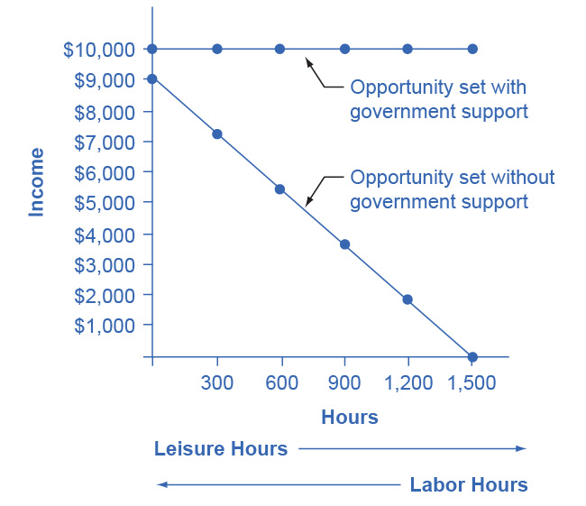
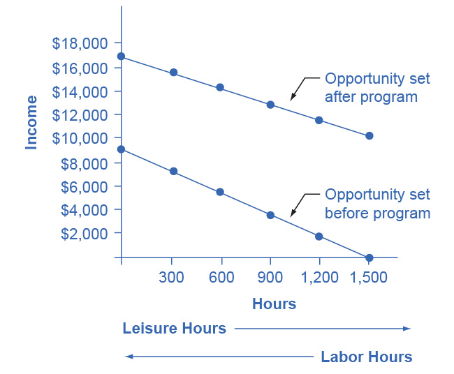
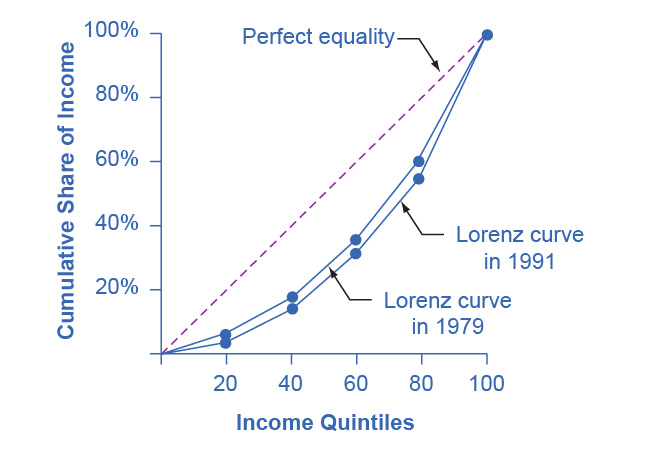
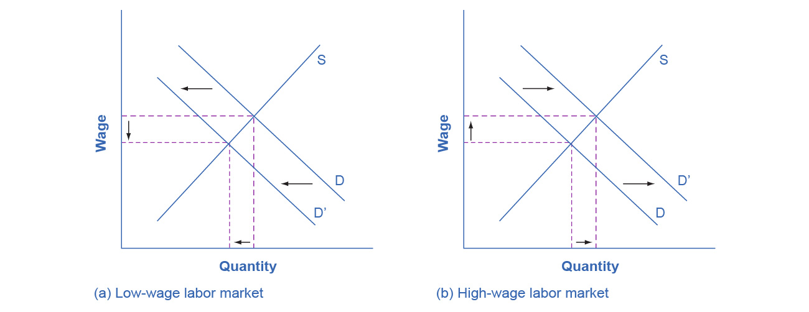

## Chapter 15

[1](http://openstax.org/books/principles-microeconomics-3e/pages/15-self-check-questions#ch14mod01_sques01).

a.  Poverty falls, inequality rises.
b.  Poverty rises, inequality falls.

[2](http://openstax.org/books/principles-microeconomics-3e/pages/15-self-check-questions#ch14mod02_sques01).

Jonathon's options for working and total income are shown in the
following table. His labor-leisure diagram is shown in the figure
following the table.

{width="3.25in" height="2.805in"}

[3](http://openstax.org/books/principles-microeconomics-3e/pages/15-self-check-questions#ch14mod02_sques02).

The following table shows a policy where only 30 cents in government
support is pulled right back for every \$1 of income earned. Jonathon's
labor-leisure diagram is shown in the figure following the table.
"Opportunity set after program" extends from (0, \$16,300) to (1,500,
\$10,000). "Opportunity set before program" slopes downward from (0,
\$9,000) to (1,500, \$0).

{width="3.25in" height="2.68in"}

[4](http://openstax.org/books/principles-microeconomics-3e/pages/15-self-check-questions#ch14mod03_sques01).

The earned income tax credit works like this: a family receives a tax
break that increases according to how much they work. Families that work
more get more. In that sense it loosens the poverty trap by encouraging
work. As families earn above the poverty level, the earned income tax
credit is gradually reduced. For those near-poor families, the earned
income tax credit is a partial disincentive to work.

[5](http://openstax.org/books/principles-microeconomics-3e/pages/15-self-check-questions#ch14mod03_sques02).

TANF attempts to loosen the poverty trap by providing incentives to work
in other ways. Specifically, it requires that people work (or complete
their education) as a condition of receiving TANF benefits, and it
places a time limit on benefits.

[6](http://openstax.org/books/principles-microeconomics-3e/pages/15-self-check-questions#ch14mod04_sques01).

A useful first step is to rank the households by income, from lowest to
highest. Then, since there are 10 households total, the bottom quintile
will be the bottom two households, the second quintile will be the third
and fourth households, and so on up to the top quintile. The quintiles
and percentage of total income for the data provided are shown in the
following table. Comparing this distribution to the U.S. income
distribution for 2005, the top quintile in the example has a smaller
share of total income than in the U.S. distribution and the bottom
quintile has a larger share. This pattern usually means that the income
distribution in the example is more equal than the U.S. distribution.

[7](http://openstax.org/books/principles-microeconomics-3e/pages/15-self-check-questions#ch14mod04_sques02).

Just from glancing at the quintile information, it is fairly obvious
that income inequality increased in the United Kingdom over this time:
The top quintile is getting a lot more, and the lowest quintile is
getting a bit less. Converting this information into a Lorenz curve,
however, is a little trickier, because the Lorenz curve graphs the
cumulative distribution, not the amount received by individual
quintiles. Thus, as explained in the text, you have to add up the
individual quintile data to convert the data to this form. The following
table shows the actual calculations for the share of income in 1979
versus 1991. The figure following the table shows the perfect equality
line and the Lorenz curves for 1979 and 1991. As shown, the income
distribution in 1979 was closer to the perfect equality line than the
income distribution in 1991---that is, the United Kingdom income
distribution became more unequal over time.

{width="3.25in" height="2.28in"}

[8](http://openstax.org/books/principles-microeconomics-3e/pages/15-self-check-questions#ch14mod04_sques03).

In the market for low-wage labor, information technology shifts the
demand for low-wage labor to the left. One reason is that technology can
often substitute for low-wage labor in certain kinds of telephone or
bookkeeping jobs. In addition, information technology makes it easier
for companies to manage connections with low-wage workers in other
countries, thus reducing the demand for low-wage workers in the United
States. In the market for high-wage labor, information technology shifts
the demand for high-wage labor to the right. By using the new
information and communications technologies, high-wage labor can become
more productive and can oversee more tasks than before. The following
figure illustrates these two labor markets. The combination of lower
wages for low-wage labor and higher wages for high-wage labor means
greater inequality.

{width="6.5in" height="2.51in"}

[9](http://openstax.org/books/principles-microeconomics-3e/pages/15-self-check-questions#ch14mod04_sques04).

In the market for low-wage labor, a skills program will shift supply to
the left, which will tend to drive up wages for the remaining low-skill
workers. In the market for high-wage labor, a skills program will shift
supply to the right (because after the training program there are now
more high-skilled workers at every wage), which will tend to drive down
wages for high-skill workers. The combination of these two programs will
result in a lesser degree of inequality. The following figure
illustrates these two labor markets. In the market for high-wage labor,
a skills program will shift supply to the right, which will tend to
drive down wages for high-skill workers.

{width="6.5in" height="2.51in"}

[10](http://openstax.org/books/principles-microeconomics-3e/pages/15-self-check-questions#ch14mod05_sques01).

A very strong push for economic equality might include extremely high
taxes on high-wage earners to pay for extremely large government social
payments for people with much lower incomes. Such a policy could limit
incentives for the high-wage workers, lock the poor into a poverty trap,
and thus reduce output. The PPF in this case will have the standard
appearance: it will be downward sloping.

[11](http://openstax.org/books/principles-microeconomics-3e/pages/15-self-check-questions#ch14mod05_sques02).

For the second hypothesis, a well-funded social safety net might make
people feel that even if their company goes bankrupt or they need to
change jobs or industries, they will have some degree of protection. As
a result, people may be more willing to allow markets to work without
interference, and not to lobby as hard for rules that would prevent
layoffs, set price controls, or block foreign trade. In this case,
safety net programs that increase equality could also allow the market
to work more freely in a way that could increase output. In this case,
at least some portion of the PPF between equality and economic output
would slope up.

[12](http://openstax.org/books/principles-microeconomics-3e/pages/15-self-check-questions#ch14mod05_sques03).

Pure redistribution is more likely to cause a sharp tradeoff between
economic output and equality than policies aimed at the ladder of
opportunity. A production possibility frontier showing a strict tradeoff
between economic output and equality will be downward sloping. A PPF
showing that it is possible to increase equality, at least to some
extent, while either increasing output or at least not diminishing it
would have a PPF that first rises, perhaps has a flat area, and then
falls.

[13](http://openstax.org/books/principles-microeconomics-3e/pages/15-self-check-questions#ch14mod05_sques04).

Many view the redistribution of income to achieve greater equality as
taking away from the rich to pay the poor, or as a "zero sum" game. By
taking taxes from one group of people and redistributing them to
another, the tax system is robbing some of the American Dream.
