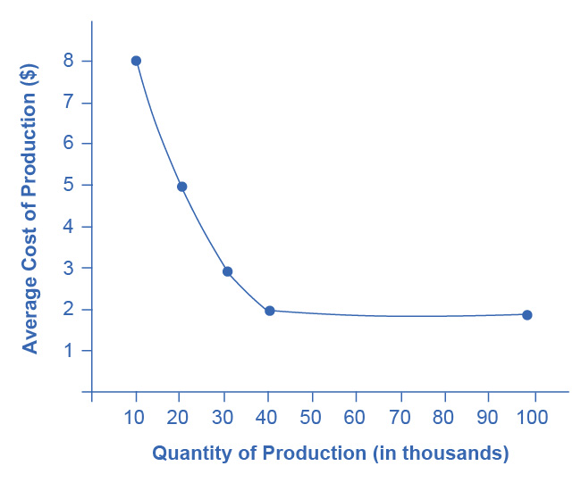

## Chapter 19

[1](http://openstax.org/books/principles-microeconomics-3e/pages/19-self-check-questions#fs-idp150363376).

False. Anything that leads to different levels of productivity between
two economies can be a source of comparative advantage. For example, the
education of workers, the knowledge base of engineers and scientists in
a country, the part of a split-up value chain where they have their
specialized learning, economies of scale, and other factors can all
determine comparative advantage.

[2](http://openstax.org/books/principles-microeconomics-3e/pages/19-self-check-questions#fs-idp176454304).

Brazil has the absolute advantage in producing beef and the United
States has the absolute advantage in autos. The opportunity cost of
producing one pound of beef is 1/10 of an auto; in the United States it
is 3/4 of an auto.

[3](http://openstax.org/books/principles-microeconomics-3e/pages/19-self-check-questions#fs-idp49111808).

In answering questions like these, it is often helpful to begin by
organizing the information in a table, such as in the following table.
Notice that, in this case, the productivity of the countries is
expressed in terms of how many workers it takes to produce a unit of a
product.

In this example, France has an absolute advantage in the production of
both sweaters and wine. You can tell because it takes France less labor
to produce a unit of the good.

[4](http://openstax.org/books/principles-microeconomics-3e/pages/19-self-check-questions#fs-idp72842560).

a.  In Germany, it takes fewer workers to make either a television or a
    video camera. Germany has an absolute advantage in the production of
    both goods.
b.  Producing an additional television in Germany requires three
    workers. Shifting those three German workers will reduce video
    camera production by 3/4 of a camera. Producing an additional
    television set in Poland requires six workers, and shifting those
    workers from the other good reduces output of video cameras by 6/12
    of a camera, or 1/2. Thus, the opportunity cost of producing
    televisions is lower in Poland, so Poland has the comparative
    advantage in the production of televisions. *Note*: Do not let the
    fractions like 3/4 of a camera or 1/2 of a video camera bother you.
    If either country was to expand television production by a
    significant amount---that is, lots more than one unit---then we will
    be talking about whole cameras and not fractional ones. You can also
    spot this conclusion by noticing that Poland's absolute disadvantage
    is relatively lower in televisions, because Poland needs twice as
    many workers to produce a television but three times as many to
    produce a video camera, so the product with the relatively lower
    absolute disadvantage is Poland's comparative advantage.
c.  Producing a video camera in Germany requires four workers, and
    shifting those four workers away from television production has an
    opportunity cost of 4/3 television sets. Producing a video camera in
    Poland requires 12 workers, and shifting those 12 workers away from
    television production has an opportunity cost of two television
    sets. Thus, the opportunity cost of producing video cameras is lower
    in Germany, and video cameras will be Germany's comparative
    advantage.
d.  In this example, absolute advantage differs from comparative
    advantage. Germany has the absolute advantage in the production of
    both goods, but Poland has a comparative advantage in the production
    of televisions.
e.  Germany should specialize, at least to some extent, in the
    production of video cameras, export video cameras, and import
    televisions. Conversely, Poland should specialize, at least to some
    extent, in the production of televisions, export televisions, and
    import video cameras.

[5](http://openstax.org/books/principles-microeconomics-3e/pages/19-self-check-questions#fs-idm56281808).

There are a number of possible advantages of intra-industry trade. Both
nations can take advantage of extreme specialization and learning in
certain kinds of cars with certain traits, like gas-efficient cars,
luxury cars, sport-utility vehicles, higher- and lower-quality cars, and
so on. Moreover, nations can take advantage of economies of scale, so
that large companies will compete against each other across
international borders, providing the benefits of competition and variety
to customers. This same argument applies to trade between U.S. states,
where people often buy products made by people of other states, even
though a similar product is made within the boundaries of their own
state. All states---and all countries---can benefit from this kind of
competition and trade.

[6](http://openstax.org/books/principles-microeconomics-3e/pages/19-self-check-questions#fs-idm20174080).

a.  Start by plotting the points on a sketch diagram and then drawing a
    line through them. The following figure illustrates the average
    costs of production of semiconductors.

-   {width="3.25in" height="2.75in"}

    The curve illustrates economies of scale by showing that as the
    scale increases---that is, as production at this particular factory
    goes up---the average cost of production declines. The economies of
    scale exist up to an output of 40,000 semiconductors; at higher
    outputs, the average cost of production does not seem to decline any
    further.

b.  At any quantity demanded above 40,000, this economy can take full
    advantage of economies of scale; that is, it can produce at the
    lowest cost per unit. Indeed, if the quantity demanded was quite
    high, like 500,000, then there could be a number of different
    factories all taking full advantage of economies of scale and
    competing with each other. If the quantity demanded falls below
    40,000, then the economy by itself, without foreign trade, cannot
    take full advantage of economies of scale.
c.  The simplest answer to this question is that the small country could
    have a large enough factory to take full advantage of economies of
    scale, but then export most of the output. For semiconductors,
    countries like Taiwan and Korea have recently fit this description.
    Moreover, this country could also import semiconductors from other
    countries which also have large factories, thus getting the benefits
    of competition and variety. A slightly more complex answer is that
    the country can get these benefits of economies of scale without
    producing semiconductors, but simply by buying semiconductors made
    at low cost around the world. An economy, especially a smaller
    country, may well end up specializing and producing a few items on a
    large scale, but then trading those items for other items produced
    on a large scale, and thus gaining the benefits of economies of
    scale by trade, as well as by direct production.

[7](http://openstax.org/books/principles-microeconomics-3e/pages/19-self-check-questions#fs-idp62005328).

A nation might restrict trade on imported products to protect an
industry that is important for national security. For example, nation X
and nation Y may be geopolitical rivals, each with ambitions of
increased political and economic strength. Even if nation Y has
comparative advantage in the production of missile defense systems, it
is unlikely that nation Y would seek to export those goods to nation X.
It is also the case that, for some nations, the production of a
particular good is a key component of national identity. In Japan, the
production of rice is culturally very important. It may be difficult for
Japan to import rice from a nation like Vietnam, even if Vietnam has a
comparative advantage in rice production.
