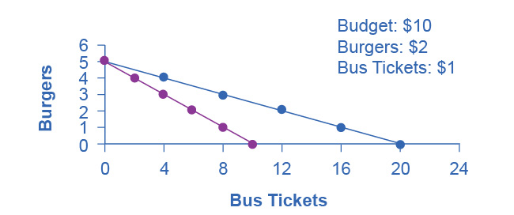

## Chapter 2

[1](http://openstax.org/books/principles-microeconomics-3e/pages/2-self-check-questions#fs-idp67687232).

The opportunity cost of bus tickets is the number of burgers that must
be given up to obtain one more bus ticket. Originally, when the price of
bus tickets was 50 cents per trip, this opportunity cost was 0.50/2 =
.25 burgers. The reason for this is that at the original prices, one
burger (\$2) costs the same as four bus tickets (\$0.50), so the
opportunity cost of a burger is four bus tickets, and the opportunity
cost of a bus ticket is .25 burgers (the inverse of the opportunity cost
of a burger). With the new, higher price of bus tickets, the opportunity
cost rises to \$1/\$2 or 0.50 burgers. You can see this graphically
since the slope of the new budget constraint is steeper than the
original one. If Alphonso spends all of his budget on burgers, the
higher price of bus tickets has no impact so the vertical intercept of
the budget constraint is the same. If he spends his entire budget on bus
tickets, he can now afford only half as many, so the horizontal
intercept is half as much. In short, the budget constraint rotates
clockwise around the vertical intercept, steepening as it goes and the
opportunity cost of bus tickets increases.

{width="3.25in" height="1.36in"}

[2](http://openstax.org/books/principles-microeconomics-3e/pages/2-self-check-questions#fs-idp42902064).

Because of the improvement in technology, the vertical intercept of the
PPF would be at a higher level of healthcare. In other words, the PPF
would rotate clockwise around the horizontal intercept. This would make
the PPF steeper, corresponding to an increase in the opportunity cost of
education, since resources devoted to education would now mean forgoing
a greater quantity of healthcare.

[3](http://openstax.org/books/principles-microeconomics-3e/pages/2-self-check-questions#fs-idm8667296).

No. Allocative efficiency requires productive efficiency, because it
pertains to choices along the production possibilities frontier.

[4](http://openstax.org/books/principles-microeconomics-3e/pages/2-self-check-questions#fs-idp46127904).

Both the budget constraint and the PPF show the constraint that each
operates under. Both show a tradeoff between having more of one good but
less of the other. Both show the opportunity cost graphically as the
slope of the constraint (budget or PPF).

[5](http://openstax.org/books/principles-microeconomics-3e/pages/2-self-check-questions#fs-idm126889808).

When individuals compare cost per unit in the grocery store, or
characteristics of one product versus another, they are behaving
approximately like the model describes.

[6](http://openstax.org/books/principles-microeconomics-3e/pages/2-self-check-questions#fs-idm106259344).

Since an op-ed makes a case for what should be, it is considered
normative.

[7](http://openstax.org/books/principles-microeconomics-3e/pages/2-self-check-questions#fs-idm56025936).

Assuming that the study is not taking an explicit position about whether
soft drink consumption is good or bad, but just reporting the science,
it would be considered positive.
