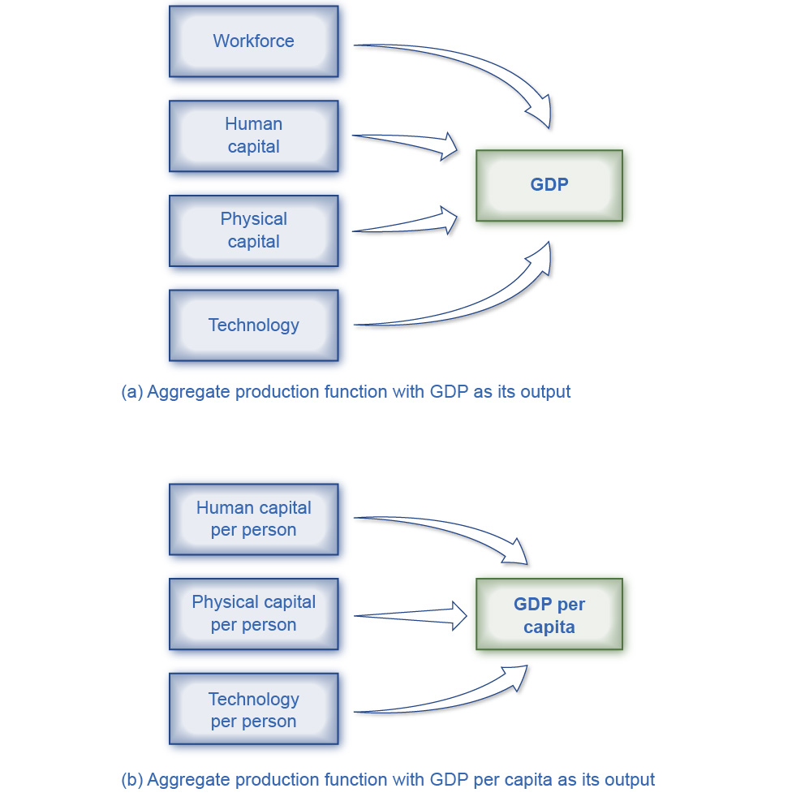
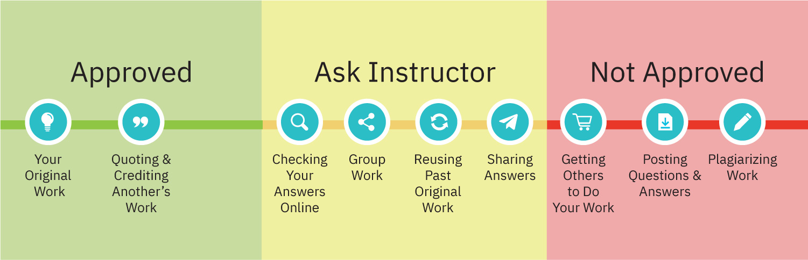

# Preface

Welcome to *Principles of Microeconomics 3e* (Third Edition), an
OpenStax resource. This textbook was written to increase student access
to high-quality learning materials, maintaining highest standards of
academic rigor at little to no cost.

### About OpenStax

OpenStax is part of Rice University, which is a 501(c)(3) nonprofit
charitable corporation. As an educational initiative, it\'s our mission
to transform learning so that education works for every student. Through
our partnerships with philanthropic organizations and our alliance with
other educational resource companies, we\'re breaking down the most
common barriers to learning. Because we believe that everyone should and
can have access to knowledge.

### About OpenStax Resources

#### Customization

*Principles of Microeconomics 3e* is licensed under a Creative Commons
Attribution 4.0 International (CC BY) license, which means that you can
distribute, remix, and build upon the content, as long as you provide
attribution to OpenStax and its content contributors.

Because our books are openly licensed, you are free to use the entire
book or select only the sections that are most relevant to the needs of
your course. Feel free to remix the content by assigning your students
certain chapters and sections in your syllabus, in the order that you
prefer. You can even provide a direct link in your syllabus to the
sections in the web view of your book.

Instructors also have the option of creating a customized version of
their OpenStax book. Visit the Instructor Resources section of your book
page on OpenStax.org for more information.

#### Art attribution

In *Principles of Microeconomics 3e*, most art contains attribution to
its title, creator or rights holder, host platform, and license within
the caption. Because the art is openly licensed, anyone may reuse the
art as long as they provide the same attribution to its original source.
To maximize readability and content flow, some art does not include
attribution in the text. If you reuse art from this text that does not
have attribution provided, use the following attribution: Copyright Rice
University, OpenStax, under CC-BY 4.0 license.

#### Errata

All OpenStax textbooks undergo a rigorous review process. However, like
any professional-grade textbook, errors sometimes occur. In addition,
economic data and related developments change frequently, and portions
of the textbook may become out of date. Since our books are web based,
we can make updates periodically when deemed pedagogically necessary. If
you have a correction to suggest, submit it through the link on your
book page on OpenStax.org. Subject matter experts review all errata
suggestions. OpenStax is committed to remaining transparent about all
updates, so you will also find a list of past and pending errata changes
on your book page on OpenStax.org.

#### Format

You can access this textbook for free in web view or PDF through
OpenStax.org, and for a low cost in print.

### About *Principles of Microeconomics 3e*

*Principles of Microeconomics 3e* aligns to the topics and objectives of
most introductory microeconomics courses. The text uses conversational
language and ample illustrations to explore economic theories, and
provides a wide array of examples using both fictional and real-world
scenarios. The third edition has been carefully and thoroughly updated
to reflect current data and understanding, as well as to provide a
deeper background in diverse contributors and their impacts on economic
thought and analysis.

#### Coverage and scope

In response to faculty feedback and to ease transition to a new edition,
Principles of Microeconomics 3e retains the organization of the previous
editions. The book covers the breadth of economics topics and also
provides the necessary depth to ensure the course is manageable for
instructors and students alike. We strove to balance theory and
application, as well as the amount of calculation and mathematical
examples.

The book is organized into five main parts:

-   **What is Economics?** The first two chapters introduce students to
    the study of economics with a focus on making choices in a world of
    scarce resources.
-   **Supply and Demand**, Chapters 3 and 4, introduces and explains the
    first analytical model in economics--supply, demand, and
    equilibrium--before showing applications in the markets for labor
    and finance.
-   **The Fundamentals of Microeconomic Theory**, Chapters 5 through 10,
    begins the microeconomics portion of the text, presenting the
    theories of consumer behavior, production and costs, and the
    different models of market structure, including some simple game
    theory.
-   **Microeconomic Policy Issues**, Chapters 11 through 18, covers the
    range of topics in applied micro, framed around the concepts of
    public goods and positive and negative externalities. Students
    explore competition and antitrust policies, environmental problems,
    poverty, income inequality, and other labor market issues. The text
    also covers information, risk and financial markets, and public
    economy.
-   **International Economics**, Chapters 19 and 20, introduces the
    international dimensions of economics, including international trade
    and protectionism.

#### Changes to the third edition

The revision process incorporated extensive feedback from faculty who
have used the book in their courses. They advised that the third edition
changes focus on currency updates, integration of newer perspectives and
more diverse contributors, and relevance to students' lives and careers.

**Current data and analysis:** The authors have updated dozens of
explanations, graphs, and tables containing financial, demographic,
employment, and related economic data. The corresponding discussions
provide context and interpretations of the data, including descriptions
of change over time, cause-and-effect relationships, and balanced
analysis of policies and opinions.

**Diverse perspectives and contributors:** The third edition highlights
the research and views of a broader group of economists. These include
people from across the spectrum of economic thought, with a particular
focus on those who take what are often considered non-traditional views
of economic policy and government action. Examples include:

-   Chapter 1: Esther Duflo, Abhijit Banerjee, and Michael Kremer
    regarding experimental analysis in development economics.
-   Chapter 4: Walter Williams and Thomas Sowell regarding the downsides
    of minimum wages.
-   Chapter 13: Carlota Perez regarding employment shifts resulting from
    innovation; Mariana Mazzucato regarding government involvement in
    innovation; Elinor Ostrom and the "non-tragedy of the commons."
-   Chapter 14: William A. Darity Jr. on employment discrimination and
    market forces; Phyllis Ann Wallace and the EEOC.

**Relevance and engagement:** In order to show the importance and
application of economics in students' lives and careers, the third
edition directly addresses and expands topics likely to connect to
various industries, issues, groups, and events. Brief references and
deeply explored socio-political examples have been updated to showcase
the critical---and sometimes unnoticed---ties between economic
developments and topics relevant to students. Examples include education
spending, the value of college degrees, discrimination, environmental
policies, immigration policies, entrepreneurship and innovation,
healthcare and insurance, and general financial literacy. Finally, the
COVID-19 pandemic is referenced frequently to demonstrate its deep and
evolving impacts on financial data, employment, and other aspects of the
economy.

**FRED Data and Graphs:** As in previous editions, the authors have
included and referenced data from the Federal Reserve Economic Data
(FRED). In some cases, interactive FRED graphs are embedded directly in
the web view of the book; students may magnify and focus on specific
time periods, analyze individual data points, and otherwise manipulate
the graphs from within the OpenStax reading experience. In others cases
(and in the PDF), links to the direct source of the FRED data are
provided, and students are encouraged to explore the information and the
overall FRED resources more thoroughly. Note that other data sources,
such as the Bureau of Labor Statistics, U.S. Census Bureau, and World
Bank, usually include links in the captions or credits; instructors and
students can also explore those sites for more detailed investigations
of the topics at hand.

#### Updated art

*Principles of Microeconomics 3e* includes updated and redesigned art to
clarify concepts and provide opportunities for graphical interpretation.
Many graphs are shown with accompanying data tables and explanations of
the drivers and consequences of change.

{width="3.25in" height="2.52in"}

{width="4.88in" height="4.91in"}

#### Pedagogical foundation

The narrative explanations and analysis presented in *Principles of
Microeconomics 3e* have been carefully crafted to provide a solid basis
in economic concepts, flexibly approach skills and assess understanding,
and deepen students' engagement with the course materials. You will also
find features that promote economic inquiry and explorations, including:

-   **Bring It Home:** These explorations include a brief case study,
    specific to each chapter, which connects the chapter's main topic to
    the real world. It is broken up into two parts: the first at the
    beginning of the chapter (in the Intro module) and the second at
    chapter's end, when students have learned what's necessary to
    understand the case and "bring home" the chapter's core concepts.
-   **Work It Out:** These worked examples progress through an
    analytical or computational problem, and guide students step-by-step
    to find out how its solution is derived.
-   **Clear It Up:** These boxes are deeper explanations of something in
    the main body of the text. Each CIU starts with a question. The rest
    of the feature explains the answer.

#### Questions for each level of learning

*Principles of Microeconomics 3e* offers flexibility in practice and
assessment, and provides a range of opportunities to check understanding
and encourage deeper thinking and application.

-   **Self-Checks** are analytical self-assessment questions that appear
    at the end of each module. They "click to reveal" an answer in the
    web view so students can check their understanding before moving on
    to the next module. Self-Check questions are not simple look-up
    questions. They push the student to think beyond what is said in the
    text. Self-Check questions are designed for formative (rather than
    summative) assessment. The questions and answers are explained so
    that students feel like they are being walked through the problem.
-   **Review Question** are simple recall questions from the chapter and
    are in open-response format (not multiple choice or true/false). The
    answers can be looked up in the text.
-   **Critical Thinking Questions** are higher-level, conceptual
    questions ask students to demonstrate their understanding by
    applying what they have learned in different contexts.
-   **Problems** are exercises give students additional practice working
    with the analytic and computational concepts in the module.

### About the Authors

#### Senior contributing authors

**David Shapiro, Pennsylvania State University**\
David Shapiro is Professor Emeritus of Economics, Demography, and
Women's, Gender, and Sexuality Studies at the Pennsylvania State
University. He received a BA in Economics and Political Science from the
University of Michigan, and an MA as well as a PhD in Economics from
Princeton University. He began his academic career at Ohio State
University in 1971, and moved to Penn State in 1980. His early research
focused on women and youth in the United States labor market. Following
a 1978-79 stint as a Fulbright professor at the University of Kinshasa
in the Democratic Republic of the Congo, his research shifted focus to
fertility in Kinshasa and more broadly, in sub-Saharan Africa. He has
also received the top prize for teaching at both Ohio State and Penn
State.

**Daniel MacDonald, California State University, San Bernardino**\
Professor Daniel MacDonald is the Chair of the Economics Department at
California State University, San Bernardino. He earned his BA in
mathematics and economics from Seton Hall University in 2007 and his
economics PhD from the University of Massachusetts Amherst in 2013.
Macdonald conducts economic research in labor economics, public policy
(housing), and the economic history of the U.S. Consulting. He is also
the author of the weekly [Inland Empire Economic Update
newsletter](https://dpmacdonald.substack.com/), which he started in
2021.

**Steven A. Greenlaw, Professor Emeritus at University of Mary
Washington**\
Steven Greenlaw taught principles of economics for 39 years. In 1999, he
received the Grellet C. Simpson Award for Excellence in Undergraduate
Teaching at the University of Mary Washington. He is the author of Doing
Economics: A Guide to Doing and Understanding Economic Research, as well
as a variety of articles on economics pedagogy and instructional
technology, published in the *Journal of Economic Education*, the
*International Review of Economic Education*, and other outlets. He
wrote the module on Quantitative Writing for *Starting Point: Teaching
and Learning Economics*, the web portal on best practices in teaching
economics. Steven Greenlaw lives in Alexandria, Virginia with his wife
Kathy. Since retiring from full-time teaching, he has been doing faculty
development work and other writing projects.

#### Contributing authors

Eric Dodge, Hanover College\
Cynthia Gamez, University of Texas at El Paso\
Andres Jauregui, Columbus State University\
Diane Keenan, Cerritos College\
Amyaz Moledina, The College of Wooster\
Craig Richardson, Winston-Salem State University\
Ralph Sonenshine, American University

#### Reviewers

Bryan Aguiar, Northwest Arkansas Community College\
Basil Al Hashimi, Mesa Community College\
Jennifer Ball, Washburn University\
Emil Berendt, Mount St. Mary\'s University\
Zena Buser, Adams State University\
Douglas Campbell, The University of Memphis\
Sanjukta Chaudhuri, University of Wisconsin-Eau Claire\
Xueyu Cheng, Alabama State University\
Robert Cunningham, Alma College\
Rosa Lea Danielson, College of DuPage\
Steven Deloach, Elon University\
Debbie Evercloud, University of Colorado Denver\
Sal Figueras, Hudson County Community College\
Reza Ghorashi, Stockton University\
Robert Gillette, University of Kentucky\
George Jones, University of Wisconsin-Rock County\
Charles Kroncke, College of Mount St. Joseph\
Teresa Laughlin, Palomar Community College\
Carlos Liard-Muriente, Central Connecticut State University\
Heather Luea, Kansas State University\
Charles Meyrick, Housatonic Community College\
William Mosher, Nashua Community College\
Michael Netta, Hudson County Community College\
Nick Noble, Miami University\
Joe Nowakowski, Muskingum University\
Shawn Osell, University of Wisconsin, Superior\
Mark Owens, Middle Tennessee State University\
Sonia Pereira, Barnard College\
Brian Peterson, Central College\
Jennifer Platania, Elon University\
Robert Rycroft, University of Mary Washington\
Adrienne Sachse, Florida State College at Jacksonville\
Hans Schumann, Texas A&M University\
Gina Shamshak, Goucher College\
Chris Warburton, John Jay College of Criminal Justice, CUNY\
Mark Witte, Northwestern University\
Chiou-nan Yeh, Alabama State University

### Additional Resources

#### Student and instructor resources

We've compiled additional resources for both students and instructors,
including Getting Started Guides, an instructor's manual, test bank, and
image slides. Instructor resources require a verified instructor
account, which you can apply for when you log in or create your account
on OpenStax.org. Take advantage of these resources to supplement your
OpenStax book.

-   **Premium Course Shells:** These robust course cartridges are
    preloaded with assessments, activities, discussion prompts,
    readings, and other assignable material. They are logically
    organized to match the way you manage your course, with pre-lecture,
    synchronous, and post-lecture experiences. Activities and
    assessments are designed so that the answers are not easily found
    via online searches. These offerings are provided for D2L, Canvas,
    and Blackboard, and may require support from campus instructional
    technology or related teams to import and integrate.
-   **Enhanced Lecture PowerPoint Slides:** These lecture slides include
    selected graphics from the text, key concepts and definitions,
    examples, and discussion questions.
-   **Test Bank:** The test bank contains multiple choice, short answer,
    and essay questions for each chapter of the textbook. Since many
    instructors use these questions in graded assignments, we ask that
    you not post these questions and the answers on any publicly
    available websites.
-   **Instructor Solution Guide:** The instructor solutions guide
    contains the instructor-facing answers to the problems and exercises
    within the textbook.
-   **Video Guide:** This video guide is a collection of videos
    recommended by instructors and grouped topically by OpenStax
    textbook chapters.
-   **Polling Questions:** Spark discussion and support in-class
    learning and engagement using this set of polling questions. Survey
    students\' understanding by a raise of hands or by pairing these
    questions with your polling technology; 3--4 questions are provided
    for each chapter.

### Academic integrity

Academic integrity builds trust, understanding, equity, and genuine
learning. While students may encounter significant challenges in their
courses and their lives, doing their own work and maintaining a high
degree of authenticity will result in meaningful outcomes that will
extend far beyond their college career. Faculty, administrators,
resource providers, and students should work together to maintain a fair
and positive experience.

We realize that students benefit when academic integrity ground rules
are established early in the course. To that end, OpenStax has created
an interactive to aid with academic integrity discussions in your
course.

{width="3.6458333333333335in"
height="1.1756047681539807in"}

Visit our [academic integrity
slider](https://view.genial.ly/61e08a7af6db870d591078c1/interactive-image-defining-academic-integrity-interactive-slider).
Click and drag icons along the continuum to align these practices with
your institution and course policies. You may then include the graphic
on your syllabus, present it in your first course meeting, or create a
handout for students.

At OpenStax we are also developing resources supporting authentic
learning experiences and assessment. Please visit this book's page for
updates. For an in-depth review of academic integrity strategies, we
highly recommend visiting the International Center of Academic Integrity
(ICAI) website at <https://academicintegrity.org/>.

#### Community hubs

OpenStax partners with the Institute for the Study of Knowledge
Management in Education (ISKME) to offer Community Hubs on OER
Commons---a platform for instructors to share community-created
resources that support OpenStax books, free of charge. Through our
Community Hubs, instructors can upload their own materials or download
resources to use in their own courses, including additional ancillaries,
teaching material, multimedia, and relevant course content. We encourage
instructors to join the hubs for the subjects most relevant to your
teaching and research as an opportunity both to enrich your courses and
to engage with other faculty. To reach the Community Hubs, visit
[www.oercommons.org/hubs/openstax](http://www.oercommons.org/hubs/openstax).

#### Technology partners

As allies in making high-quality learning materials accessible, our
technology partners offer optional low-cost tools that are integrated
with OpenStax books. To access the technology options for your text,
visit your book page on OpenStax.org.
