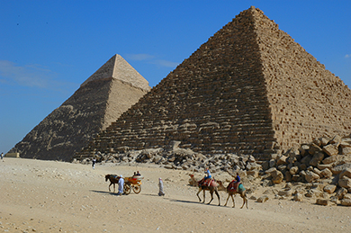
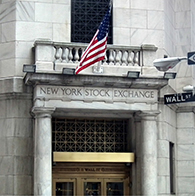
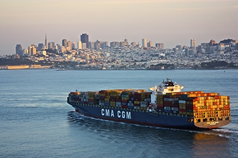

## 1.4 How To Organize Economies: An Overview of Economic Systems

### Learning Objectives

By the end of this section, you will be able to:

-   Contrast traditional economies, command economies, and market
    economies
-   Explain gross domestic product (GDP)
-   Assess the importance and effects of globalization

Think about what a complex system a modern economy is. It includes all
production of goods and services, all buying and selling, all
employment. The economic life of every individual is interrelated, at
least to a small extent, with the economic lives of thousands or even
millions of other individuals. Who organizes and coordinates this
system? Who ensures that, for example, the number of televisions a
society provides is the same as the amount it needs and wants? Who
ensures that the right number of employees work in the electronics
industry? Who ensures that televisions are produced in the best way
possible? How does it all get done?

There are at least three ways that societies organize an economy. The
first is the traditional economy, which is the oldest economic system
and is used in parts of Asia, Africa, and South America. Traditional
economies organize their economic affairs the way they have always done
(i.e., tradition). Occupations stay in the family. Most families are
farmers who grow the crops using traditional methods. What you produce
is what you consume. Because tradition drives the way of life, there is
little economic progress or development.

{width="6.5in" height="4.316666666666666in"}

Figure 1.8 A Command Economy Ancient Egypt was an example of a command
economy. (Credit: \"Pyramids at Giza\" by Jay Bergesen/Flickr Creative
Commons, CC BY 2.0)

Command economies are very different. In a command economy, economic
effort is devoted to goals passed down from a ruler or ruling class.
Ancient Egypt was a good example: a large part of economic life was
devoted to building pyramids, like those in [Figure
1.8](#CNX_Econ_C01_005), for the pharaohs. Medieval manor life is
another example: the lord provided the land for growing crops and
protection in the event of war. In return, vassals provided labor and
soldiers to do the lord's bidding. In the last century, communism
emphasized command economies.

In a command economy, the government decides what goods and services
will be produced and what prices it will charge for them. The government
decides what methods of production to use and sets wages for workers.
The government provides many necessities like healthcare and education
for free. Currently, Cuba and North Korea have command economies.

{width="6.5in" height="6.533333333333333in"}

Figure 1.9 A Market Economy Nothing says "market" more than The New York
Stock Exchange. (Credit: work by Erik Drost/Flickr Creative Commons, CC
BY 2.0)

Although command economies have a very centralized structure for
economic decisions, market economies have a very decentralized
structure. A market is an institution that brings together buyers and
sellers of goods or services, who may be either individuals or
businesses. The New York Stock Exchange ([Figure
1.9](#CNX_Econ_C01_006)) is a prime example of a market which brings
buyers and sellers together. In a market economy, decision-making is
decentralized. Market economies are based on private enterprise: the
private individuals or groups of private individuals own and operate the
means of production (resources and businesses). Businesses supply goods
and services based on demand. (In a command economy, by contrast, the
government owns resources and businesses.) Supply of goods and services
depends on what the demands are. A person's income is based on their
ability to convert resources (especially labor) into something that
society values. The more society values the person's output, the higher
the income (think Lady Gaga or LeBron James). In this scenario, market
forces, not governments, determine economic decisions.

Most economies in the real world are mixed. They combine elements of
command and market (and even traditional) systems. The U.S. economy is
positioned toward the market-oriented end of the spectrum. Many
countries in Europe and Latin America, while primarily market-oriented,
have a greater degree of government involvement in economic decisions
than the U.S. economy. China and Russia, while over the past several
decades have moved more in the direction of having a market-oriented
system, remain closer to the command economy end of the spectrum. The
Heritage Foundation provides perspective on countries' economic freedom,
as the following Clear It Up feature discusses.

### Clear It Up {#clear-it-up .Heading3Grey}

#### What countries are considered economically free? {#what-countries-are-considered-economically-free .Heading4Grey}

Who is in control of economic decisions? Are people free to do what they
want and to work where they want? Are businesses free to produce when
they want and what they choose, and to hire and fire as they wish? Are
banks free to choose who will receive loans, or does the government
control these kinds of choices? Each year, researchers at the Heritage
Foundation and the *Wall Street Journal* look at 50 different categories
of economic freedom for countries around the world. They give each
nation a score based on the extent of economic freedom in each category.
Note that while the Heritage Foundation/WSJ index is widely cited by an
array of scholars and publications, it should be regarded as only one
viewpoint. Some experts indicate that the index's category choices and
scores are politically biased. However, the index and others like it
provide a useful resource for critical discussion of economic freedom.

The 2016 Heritage Foundation's Index of Economic Freedom report ranked
178 countries around the world: [Table 1.1](#Table_01_01) lists some
examples of the most free and the least free countries. Although
technically not a separate country, Hong Kong has been granted a degree
of autonomy such that, for purposes of measuring economic statistics, it
is often treated as a separate country. Several additional countries
were not ranked because of extreme instability that made judgments about
economic freedom impossible. These countries include Afghanistan, Iraq,
Libya, Syria, Somalia, and Yemen.

The assigned rankings are inevitably based on estimates, yet even these
rough measures can be useful for discerning trends. In 2015, 101 of the
178 included countries shifted toward greater economic freedom, although
77 of the countries shifted toward less economic freedom. In recent
decades, the overall trend has been a *higher level of economic freedom
around the world*.

Table 1.1 Economic Freedoms, 2016 (Source: The Heritage Foundation, 2016
Index of Economic Freedom, Country Rankings,
http://www.heritage.org/index/ranking)

### Regulations: The Rules of the Game

Markets and government regulations are always entangled. There is no
such thing as an absolutely free market. Regulations always define the
"rules of the game" in the economy. Economies that are primarily
market-oriented have fewer regulations---ideally just enough to maintain
an even playing field for participants. At a minimum, these laws govern
matters like safeguarding private property against theft, protecting
people from violence, enforcing legal contracts, preventing fraud, and
collecting taxes. Conversely, even the most command-oriented economies
operate using markets. How else would buying and selling occur? The
government heavily regulates decisions of what to produce and prices to
charge. Heavily regulated economies often have underground economies (or
black markets), which are markets where the buyers and sellers make
transactions without the government's approval.

The question of how to organize economic institutions is typically not a
straightforward choice between all market or all government, but instead
involves a balancing act over the appropriate combination of market
freedom and government rules.

{width="6.5in" height="4.333332239720035in"}

Figure 1.10 Globalization Cargo ships are one mode of transportation for
shipping goods in the global economy. (Credit: \"Cargo Ship\" by Raul
Valdez/Flickr Creative Commons, CC BY 2.0)

### The Rise of Globalization

Recent decades have seen a trend toward globalization, which is the
expanding cultural, political, and economic connections between people
around the world. One measure of this is the increased buying and
selling of goods, services, and assets across national borders---in
other words, international trade and financial capital flows.

Globalization has occurred for a number of reasons. Improvements in
shipping, as illustrated by the container ship in [Figure
1.10](#CNX_Econ_C01_007), and air cargo have driven down transportation
costs. Innovations in computing and telecommunications have made it
easier and cheaper to manage long-distance economic connections of
production and sales. Many valuable products and services in the modern
economy can take the form of information---for example: computer
software; financial advice; travel planning; music, books and movies;
and blueprints for designing a building. These products and many others
can be transported over telephones and computer networks at ever-lower
costs. Finally, international agreements and treaties between countries
have encouraged greater trade.

[Table 1.2](#Table_01_02) presents one measure of globalization. It
shows the percentage of domestic economic production that was exported
for a selection of countries from 2010 to 2015, according to an entity
known as The World Bank. Exports are the goods and services that one
produces domestically and sells abroad. Imports are the goods and
services that one produces abroad and then sells domestically. Gross
domestic product (GDP) measures the size of total production in an
economy. Thus, the ratio of exports divided by GDP measures what share
of a country's total economic production is sold in other countries.

Table 1.2 The Extent of Globalization (exports/GDP) (Source:
http://databank.worldbank.org/data/)

In recent decades, the export/GDP ratio has generally risen, both
worldwide and for the U.S. economy. Interestingly, the share of U.S.
exports in proportion to the U.S. economy is well below the global
average, in part because large economies like the United States can
contain more of the division of labor inside their national borders.
However, smaller economies like Belgium, Korea, and Canada need to trade
across their borders with other countries to take full advantage of
division of labor, specialization, and economies of scale. In this
sense, the enormous U.S. economy is less affected by globalization than
most other countries.

[Table 1.2](#Table_01_02) indicates that many medium and low income
countries around the world, like Mexico and China, have also experienced
a surge of globalization in recent decades. If an astronaut in orbit
could put on special glasses that make all economic transactions visible
as brightly colored lines and look down at Earth, the astronaut would
see the planet covered with connections.

Despite the rise in globalization over the last few decades, in recent
years we\'ve seen significant pushback against globalization from people
across the world concerned about loss of jobs, loss of political
sovereignty, and increased economic inequality. Prominent examples of
this pushback include the 2016 vote in Great Britain to exit the
European Union (i.e. Brexit), and the election of Donald J. Trump for
President of the United States.

Hopefully, you now have an idea about economics. Before you move to any
other chapter of study, be sure to read the very important appendix to
this chapter called [The Use of Mathematics in Principles of
Economics](http://openstax.org/books/principles-microeconomics-3e/pages/a-the-use-of-mathematics-in-principles-of-economics).
It is essential that you learn more about how to read and use models in
economics.

### Bring It Home {#bring-it-home .Heading3Grey}

#### Information Overload in the Information Age {#information-overload-in-the-information-age .Heading4Grey}

The world provides nearly instant access to a wealth of information.
Consider that as recently as the late 1970s, the *Farmer's Almanac*,
along with the Weather Bureau of the U.S. Department of Agriculture,
were the primary sources American farmers used to determine when to
plant and harvest their crops. Today, these decisions are driven by
data. Farmers access detailed data streams driven by global positioning
systems, historical rainfall patterns, and complex weather monitoring
services. They combine this information with crop yield data and soil
quality measurements from prior years. Maximizing production efficiently
can mean the difference between a farm that remains profitable and one
that may need to sell its land, and data helps eliminate guesswork.

Information helps us make decisions as simple as what to wear today to
how many reporters the media should send to cover an event. Each of
these decisions is an economic decision. After all, resources are
scarce. If the media send ten reporters to cover an announcement, they
are not available to cover other stories or complete other tasks.
Information provides the necessary knowledge to make the best possible
decisions on how to utilize scarce resources. Welcome to the world of
economics!
