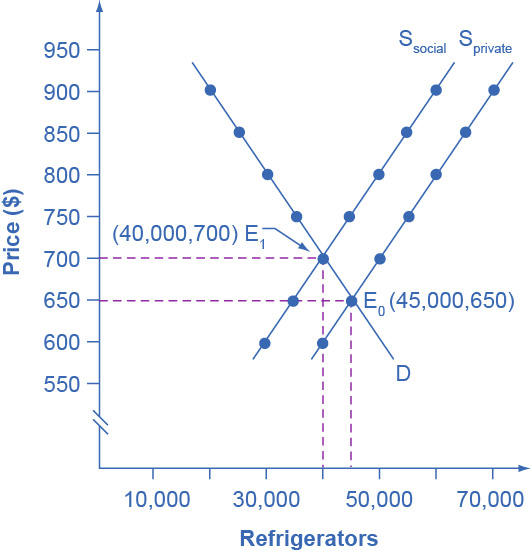

## 12.1 The Economics of Pollution

### Learning Objectives

By the end of this section, you will be able to:

-   Explain and give examples of positive and negative externalities
-   Identify equilibrium price and quantity
-   Evaluate how firms can contribute to market failure

From 1970 to 2020, the U.S. population increased by 63 percent, and the
size of the U.S. economy increased by more than 3.8-fold. Since the
1970s, however, the United States, using a variety of anti-pollution
policies, has made genuine progress against a number of pollutants.
[Table 12.1](#Table_12_01) lists the change in carbon dioxide emissions
by energy users (from residential to industrial) according to the U.S.
Energy Information Administration (EIA). The table shows that emissions
of certain key air pollutants declined substantially from 2007 to 2012.
They dropped 740 million metric tons (MMT) a year---a 12% reduction.
This seems to indicate that there has been progress made in the United
States in reducing overall carbon dioxide emissions, which contribute to
the greenhouse effect.

Table 12.1 Carbon Dioxide Emissions from Energy Consumption, by Source
(Source: EIA Monthly Energy Review)

Despite the gradual reduction in emissions from fossil fuels, many
important environmental issues remain. Along with the still high levels
of air and water pollution, other issues include hazardous waste
disposal, destruction of wetlands and other wildlife habitats, and the
impact on human health from pollution.

### Externalities

Private markets, such as the cell phone industry, offer an efficient way
to put buyers and sellers together and determine what goods they
produce, how they produce them and who gets them. The principle that
voluntary exchange benefits both buyers and sellers is a fundamental
building block of the economic way of thinking. However, what happens
when a voluntary exchange affects a third party who is neither the buyer
nor the seller?

As an example, consider a concert producer who wants to build an outdoor
arena that will host country music concerts a half-mile from your
neighborhood. You will be able to hear these outdoor concerts while
sitting on your back porch---or perhaps even in your dining room. In
this case, the sellers and buyers of concert tickets may both be quite
satisfied with their voluntary exchange, but you have no voice in their
market transaction. The effect of a market exchange on a third party who
is outside or "external" to the exchange is called an externality.
Because externalities that occur in market transactions affect other
parties beyond those involved, they are sometimes called spillovers.

Externalities can be negative or positive. If you hate country music,
then having it waft into your house every night would be a negative
externality. If you love country music, then what amounts to a series of
free concerts would be a positive externality.

### Pollution as a Negative Externality

Pollution is a negative externality. Economists illustrate the social
costs of production with a demand and supply diagram. The social costs
include the private costs of production that a company incurs and the
external costs of pollution that pass on to society. [Figure
12.2](#CNX_Econ_C12_001) shows the demand and supply for manufacturing
refrigerators. The demand curve (D) shows the quantity demanded at each
price. The supply curve (S~private~) shows the quantity of refrigerators
that all firms in the industry supply at each price assuming they are
taking only their private costs into account and they are allowed to
emit pollution at zero cost. The market equilibrium (E~0~), where
quantity supplied equals quantity demanded, is at a price of \$650 per
refrigerator and a quantity of 45,000 refrigerators. [Table
12.2](#Table_12_02) reflects this information in the first three
columns.

{width="2.655in" height="2.77in"}

Figure 12.2 Taking Social Costs into Account: A Supply Shift If the firm
takes only its own costs of production into account, then its supply
curve will be S~private~, and the market equilibrium will occur at E~0~.
Accounting for additional external costs of \$100 for every unit
produced, the firm's supply curve will be S~social~. The new equilibrium
will occur at E~1~.

Table 12.2 A Supply Shift Caused by Pollution Costs

However, as a by-product of the metals, plastics, chemicals and energy
that refrigerator manufacturers use, some pollution is created. Let's
say that, if these pollutants were emitted into the air and water, they
would create costs of \$100 per refrigerator produced. These costs might
occur because of adverse effects on human health, property values, or
wildlife habitat, reduction of recreation possibilities, or because of
other negative impacts. In a market with no anti-pollution restrictions,
firms can dispose of certain wastes absolutely free. Now imagine that
firms which produce refrigerators must factor in these external costs of
pollution---that is, the firms have to consider not only labor and
material costs, but also the broader costs to society of harm to health
and other costs caused by pollution. If the firm is required to pay
\$100 for the additional external costs of pollution each time it
produces a refrigerator, production becomes more costly and the entire
supply curve shifts up by \$100.

As [Table 12.2](#Table_12_02) and [Figure 12.2](#CNX_Econ_C12_001)
illustrate, the firm will need to receive a price of \$700 per
refrigerator and produce a quantity of 40,000---and the firm's new
supply curve will be S~social~. The new equilibrium will occur at E~1~.
In short, taking the additional external costs of pollution into account
results in a higher price, a lower quantity of production, and a lower
quantity of pollution. The following Work It Out feature will walk you
through an example, this time with musical accompaniment.

### Work It Out {#work-it-out .Heading3Grey}

#### Identifying the Equilibrium Price and Quantity {#identifying-the-equilibrium-price-and-quantity .Heading4Grey}

[Table 12.3](#Table_12_03) shows the supply and demand conditions for a
firm that will play trumpets on the streets when requested. We measure
output as the number of songs played.

Table 12.3 Supply and Demand Conditions for a Trumpet-Playing Firm

Step 1. Determine the negative externality in this situation. To do
this, you must think about the situation and consider all parties that
might be impacted. A negative externality might be the increase in noise
pollution in the area where the firm is playing.

Step 2. Identify the initial equilibrium price and quantity only taking
private costs into account. Next, identify the new equilibrium taking
into account social costs as well as private costs. Remember that
equilibrium is where the quantity demanded is equal to the quantity
supplied.

Step 3. Look down the columns to where the quantity demanded (the second
column) is equal to the "quantity supplied without paying the costs of
the externality" (the third column). Then refer to the first column of
that row to determine the equilibrium price. In this case, the
equilibrium price and quantity would be at a price of \$10 and a
quantity of five when we only take into account private costs.

Step 4. Identify the equilibrium price and quantity when we take into
account the additional external costs. Look down the columns of quantity
demanded (the second column) and the "quantity supplied after paying the
costs of the externality" (the fourth column) then refer to the first
column of that row to determine the equilibrium price. In this case, the
equilibrium will be at a price of \$12 and a quantity of four.

Step 5. Consider how taking into account the externality affects the
equilibrium price and quantity. Do this by comparing the two equilibrium
situations. If the firm is forced to pay its additional external costs,
then production of trumpet songs becomes more costly, and the supply
curve will shift up.

Remember that the supply curve is based on choices about production that
firms make while looking at their marginal costs, while the demand curve
is based on the benefits that individuals perceive while maximizing
utility. If no externalities existed, private costs would be the same as
the costs to society as a whole, and private benefits would be the same
as the benefits to society as a whole. Thus, if no externalities
existed, the interaction of demand and supply will coordinate social
costs and benefits.

However, when the externality of pollution exists, the supply curve no
longer represents all social costs. Because externalities represent a
case where markets no longer consider all social costs, but only some of
them, economists commonly refer to externalities as an example of market
failure. When there is market failure, the private market fails to
achieve efficient output, because either firms do not account for all
costs incurred in the production of output and/or consumers do not
account for all benefits obtained (a positive externality). In the case
of pollution, at the market output, social costs of production exceed
social benefits to consumers, and the market produces too much of the
product.

We can see a general lesson here. If firms were required to pay the
social costs of pollution, they would create less pollution but produce
less of the product and charge a higher price. In the next module, we
will explore how governments require firms to account for the social
costs of pollution.
