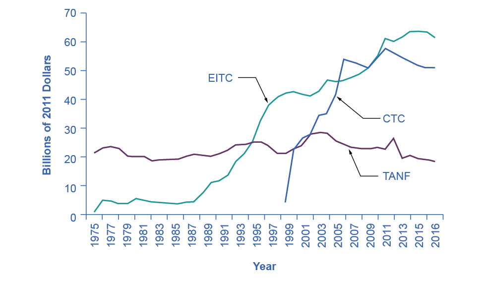
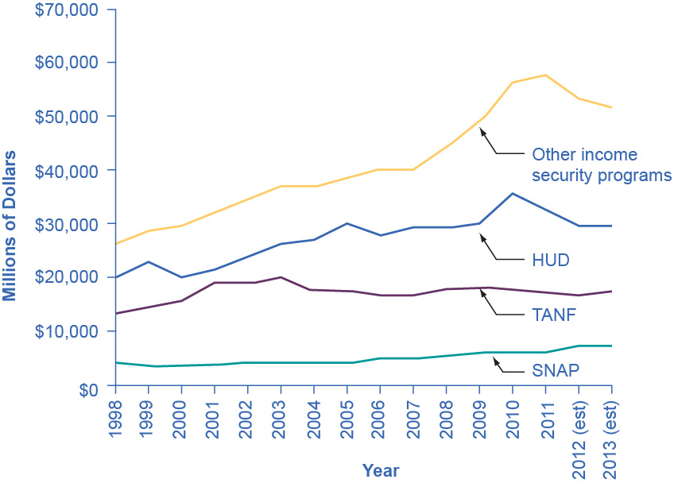
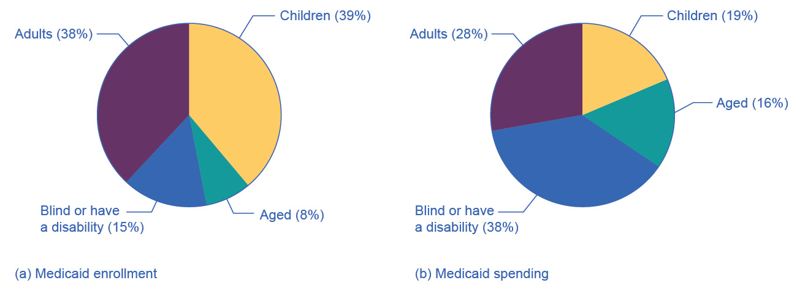

## 15.3 The Safety Net

### Learning Objectives

By the end of this section, you will be able to:

-   Identify the antipoverty government programs that comprise the
    safety net
-   Explain the safety net programs\' primary goals and how these
    programs have changed over time
-   Discuss the complexities of these safety net programs and why they
    can be controversial

The U.S. government has implemented a number of programs to assist those
below the poverty line and those who have incomes just above the poverty
line. Such programs are called the safety net, to recognize that they
offer some protection for those who find themselves without jobs or
income.

### Temporary Assistance for Needy Families

From the Great Depression until 1996, the United States' most visible
antipoverty program was Aid to Families with Dependent Children (AFDC),
which provided cash payments to mothers with children who were below the
poverty line. Many just called this program "welfare." In 1996, Congress
passed and President Bill Clinton signed into law the Personal
Responsibility and Work Opportunity Reconciliation Act, more commonly
called the "welfare reform act." The new law replaced AFDC with
Temporary Assistance for Needy Families (TANF).

### Link It Up {#link-it-up .Heading3Grey}

Visit this [website](http://openstax.org/l/Clinton_speech) to watch a
video of President Bill Clinton's Welfare Reform speech.

TANF brought several dramatic changes in how welfare operated. Under the
old AFDC program, states set the level of welfare benefits that they
would pay to people experiencing poverty, and the federal government
guaranteed it would chip in some of the money as well. The federal
government's welfare spending would rise or fall depending on the number
of people in need, and on how each state set its own welfare
contribution.

Under TANF, however, the federal government gives a fixed amount of
money to each state. The state can then use the money for almost any
program with an antipoverty component: for example, the state might use
the money to give funds to families with low income, or to reduce
teenage pregnancy, or even to raise the high school graduation rate.
However, the federal government imposed two key requirements. First, if
states are to keep receiving the TANF grants, they must impose work
requirements so that most of those receiving TANF benefits are working
(or attending school). Second, no one can receive TANF benefits with
federal money for more than a total of five years over their lifetime.
The old AFDC program had no such work requirements or time limits.

TANF attempts to avoid the poverty trap by requiring that welfare
recipients work and by limiting the length of time they can receive
benefits. In its first few years, the program was quite successful. The
number of families receiving payments in 1995, the last year of AFDC,
was 4.8 million. November 2020, according to the Congressional Research
Service, the number of families receiving payments under TANF was 1.0
million---a decline of nearly 80%.

TANF benefits to poor families vary considerably across states. For
example, again according to the Congressional Research Service, in July
2020 the highest monthly payment in New Hampshire to a single mother
with one child was \$862, while in Mississippi the highest monthly
payment to that family was \$146. In part, these payments reflect
differences in states' cost of living. As reported by the Department of
Health and Human Services, in 1995 total spending on TANF was
approximately \$19 billion. Spending increased yearly through 2001, then
it was roughly flat at approximately \$26 billion until 2005, then it
increased again through 2010, where it peaked at nearly \$35 billion. It
then decreased again to around \$30 billion in 2020. When you take into
account the effects of inflation, the decline is even greater. Moreover,
there seemed little evidence that families were suffering a reduced
standard of living as a result of TANF---although, on the other side,
there was not much evidence that families had greatly improved their
total levels of income, either.

### The Earned Income Tax Credit (EITC)

The earned income tax credit (EITC), first passed in 1975, is a method
of assisting the working poor through the tax system. The EITC is one of
the largest assistance program for low-income groups, and as of December
2021, about 25 million eligible workers and families received about \$60
billion in EITC. For the 2021 tax year, the earned income credit ranges
from \$1,502 to \$6,728 depending on tax-filing status, income, and
number of children. The average amount of EITC received nationwide was
about \$2,411. In 2021, for example, a single parent with two children
would have received a tax credit of \$5,980 up to a modest income level.
The amount of the tax break increases with the amount of income earned,
up to a point. The earned income tax credit has often been popular with
both economists and the general public because of the way it effectively
increases the payment received for work.

What about the danger of the poverty trap that every additional \$1
earned will reduce government support payments by close to \$1? To
minimize this problem, the earned income tax credit is phased out
slowly. For example, according to the Tax Policy Center, for a
single-parent family with two children in 2013, the credit is not
reduced at all (but neither is it increased) as earnings rise from
\$13,430 to \$17,530. Then, for every \$1 earned above \$17,530, the
amount received from the credit is reduced by 21.06 cents, until the
credit phases out completely at an income level of \$46,227.

[Figure 15.5](#CNX_Econ_C14_007) illustrates that the earned income tax
credits, child tax credits, and the TANF program all cost the federal
government money---either in direct outlays or in loss of tax revenues.
CTC stands for the government tax cuts for the child tax credit.

{width="4.88in" height="2.855in"}

Figure 15.5 Real Federal Spending on CTC, EITC, and TANF, 1975--2016
EITC increased from under \$10 billion in the late 1980s to almost \$42
billion in 2000 and to over \$61 billion in 2016, far exceeding
estimated 2016 outlays in the CTC (Child Tax Credits) and TANF of over
\$25 billion and \$18 billion, respectively. (Source: Office of
Management and Budget)

In recent years, the EITC has become a hugely expensive government
program for providing income assistance to people below or near the
poverty line, costing about \$60 billion in 2021. In that year, the EITC
provided benefits to about 25 million families and individuals and, on
average, is worth about \$2,411 per family (with children), according to
the Tax Policy Center. One reason that the TANF law worked as well as it
did is that the government greatly expanded EITC in the late 1980s and
again in the early 1990s, which increased the returns to work for
low-income Americans.

### Supplemental Nutrition Assistance Program (SNAP)

Often called "food stamps," Supplemental Nutrition Assistance Program
(SNAP) is a federally funded program, started in 1964, in which each
month people receive a card like a debit card that they can use to buy
food. The amount of food aid for which a household is eligible varies by
income, number of children, and other factors but, in general,
households are expected to spend about 30% of their own net income on
food, and if 30% of their net income is not enough to purchase a
nutritionally adequate diet, then those households are eligible for
SNAP.

SNAP can contribute to the poverty trap. For every \$100 earned, the
government assumes that a family can spend \$30 more for food, and thus
reduces its eligibility for food aid by \$30. This decreased benefit is
not a complete disincentive to work---but combined with how other
programs reduce benefits as income increases, it adds to the problem.
SNAP, however, does try to address the poverty trap with its own set of
work requirements and time limits.

Why give debit cards and not just cash? Part of the political support
for SNAP comes from a belief that since recipients must spend the the
cards on food, they cannot "waste" them on other forms of consumption.
From an economic point of view, however, the belief that cards must
increase spending on food seems wrong-headed. After all, say that a
family is spending \$2,500 per year on food, and then it starts
receiving \$1,000 per year in SNAP aid. The family might react by
spending \$3,500 per year on food (income plus aid), or it might react
by continuing to spend \$2,500 per year on food, but use the \$1,000 in
food aid to free up \$1,000 that it can now spend on other goods. Thus,
it is reasonable to think of SNAP cards as an alternative method, along
with TANF and the earned income tax credit, of transferring income to
those working but still experiencing poverty.

Anyone eligible for TANF is also eligible for SNAP, although states can
expand eligibility for food aid if they wish to do so. In some states,
where TANF welfare spending is relatively low, a poor family may receive
more in support from SNAP than from TANF. In 2021, about 41.5 million
people received food aid with total benefits of just over \$108 billion,
which is an average monthly benefit of about \$287 per person per month.
SNAP participation increased by 70% between 2007 and 2011, from 26.6
million participants to 45 million. According to the Congressional
Budget Office, the 2008-2009 Great Recession and rising food prices
caused this dramatic rise in participation. Likewise, between 2019 and
2021, the number of participants in SNAP increased by 5.8 million, the
amount per person increased by 67%, and total benefits nearly doubled as
a consequence of the sharp recession due to the onset of the COVID-19
pandemic in early 2020.

The federal government deploys a range of income security programs that
it funds through departments such as Health and Human Services,
Agriculture, and Housing and Urban Development (HUD) (see [Figure
15.6](#CNX_Econ_C14_012)). According to the Office of Management and
Budget, collectively, these three departments provided an estimated \$62
billion of aid through programs such as supplemental feeding programs
for women and children, subsidized housing, and energy assistance. The
federal government also transfers funds to individual states through
special grant programs.

{width="4.239998906386702in" height="3.04in"}

Figure 15.6 Expenditure Comparison of TANF, SNAP, HUD, and Other Income
Security Programs, 1988--2013 (est.) Total expenditures on income
security continued to rise between 1988 and 2010, while payments for
TANF have increased from \$13 billion in 1998 to an estimated \$17.3
billion in 2013. SNAP has seen relatively small increments. These two
programs comprise a relatively small portion of the estimated \$106
billion dedicated to income security in 2013. Note that other programs
and housing programs increased dramatically during the 2008 and 2010
time periods. (Source: Table 12.3 Section 600 Income Security,
https://www.whitehouse.gov/sites/default/files/omb/budget/fy2013/assets/hist.pdf)

The safety net includes a number of other programs:
government-subsidized school lunches and breakfasts for children from
low-income families; the Special Supplemental Food Program for Women,
Infants and Children (WIC), which provides food assistance for pregnant
women and newborns; the Low Income Home Energy Assistance Program, which
provides help with home heating bills; housing assistance, which helps
pay the rent; and Supplemental Security Income, which provides cash
support for people with disabilities and elderly people experiencing
poverty.

### Medicaid

Congress created Medicaid in 1965. This is a joint health insurance
program between both the states and the federal government. The federal
government helps fund Medicaid, but each state is responsible for
administering the program, determining the level of benefits, and
determining eligibility. It provides medical insurance for certain
people with low incomes, including those below the poverty line, with a
focus on families with children, the elderly, and people with
disabilities. About one-third of Medicaid spending is for low-income
mothers with children. While an increasing share of the program funding
in recent years has gone to pay for nursing home costs for older people
who cannot afford to pay for housing. The program ensures that
participants receive a basic level of benefits, but because each state
sets eligibility requirements and provides varying levels of service,
the program differs from state to state.

In the past, a common problem has been that many low-paying jobs pay
enough to a breadwinner so that a family could lose its eligibility for
Medicaid, yet the job does not offer health insurance benefits. A parent
considering such a job might choose not to work rather than lose health
insurance for their children. In this way, health insurance can become a
part of the poverty trap. Many states recognized this problem in the
1980s and 1990s and expanded their Medicaid coverage to include people
earning up to 135% or even 185% of the poverty line. Some states also
guaranteed that children would not lose coverage if their parents
worked.

These expanded guarantees cost the government money, of course, but they
also helped to encourage those on welfare to enter the labor force. As
of 2014, approximately 69.7 million people participated in Medicaid. Of
those enrolled, almost half are children. Healthcare expenditures,
however, are highest for the elderly population, which comprises
approximately 25% of participants. As [Figure 15.7](#CNX_Econ_C14_008)
(a) indicates, the largest number of households that enroll in Medicaid
are those with children. Lower-income adults are the next largest group
enrolled in Medicaid at 28%. People who are blind or have a disability
account for 16% of those enrolled, and seniors are 9% of those enrolled.
[Figure 15.7](#CNX_Econ_C14_008) (b) shows how much actual Medicaid
dollars the government spends for each group. Out of total Medicaid
spending, the government spends more on seniors (20%) and people who are
blind or have a disability (44%). Thus, 64% of all Medicaid spending
goes to seniors, those who are blind, and people with disabilities.
Children receive 21% of all Medicaid spending, followed by adults at
15%.

{width="6.5in" height="2.38in"}

Figure 15.7 Medicaid Enrollment and Spending Part (a) shows the Medicaid
enrollment by different populations, with children comprising the
largest percentage at 47%, followed by adults at 28%, and those who are
blind or have a disability at 16%. Part (b) shows that Medicaid spending
is principally for those who are blind or have a disability, followed by
the elderly. Although children are the largest population that Medicaid
covers, expenditures on children are only at 19%.
