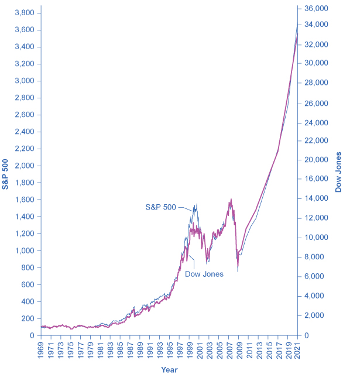

## 17.2 How Households Supply Financial Capital

### Learning Objectives

By the end of this section, you will be able to:

-   Show the relationship between savers, banks, and borrowers
-   Calculate bond yield
-   Contrast bonds, stocks, mutual funds, and assets
-   Explain the tradeoffs between return and risk

The ways in which firms would prefer to raise funds are only half the
story of financial markets. The other half is what those households and
individuals who supply funds desire, and how they perceive the available
choices. The focus of our discussion now shifts from firms on the demand
side of financial capital markets to households on the supply side of
those markets. We can divide the mechanisms for savings available to
households into several categories: deposits in bank accounts; bonds;
stocks; money market mutual funds; stock and bond mutual funds; and
housing and other tangible assets like owning gold. We need to analyze
each of these investments in terms of three factors: (1) the expected
rate of return it will pay; (2) the risk that the return will be much
lower or higher than expected; and (3) the investment\'s liquidity,
which refers to how easily one can exchange money or financial assets
for a good or service. We will do this analysis as we discuss each of
these investments in the sections below. First, however, we need to
understand the difference between expected rate of return, risk, and
actual rate of return.

### Expected Rate of Return, Risk, and Actual Rate of Return

The expected rate of return refers to how much a project or an
investment is expected to return to the investor, either in future
interest payments, capital gains, or increased profitability. It is
usually the average return over a period of time, usually in years or
even decades. We normally measure it as a percentage rate. Risk measures
the uncertainty of that project's profitability. There are several types
of risk, including default risk and interest rate risk. Default risk, as
its name suggests, is the risk that the borrower fails to pay back the
bond or loan. Interest rate risk is the danger that you might buy a long
term bond at a 6% interest rate right before market rates suddenly rise,
so had you waited, you could have received a similar bond that paid 9%.
A high-risk investment is one for which a wide range of potential
payoffs is reasonably probable. A low-risk investment may have actual
returns that are fairly close to its expected rate of return year after
year. A high-risk investment will have actual returns that are much
higher than the expected rate of return in some months or years and much
lower in other months or years. The actual rate of return refers to the
total rate of return, including capital gains and interest paid on an
investment at the end of a time period.

### Bank Accounts

An intermediary is one who stands between two other parties. For
example, a person who arranges a blind date between two other people is
one kind of intermediary. In financial capital markets, banks are an
example of a financial intermediary---that is, an institution that
operates between a saver who deposits funds in a bank and a borrower who
receives a loan from that bank. When a bank serves as a financial
intermediary, unlike the situation with a couple on a blind date, the
saver and the borrower never meet. In fact, it is not even possible to
make direct connections between those who deposit funds in banks and
those who borrow from banks, because all deposited funds end up in one
big pool, which the financial institution then lends out.

[Figure 17.3](#CNX_Econ_C17_001) illustrates the position of banks as a
financial intermediary, with a pattern of deposits flowing into a bank
and loans flowing out, and then repayment of the loans flowing back to
the bank, with interest payments for the original savers.

{width="4.88in" height="2.35in"}

Figure 17.3 Banks as Financial Intermediaries Banks are a financial
intermediary because they stand between savers and borrowers. Savers
place deposits with banks, and then receive interest payments and
withdraw money. Borrowers receive loans from banks, and repay the loans
with interest.

Banks offer a range of accounts to serve different needs. A checking
account typically pays little or no interest, but it facilitates
transactions by giving you easy access to your money, either by writing
a check or by using a debit card (that is, a card which works like a
credit card, except that purchases are immediately deducted from your
checking account rather than billed separately through a credit card
company). A savings account typically pays some interest rate, but
getting the money typically requires you to make a trip to the bank or
an automatic teller machine (or you can access the funds
electronically). The lines between checking and savings accounts have
blurred in the last couple of decades, as many banks offer checking
accounts that will pay an interest rate similar to a savings account if
you keep a certain minimum amount in the account, or conversely, offer
savings accounts that allow you to write at least a few checks per
month.

Another way to deposit savings at a bank is to use a certificate of
deposit (CD). With a CD, you agree to deposit a certain amount of money,
often measured in thousands of dollars, in the account for a stated
period of time, typically ranging from a few months to several years. In
exchange, the bank agrees to pay a higher interest rate than for a
regular savings account. While you can withdraw the money before the
allotted time, as the advertisements for CDs always warn, there is "a
substantial penalty for early withdrawal."

[Figure 17.4](#CNX_Econ_C17_007) shows the annual rate of interest paid
on a six-month, one-year, and five-year CD since 1984, as reported by
Bankrate.com. The interest rates that savings accounts pay are typically
a little lower than the CD rate, because financial investors need to
receive a slightly higher rate of interest as compensation for promising
to leave deposits untouched for a period of time in a CD, and thus
forfeiting some liquidity.

{width="4.883333333333334in"
height="2.658333333333333in"}

Figure 17.4 Interest Rates on Six-Month, One-Year, and Five-Year
Certificates of Deposit The interest rates on certificates of deposit
have fluctuated over time. The high interest rates of the early 1980s
are indicative of the relatively high inflation rate in the United
States at that time. Interest rates fluctuate with the business cycle,
typically increasing during expansions and decreasing during a
recession. Note the steep decline in CD rates since 2008, the beginning
of the Great Recession.

The great advantages of bank accounts are that financial investors have
very easy access to their money, and also money in bank accounts is
extremely safe. In part, this safety arises because a bank account
offers more security than keeping a few thousand dollars in the toe of a
sock in your underwear drawer. In addition, the Federal Deposit
Insurance Corporation (FDIC) protects the savings of the average person.
Every bank is required by law to pay a fee to the FDIC, based on the
size of its deposits. Then, if a bank should go bankrupt and not be able
to repay depositors, the FDIC guarantees that all customers will receive
their deposits back up to \$250,000.

The bottom line on bank accounts looks like this: low risk means low
rate of return but high liquidity.

### Bonds

An investor who buys a bond expects to receive a rate of return.
However, bonds vary in the rates of return that they offer, according to
the riskiness of the borrower. We always can divide an interest rate
into three components (as we explained in [Choice in a World of
Scarcity](http://openstax.org/books/principles-microeconomics-3e/pages/2-introduction-to-choice-in-a-world-of-scarcity)):
compensation for delaying consumption, an adjustment for an inflationary
rise in the overall level of prices, and a risk premium that takes the
borrower's riskiness into account.

The U.S. government is an extremely safe borrower, so when the U.S.
government issues Treasury bonds, it can pay a relatively low interest
rate. Firms that appear to be safe borrowers, perhaps because of their
sheer size or because they have consistently earned profits over time,
will pay a higher interest rate than the U.S. government. Firms that
appear to be riskier borrowers, perhaps because they are still growing
or their businesses appear shaky, will pay the highest interest rates
when they issue bonds. We call bonds that offer high interest rates to
compensate for their relatively high chance of default high-yield bonds
or junk bonds. A number of today's well-known firms issued junk bonds in
the 1980s when they were starting to grow, including Turner Broadcasting
and Microsoft.

### Link It Up {#link-it-up .Heading3Grey}

Visit this [website](http://openstax.org/l/bondsecurities) to read about
Treasury bonds.

A bond issued by the U.S. government or a large corporation may seem to
be relatively low risk: after all, the bond issuer has promised to make
certain payments over time, and except for rare bankruptcy cases, these
payments will occur. If a corporate bond issuer fails to make the
payments that it owes to its bondholders, the bondholders can require
that the company declare bankruptcy, sell off its assets, and pay them
as much as it can. Even in the case of junk bonds, a wise investor can
reduce the risk by purchasing bonds from a wide range of different
companies since, even if a few firms go broke and do not pay, they are
not all likely to go bankrupt.

As we noted before, bonds carry an interest rate risk. For example,
imagine you decide to buy a 10-year bond for \$1,000 that would pay an
annual interest rate of 8%. Soon after you buy the bond, interest rates
on bonds rise, so that now similar companies are paying an annual rate
of 12%. Anyone who buys a \$1,000 bond now can receive annual payments
of \$120 per year, but since your bond was issued at an interest rate of
8%, you have tied up \$1,000 and receive payments of only \$80 per year.
In the meaningful sense of opportunity cost, you are missing out on the
higher payments that you could have received. Furthermore, you can
calculate the amount you should be willing to pay now for future
payments. To place a present discounted value on a future payment,
decide what you would need in the present to equal a certain amount in
the future. This calculation will require an interest rate. For example,
if the interest rate is 25%, then a payment of \$125 a year from now
will have a present discounted value of \$100---that is, you could take
\$100 in the present and have \$125 in the future. (We discuss this
further in the appendix on [Present Discounted
Value](http://openstax.org/books/principles-microeconomics-3e/pages/c-present-discounted-value).)

In financial terms, a bond has several parts. A bond is basically an "I
owe you" note that an investor receives in exchange for capital (money).
The bond has a face value. This is the amount the borrower agrees to pay
the investor at maturity. The bond has a coupon rate or interest rate,
which is usually semi-annual, but can be paid at different times
throughout the year. (Bonds used to be paper documents with coupons that
investors clipped and turned in to the bank to receive interest.) The
bond has a maturity date when the borrower will pay back its face value
as well as its last interest payment. Combining the bond's face value,
interest rate, and maturity date, and market interest rates, allows a
buyer to compute a bond's present value, which is the most that a buyer
would be willing to pay for a given bond. This may or may not be the
same as the face value.

The bond yield measures the rate of return a bond is expected to pay
over time. Investors can buy bonds when they are issued and they can buy
and sell them during their lifetimes. When buying a bond that has been
around for a few years, investors should know that the interest rate
printed on a bond is often not the same as the bond yield, even on new
bonds. Read the next Work It Out feature to see how this happens.

### Work It Out {#work-it-out .Heading3Grey}

#### Calculating the Bond Yield {#calculating-the-bond-yield .Heading4Grey}

You have bought a \$1,000 bond whose coupon rate is 8%. To calculate
your return or yield, follow these steps:

1.  Assume the following:\
    Face value of a bond: \$1,000\
    Coupon rate: 8 %\
    Annual payment: \$80 per year
2.  Consider the risk of the bond. If this bond carries no risk, then it
    would be safe to assume that the bond will sell for \$1,000 when it
    is issued and pay the purchaser \$80 per year until its maturity, at
    which time the final interest payment will be made and the original
    \$1,000 will be repaid. Now, assume that over time the interest
    rates prevailing in the economy rise to 12% and that there is now
    only one year left to this bond's maturity. This makes the bond an
    unattractive investment, since an investor can find another bond
    that perhaps pays 12%. To induce the investor to buy the 8% bond,
    the bond seller will lower its price below its face value of
    \$1,000.
3.  Calculate the bond\'s price when its interest rate is less than the
    market interest rate. The expected payments from the bond one year
    from now are \$1,080, because in the bond's last year the bond\'s
    issuer will make the final interest payment and then also repay the
    original \$1,000. Given that interest rates are now 12%, you know
    that you could invest \$964 in an alternative investment and receive
    \$1,080 a year from now; that is, \$964(1 + 0.12) = \$1080.
    Therefore, you will not pay more than \$964 for the original \$1,000
    bond.
4.  Consider that the investor will receive the \$1,000 face value, plus
    \$80 for the last year's interest payment. The yield on the bond
    will be (\$1080 -- \$964)/\$964 = 12%. The yield, or total return,
    means interest payments, plus capital gains. Note that the interest
    or coupon rate of 8% did not change. When interest rates rise, bonds
    previously issued at lower interest rates will sell for less than
    face value. Conversely, when interest rates fall, bonds previously
    issued at higher interest rates will sell for more than face value.

[Figure 17.5](#CNX_Econ_C17_003) shows bond yield for two kinds of
bonds: 10-year Treasury bonds (which are officially called "notes") and
corporate bonds issued by firms that have been given an AAA rating as
relatively safe borrowers by Moody's, an independent firm that publishes
such ratings. Even though corporate bonds pay a higher interest rate,
because firms are riskier borrowers than the federal government, the
rates tend to rise and fall together. Treasury bonds typically pay more
than bank accounts, and corporate bonds typically pay a higher interest
rate than Treasury bonds.

{width="4.883333333333334in"
height="2.466666666666667in"}

Figure 17.5 Interest Rates for Corporate Bonds and Ten-Year U.S.
Treasury Bonds The interest rates for corporate bonds and U.S. Treasury
bonds (officially "notes") rise and fall together, depending on
conditions for borrowers and lenders in financial markets for borrowing.
The corporate bonds always pay a higher interest rate, to make up for
the higher risk they have of defaulting compared with the U.S.
government.

The bottom line for bonds: rate of return---low to moderate, depending
on the borrower\'s risk; risk---low to moderate, depending on whether
interest rates in the economy change substantially after the bond is
issued; liquidity---moderate, because the investor needs to sell the
bond before the investor regains the cash.

### Stocks

As we stated earlier, the rate of return on a financial investment in a
share of stock can come in two forms: as dividends paid by the firm and
as a capital gain achieved by selling the stock for more than you paid.
The range of possible returns from buying stock is mind-bending. Firms
can decide to pay dividends or not. A stock price can rise to a multiple
of its original price or sink all the way to zero. Even in short periods
of time, well-established companies can see large movements in their
stock prices. For example, on July 1, 2011, Netflix stock peaked at
\$295 per share; one year later, on July 30, 2012, it was at \$53.91 per
share; in 2022, it had recovered to \$199. When Facebook went public,
its shares of stock sold for around \$40 per share, but in 2022, they
were selling for slightly over \$212.

We will discuss the reasons why stock prices fall and rise so abruptly
below, but first you need to know how we measure stock market
performance. There are a number of different ways to measure the overall
performance of the stock market, based on averaging different subsets of
companies\' stock prices. Perhaps the best-known stock market measure is
the Dow Jones Industrial Average, which is based on 30 large U.S.
companies\' stock prices. Another stock market performance gauge, the
Standard & Poor's 500, follows the stock prices of the 500 largest U.S.
companies. The Wilshire 5000 tracks the stock prices of essentially all
U.S. companies that have stock the public can buy and sell.

Other stock market measures focus on where stocks are traded. For
example, the New York Stock Exchange monitors the performance of stocks
that are traded on that exchange in New York City. The Nasdaq stock
market includes about 3,600 stocks, with a concentration of technology
stocks. [Table 17.1](#ch17mod02_tab01) lists some of the most commonly
cited measures of U.S. and international stock markets.

Table 17.1 Some Stock Market Measures

The trend in the stock market is generally up over time, but with some
large dips along the way. [Figure 17.6](#CNX_Econ_C17_004) shows the
path of the Standard & Poor's 500 index (which is measured on the
left-hand vertical axis) and the Dow Jones Index (which is measured on
the right-hand vertical axis). Broad stock market measures, like the
ones we list here, tend to move together. The S&P 500 Index is the
weighted average market capitalization of the firms selected to be in
the index. The Dow Jones Industrial Average is the price weighted
average of 30 industrial stocks tracked on the New York Stock Exchange.

When the Dow Jones average rises from 5,000 to 10,000, you know that the
average price of the stocks in that index has roughly doubled. [Figure
17.6](#CNX_Econ_C17_004) shows that stock prices did not rise much in
the 1970s, but then started a steady climb in the 1980s. From 2000 to
2013, stock prices bounced up and down, but ended up at about the same
level.

{width="4.883333333333334in" height="5.425in"}

Figure 17.6 The Dow Jones Industrial Index and the Standard & Poor's
500, 1965--2021 Stock prices rose dramatically from the 1980s up to
about 2000. From 2000 to 2013, stock prices bounced up and down, but
ended up at about the same level. Since 2009, both indexes have for the
most part increased.

[Table 17.2](#ch17mod02_tab02) shows the total annual rate of return an
investor would have received from buying the stocks in the S&P 500 index
over recent decades. The total return here includes both dividends paid
by these companies and also capital gains arising from increases in the
stock value. (For technical reasons related to how we calculate the
numbers, the dividends and capital gains do not add exactly to the total
return.) From the 1950s to the 1980s, the average firm paid annual
dividends equal to about 4% of its stock value. Since the 1990s,
dividends have dropped and now often provide a return closer to 1% to
2%. In the 1960s and 1970s, the gap between percent earned on capital
gains and dividends was much closer than it has been since the 1980s. In
the 1980s and 1990s, capital gains were far higher than dividends. In
the 2000s, dividends remained low and, while stock prices fluctuated,
they ended the decade roughly where they had started. In the 2010s,
dividends remained low and stock prices increased, and this continued at
the beginning of the 2020s.

Table 17.2 Annual Returns on S&P 500 Stocks, 1950--2021

The overall pattern is that stocks as a group have provided a high rate
of return over extended periods of time, but this return comes with
risks. The market value of individual companies can rise and fall
substantially, both over short time periods and over the long run.
During extended periods of time like the 1970s or the first decade of
the 2000s, the overall stock market return can be quite modest. The
stock market can sometimes fall sharply, as it did in 2008.

The bottom line on investing in stocks is that the rate of return over
time will be high, but the risks are also high, especially in the short
run. Liquidity is also high since one can sell stock in publicly held
companies readily for spendable money.

### Mutual Funds

Buying stocks or bonds issued by a single company is always somewhat
risky. An individual firm may find itself buffeted by unfavorable supply
and demand conditions or hurt by unlucky or unwise managerial decisions.
Thus, a standard recommendation from financial investors is
diversification, which means buying stocks or bonds from a wide range of
companies. A saver who diversifies is following the old proverb: "Don't
put all your eggs in one basket." In any broad group of companies, some
firms will do better than expected and some will do worse---but the
diversification has a tendency to cancel out extreme increases and
decreases in value.

Purchasing a diversified group of stocks or bonds has become easier in
the internet age, but it remains something of a task. To simplify the
process, companies offer mutual funds, which consist of a variety of
stocks or bonds from different companies. The financial investor buys
mutual fund shares, and then receives a return based on how the fund as
a whole performs. In 2021, according to the Investment Company Factbook,
just over 47% of U.S. households had a financial investment in a mutual
fund---including many people who have their retirement savings or
pension money invested in this way.

Mutual funds can focus in certain areas: one mutual fund might invest
only in company stocks based in Indonesia, or only in bonds issued by
large manufacturing companies, or only in biotechnology companies\'
stock. At the other end of the spectrum, a mutual fund might be quite
broad. At the extreme, some mutual funds own a tiny share of every firm
in the stock market, and thus the mutual fund\'s value will fluctuate
with the overall stock market\'s average. We call a mutual fund that
seeks only to mimic the market\'s overall performance an index fund.

Diversification can offset some of the risks of individual stocks rising
or falling. Even investors who buy an indexed mutual fund designed to
mimic some measure of the broad stock market, like the Standard & Poor's
500, had better prepare against some ups and downs, like those the stock
market experienced in the first decade of the 2000s. In 2008 average
U.S. stock funds declined 38%, reducing individual and household wealth.
This steep drop in value hit hardest those who were close to retirement
and were counting on their stock funds to supplement retirement income.

The bottom line on investing in mutual funds is that the rate of return
over time will be high. The risks are also high, but the risks and
returns for an individual mutual fund will be lower than those for an
individual stock. As with stocks, liquidity is also high provided the
mutual fund or stock index fund is readily traded.

### Housing and Other Tangible Assets

Households can also seek a rate of return by purchasing tangible assets,
especially housing. About two-thirds of U.S. households own their own
home. An owner's equity in a house is the monetary value the owner would
have after selling the house and repaying any outstanding bank loans
they used to buy the house. For example, imagine that you buy a house
for \$200,000, paying 10% of the price as a down payment and taking out
a bank loan for the remaining \$180,000. Over time, you pay off some of
your bank loan, so that only \$100,000 remains, and the house\'s value
on the market rises to \$250,000. At that point, your equity in the home
is the value of the home minus the value of the loan outstanding, which
is \$150,000. For many middle-class Americans, home equity is their
single greatest financial asset. The total value of all home equity held
by U.S. households was \$23.6 trillion as of the middle of 2021,
according to Federal Reserve data.

Investment in a house is tangibly different from bank accounts, stocks,
and bonds because a house offers both a financial and a nonfinancial
return. If you buy a house to live in, part of the return on your
investment occurs from your consumption of "housing services"---that is,
having a place to live. (Of course, if you buy a home and rent it out,
you receive rental payments for the housing services you provide, which
would offer a financial return.) Buying a house to live in also offers
the possibility of a capital gain from selling the house in the future
for more than you paid for it. There can, however, be different
outcomes, as the Clear It Up on the housing market shows.

Housing prices have usually risen steadily over time. For example, the
median sales price for an existing one-family home was \$122,900 in
1990, but 232,000 at the end of December 2016, according to FRED^®^
Economic Data. Over these 24 years, home prices increased an average of
3.1% per year, which is an average financial return over this time.
[Figure 17.7](#CNX_Econ_C17_005) shows U.S. Census data for the average
sales price of a new home in the United States from 1965 to 2021.

### Link It Up {#link-it-up-1 .Heading3Grey}

Go to this [website](http://openstax.org/l/investopedia) to experiment
with a compound annual growth rate calculator.

However, the possible capital gains from rising housing prices are
riskier than these national price averages. Certain regions of the
country or metropolitan areas have seen drops in housing prices over
time. The median housing price for the United States as a whole fell
almost 7% in 2008 and again in 2009, dropping the median price from
\$247,900 to \$216,700. As of 2016, home values had recovered and even
exceeded their pre-recession levels, and they have continued to increase
into the early 2020s.

### Link It Up {#link-it-up-2 .Heading3Grey}

Visit this [website](http://openstax.org/l/insidejob) to watch the
trailer for *Inside Job*, a movie that explores the modern financial
crisis.

{width="4.875in" height="2.441666666666667in"}

Figure 17.7 The Median Average Sales Price for New Single-Family Homes,
1990--2015 The median price is the price where half of sales prices are
higher and half are lower. The median sales price for a new one-family
home was \$122,900 in 1990. It rose as high as \$248,000 in 2007, before
falling to \$232,000 in 2008. In 2015, the median sales price was
\$294,000. Of course, this national figure conceals many local
differences, like the areas where housing prices are higher or lower, or
how housing prices have risen or fallen at certain times. (Source: U.S.
Census)

Investors can also put money into other tangible assets such as gold,
silver, and other precious metals, or in duller commodities like sugar,
cocoa, coffee, orange juice, oil, and natural gas. The return on these
investments derives from the saver's hope of buying low, selling high,
and receiving a capital gain. Investing in, say, gold or coffee offers
relatively little in the way of nonfinancial benefits to the user
(unless the investor likes to caress gold or gaze upon a warehouse full
of coffee). Typically, investors in these commodities never even see the
physical good. Instead, they sign a contract that takes ownership of a
certain quantity of these commodities, which are stored in a warehouse,
and later they sell the ownership to someone else. As one example, from
1981 to 2005, the gold prices generally fluctuated between about \$300
and \$500 per ounce, but then rose sharply to over \$1,100 per ounce by
early 2010. In January 2017, prices were hovering around \$1,191 per
ounce, and they have since increased, reaching over \$1,900 by early
2022.

A final area of tangible assets consists of "collectibles" like
paintings, fine wine, jewelry, antiques, or even baseball cards. Most
collectibles provide returns both in the form of services or of a
potentially higher selling price in the future. You can use paintings by
hanging them on the wall; jewelry by wearing it; baseball cards by
displaying them. You can also hope to sell them someday for more than
you paid for them. However, the evidence on prices of collectibles,
while scanty, is that while they may go through periods where prices
skyrocket for a time, you should not expect to make a
higher-than-average rate of return over a sustained period of time from
investing in this way.

The bottom line on investing in tangible assets: rate of
return---moderate, especially if you can receive nonfinancial benefits
from, for example, living in the house; risk---moderate for housing or
high if you buy gold or baseball cards; liquidity---low, because it
often takes considerable time and energy to sell a house or a piece of
fine art and turn your capital gain into cash. The next Clear It Up
feature explains the issues in the recent U.S. housing market crisis.

### Clear It Up {#clear-it-up .Heading3Grey}

#### What was all the commotion in the recent U.S. housing market? {#what-was-all-the-commotion-in-the-recent-u.s.-housing-market .Heading4Grey}

The cumulative average annual growth rate in housing prices from 1981 to
2000 was 5.1%. The price of an average U.S. home then took off from 2003
to 2005, rising more than 10% per year. No serious analyst believed this
rate of growth was sustainable; after all, if housing prices grew at,
say, 11% per year over time, the average price of a home would more than
double every seven years. However, at the time many serious analysts saw
no reason for deep concern. After all, housing prices often change in
fits and starts, like all prices, and a price surge for a few years is
often followed by prices that are flat or even declining a bit as local
markets adjust.

The sharp rise in housing prices was driven by a high level of demand
for housing. Interest rates were low, so financial institutions
encouraged people to borrow money to buy a house. Banks became much more
flexible in their lending, making what were called "subprime" loans.
Banks loaned money with low, or sometimes no down payment. They offered
loans with very low payments for the first two years, but then much
higher payments after that. The idea was that housing prices would keep
rising, so the borrower would just refinance the mortgage two years in
the future, and thus would not ever have to make the higher payments.
Some banks even offered so-called NINJA loans, which meant a financial
institution issued a loan even though the borrower had no income, no
job, nor assets.

In retrospect, these loans seem outlandish. Many borrowers figured,
however, that as long as housing prices kept rising, it made sense to
buy. Many lenders used a process called "securitizing," in which they
sold their mortgages to financial companies, which put all the mortgages
into a big pool, creating large financial securities, and then re-sold
these mortgage-backed securities to investors. In this way, the lenders
off-loaded the mortgage risks to investors. Investors were interested in
mortgage-backed securities as they appeared to offer a steady stream of
income, provided the borrowers repaid them. Investors relied on the
ratings agencies to assess the credit risk associated with the
mortgage-backed securities. In hindsight, it appears that the credit
agencies were far too lenient in their ratings of many of the
securitized loans. Bank and financial regulators watched the steady rise
in the market for mortgage-backed securities, but saw no reason at the
time to intervene.

When housing prices turned down, many households that had borrowed when
prices were high found that what they owed the bank was more than what
their home was worth. Many banks believed that they had diversified by
selling their individual loans and instead buying securities based on
mortgage loans from all over the country. After all, banks thought back
in 2005, the average house price had not declined at any time since the
Great Depression in the 1930s. These securities based on mortgage loans,
however, turned out to be far riskier than expected. The bust in housing
prices weakened both bank and household finances, and thus helped bring
on the 2008--2009 Great Recession.

### The Tradeoffs between Return and Risk

The discussion of financial investments has emphasized the expected rate
of return, the risk, and the liquidity of each investment. [Table
17.3](#ch17mod02_tab03) summarizes these characteristics.

Table 17.3 Key Characteristics of Financial Investments

The household investment choices listed here display a tradeoff between
the expected return and the degree of risk involved. Bank accounts have
very low risk and very low returns; bonds have higher risk but higher
returns; and stocks are riskiest of all but have the potential for still
higher returns. In effect, the higher average return compensates for the
higher degree of risk. If risky assets like stocks did not also offer a
higher average return, then few investors would want them.

This tradeoff between return and risk complicates the task of any
financial investor: Is it better to invest safely or to take a risk and
go for the high return? Ultimately, choices about risk and return will
be based on personal preferences. However, it is often useful to examine
risk and return in the context of different time frames.

The high returns of stock market investments refer to a high average
return that we can expect over a period of several years or decades. The
high risk of such investments refers to the fact that in shorter time
frames, from months to a few years, the rate of return may fluctuate a
great deal. Thus, a person near retirement age, who already owns a
house, may prefer reduced risk and certainty about retirement income.
For young workers, just starting to make a reasonably profitable living,
it may make sense to put most of their savings for retirement in mutual
funds. Mutual funds are able to take advantage of their buying and
selling size and thereby reduce transaction costs for investors. Stocks
are risky in the short term, to be sure, but when the worker can look
forward to several decades during which stock market ups and downs can
even out, stocks will typically pay a much higher return over that
extended period than will bonds or bank accounts. Thus, one must
consider tradeoffs between risk and return in the context of where the
investor is in life.
