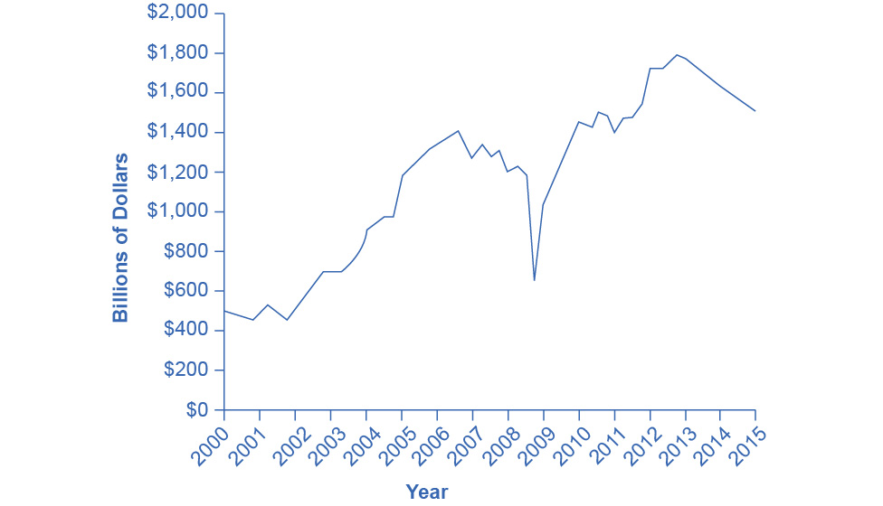

{width="6.5in" height="3.5833333333333335in"}

Figure 17.1 Building Home Equity Many people choose to purchase their
home rather than rent. This chapter explores how the global financial
crisis has influenced home ownership. (Credit: "red sold sign" by Diana
Parkhouse/Flickr Creative Commons, CC BY 2.0)

### Chapter Objectives {#chapter-objectives .Heading3Grey}

In this chapter, you will learn about:

-   How Businesses Raise Financial Capital
-   How Households Supply Financial Capital
-   How to Accumulate Personal Wealth

## Introduction to Financial Markets

### Bring It Home {#bring-it-home .Heading3Grey}

#### The Housing Bubble and the 2007 Financial Crisis {#the-housing-bubble-and-the-2007-financial-crisis .Heading4Grey}

In 2006, housing equity in the United States peaked at \$13 trillion.
That means that the market prices of homes, less what was still owed on
the loans they used to buy these houses, equaled \$13 trillion. This was
a very good number, since the equity represented the value of the
financial asset most U.S. citizens owned.

However, by 2008 this number declined to \$8.8 trillion, and it
plummeted further still in 2009. Combined with the decline in value of
other financial assets held by U.S. citizens, by 2010, U.S. homeowners'
wealth had shrunk \$14 trillion! This is a staggering result, and it
affected millions of lives: people had to alter their retirement,
housing, and other important consumption decisions. Just about every
other large economy in the world suffered a decline in the market value
of financial assets, as a result of the 2008-2009 global financial
crisis.

This chapter will explain why people purchase houses (other than as a
place to live), why they buy other types of financial assets, and why
businesses sell those financial assets in the first place. The chapter
will also give us insight into why financial markets and assets go
through boom and bust cycles like the one we described here.

When a firm needs to buy new equipment or build a new facility, it often
must go to the financial market to raise funds. Usually firms will add
capacity during an economic expansion when profits are on the rise and
consumer demand is high. Business investment is one of the critical
ingredients needed to sustain economic growth. Even in the sluggish 2009
economy, U.S. firms invested \$1.4 trillion in new equipment and
structures, in the hope that these investments would generate profits in
the years ahead.

Between the end of the recession in 2009 through the second quarter
2013, profits for the S&P 500 companies grew by 9.7% despite the weak
economy, with cost cutting and reductions in input costs driving much of
that amount, according to the *Wall Street Journal*. [Figure
17.2](#CNX_Econ_C17_006) shows corporate profits after taxes (adjusted
for inventory and capital consumption). Despite the steep decline in
quarterly net profit in 2008, profits have recovered and surpassed
pre-recession levels.

{width="4.88in" height="2.8in"}

Figure 17.2 Corporate Profits After Tax (Adjusted for Inventory and
Capital Consumption) Prior to 2008, corporate profits after tax more
often than not increased each year. There was a significant drop in
profits during 2008 and into 2009. The profit trend has since continued
to increase each year, though at a less steady or consistent rate.
(Source: Federal Reserve Economic Data (FRED)
https://research.stlouisfed.org/fred2/series/CPATAX)

Many firms, from huge companies like General Motors to startup firms
writing computer software, do not have the financial resources within
the firm to make all the desired investments. These firms need financial
capital from outside investors, and they are willing to pay interest for
the opportunity to obtain a rate of return on the investment of that
financial capital.

On the other side of the financial capital market, financial capital
suppliers, like households, wish to use their savings in a way that will
provide a return. Individuals cannot, however, take the few thousand
dollars that they save in any given year, write a letter to General
Motors or some other firm, and negotiate to invest their money with that
firm. Financial capital markets bridge this gap: that is, they find ways
to take the inflow of funds from many separate financial capital
suppliers and transform it into the funds of financial capital demanders
desire. Such financial markets include stocks, bonds, bank loans, and
other financial investments.

[Click to view
content](https://openstax.org/books/principles-microeconomics-3e/pages/17-introduction-to-financial-markets)

Corporate Profits After Tax (Adjusted for Inventory and Capital
Consumption)

### Link It Up {#link-it-up .Heading3Grey}

Visit this [website](http://openstax.org/l/marketoverview) to read more
about financial markets.

Our perspective then shifts to consider how these financial investments
appear to capital suppliers such as the households that are saving
funds. Households have a range of investment options: bank accounts,
certificates of deposit, money market mutual funds, bonds, stocks, stock
and bond mutual funds, housing, and even tangible assets like gold.
Finally, the chapter investigates two methods for becoming rich: a quick
and easy method that does not work very well at all, and a slow,
reliable method that can work very well over a lifetime.
