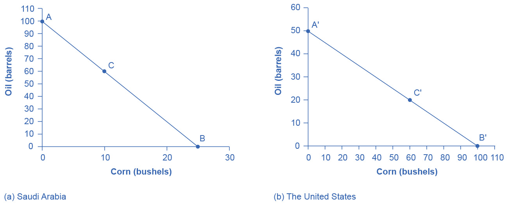

## 19.1 Absolute and Comparative Advantage

### Learning Objectives

By the end of this section, you will be able to:

-   Define absolute advantage, comparative advantage, and opportunity
    costs
-   Explain the gains of trade created when a country specializes

The American statesman Benjamin Franklin (1706--1790) once wrote: "No
nation was ever ruined by trade." Many economists would express their
attitudes toward international trade in an even more positive manner.
The evidence that international trade confers overall benefits on
economies is pretty strong. Trade has accompanied economic growth in the
United States and around the world. Many of the national economies that
have shown the most rapid growth in the last several decades---for
example, Japan, South Korea, China, and India---have done so by
dramatically orienting their economies toward international trade. There
is no modern example of a country that has shut itself off from world
trade and yet prospered. To understand the benefits of trade, or why we
trade in the first place, we need to understand the concepts of
comparative and absolute advantage.

In 1817, David Ricardo, a businessman, economist, and member of the
British Parliament, wrote a treatise called *On the Principles of
Political Economy and Taxation*. In this treatise, Ricardo argued that
specialization and free trade benefit all trading partners, even those
that may be relatively inefficient. To see what he meant, we must be
able to distinguish between absolute and comparative advantage.

A country has an absolute advantage over another country in producing a
good if it uses fewer resources to produce that good. Absolute advantage
can be the result of a country's natural endowment. For example,
extracting oil in Saudi Arabia is pretty much just a matter of "drilling
a hole." Producing oil in other countries can require considerable
exploration and costly technologies for drilling and extraction---if
they have any oil at all. The United States has some of the richest
farmland in the world, making it easier to grow corn and wheat than in
many other countries. Guatemala and Colombia have climates especially
suited for growing coffee. Chile and Zambia have some of the world's
richest copper mines. As some have argued, "geography is destiny." Chile
will provide copper and Guatemala will produce coffee, and they will
trade. When each country has a product others need and it can produce it
with fewer resources in one country than in another, then it is easy to
imagine all parties benefitting from trade. However, thinking about
trade just in terms of geography and absolute advantage is incomplete.
Trade really occurs because of comparative advantage.

Recall from the chapter [Choice in a World of
Scarcity](http://openstax.org/books/principles-microeconomics-3e/pages/2-introduction-to-choice-in-a-world-of-scarcity)
that a country has a comparative advantage when it can produce a good at
a lower cost in terms of other goods. The question each country or
company should be asking when it trades is this: "What do we give up to
produce this good?" It should be no surprise that the concept of
comparative advantage is based on this idea of opportunity cost from
[Choice in a World of
Scarcity](http://openstax.org/books/principles-microeconomics-3e/pages/2-introduction-to-choice-in-a-world-of-scarcity).
For example, if Zambia focuses its resources on producing copper, it
cannot use its labor, land and financial resources to produce other
goods such as corn. As a result, Zambia gives up the opportunity to
produce corn. How do we quantify the cost in terms of other goods?
Simplify the problem and assume that Zambia just needs labor to produce
copper and corn. The companies that produce either copper or corn tell
you that it takes two hours to mine a ton of copper and one hour to
harvest a bushel of corn. This means the opportunity cost of producing a
ton of copper is two bushels of corn. The next section develops absolute
and comparative advantage in greater detail and relates them to trade.

### Link It Up {#link-it-up .Heading3Grey}

Visit this [website](http://openstax.org/l/WTO) for a list of articles
and podcasts pertaining to international trade topics.

### A Numerical Example of Absolute and Comparative Advantage

Consider a hypothetical world with two countries, Saudi Arabia and the
United States, and two products, oil and corn. Further assume that
consumers in both countries desire both these goods. These goods are
homogeneous, meaning that consumers/producers cannot differentiate
between corn or oil from either country. There is only one resource
available in both countries, labor hours. Saudi Arabia can produce oil
with fewer resources, while the United States can produce corn with
fewer resources. [Table 19.1](#Table_33_01) illustrates the advantages
of the two countries, expressed in terms of how many hours it takes to
produce one unit of each good.

Table 19.1 How Many Hours It Takes to Produce Oil and Corn

In [Table 19.1](#Table_33_01), Saudi Arabia has an absolute advantage in
producing oil because it only takes an hour to produce a barrel of oil
compared to two hours in the United States. The United States has an
absolute advantage in producing corn.

To simplify, let's say that Saudi Arabia and the United States each have
100 worker hours (see [Table 19.2](#Table_33_02)). [Figure
19.2](#CNX_Econ_C33_010) illustrates what each country is capable of
producing on its own using a production possibility frontier (PPF)
graph. Recall from [Choice in a World of
Scarcity](http://openstax.org/books/principles-microeconomics-3e/pages/2-introduction-to-choice-in-a-world-of-scarcity)
that the production possibilities frontier shows the maximum amount that
each country can produce given its limited resources, in this case
workers, and its level of technology.

Table 19.2 Production Possibilities before Trade

{width="6.5in" height="2.625in"}

Figure 19.2 Production Possibilities Frontiers (a) Saudi Arabia can
produce 100 barrels of oil at maximum and zero corn (point A), or 25
bushels of corn and zero oil (point B). It can also produce other
combinations of oil and corn if it wants to consume both goods, such as
at point C. Here it chooses to produce/consume 60 barrels of oil,
leaving 40 work hours that to allocate to produce 10 bushels of corn,
using the data in [Table 19.1](#Table_33_01). (b) If the United States
produces only oil, it can produce, at maximum, 50 barrels and zero corn
(point A\'), or at the other extreme, it can produce a maximum of 100
bushels of corn and no oil (point B\'). Other combinations of both oil
and corn are possible, such as point C\'. All points above the frontiers
are impossible to produce given the current level of resources and
technology.

Arguably Saudi and U.S. consumers desire both oil and corn to live.
Let's say that before trade occurs, both countries produce and consume
at point C or C\'. Thus, before trade, the Saudi Arabian economy will
devote 60 worker hours to produce oil, as [Table 19.3](#Table_33_03)
shows. Given the information in [Table 19.1](#Table_33_01), this choice
implies that it produces/consumes 60 barrels of oil. With the remaining
40 worker hours, since it needs four hours to produce a bushel of corn,
it can produce only 10 bushels. To be at point C\', the U.S. economy
devotes 40 worker hours to produce 20 barrels of oil and it can allocate
the remaining worker hours to produce 60 bushels of corn.

Table 19.3 Production before Trade

The slope of the production possibility frontier illustrates the
opportunity cost of producing oil in terms of corn. Using all its
resources, the United States can produce 50 barrels of oil *or* 100
bushels of corn; therefore, the opportunity cost of one barrel of oil is
two bushels of corn---or the slope is 1/2. Thus, in the U.S. production
possibility frontier graph, every increase in oil production of one
barrel implies a decrease of two bushels of corn. Saudi Arabia can
produce 100 barrels of oil *or* 25 bushels of corn. The opportunity cost
of producing one barrel of oil is the loss of 1/4 of a bushel of corn
that Saudi workers could otherwise have produced. In terms of corn,
notice that Saudi Arabia gives up the least to produce a barrel of oil.
[Table 19.4](#Table_33_04) summarizes these calculations.

Table 19.4 Opportunity Cost and Comparative Advantage

Again recall that we defined comparative advantage as the opportunity
cost of producing goods. Since Saudi Arabia gives up the least to
produce a barrel of oil, ($\frac{\text{1}}{\text{4}}$ \< $\text{2}$ in
[Table 19.4](#Table_33_04)) it has a comparative advantage in oil
production. The United States gives up the least to produce a bushel of
corn, so it has a comparative advantage in corn production.

In this example, there is symmetry between absolute and comparative
advantage. Saudi Arabia needs fewer worker hours to produce oil
(absolute advantage, see [Table 19.1](#Table_33_01)), and also gives up
the least in terms of other goods to produce oil (comparative advantage,
see [Table 19.4](#Table_33_04)). Such symmetry is not always the case,
as we will show after we have discussed gains from trade fully, but
first, read the following Clear It Up feature to make sure you
understand why the PPF line in the graphs is straight.

### Clear It Up {#clear-it-up .Heading3Grey}

#### Can a production possibility frontier be straight? {#can-a-production-possibility-frontier-be-straight .Heading4Grey}

When you first met the production possibility frontier (PPF) in the
chapter on [Choice in a World of
Scarcity](http://openstax.org/books/principles-microeconomics-3e/pages/2-introduction-to-choice-in-a-world-of-scarcity)
we drew it with an outward-bending shape. This shape illustrated that as
we transferred inputs from producing one good to another---like from
education to health services---there were increasing opportunity costs.
In the examples in this chapter, we draw the PPFs as straight lines,
which means that opportunity costs are constant. When we transfer a
marginal unit of labor away from growing corn and toward producing oil,
the decline in the quantity of corn and the increase in the quantity of
oil is always the same. In reality this is possible only if the
contribution of additional workers to output did not change as the scale
of production changed. The linear production possibilities frontier is a
less realistic model, but a straight line simplifies calculations. It
also illustrates economic themes like absolute and comparative advantage
just as clearly.

### Gains from Trade

Consider the trading positions of the United States and Saudi Arabia
after they have specialized and traded. Before trade, Saudi Arabia
produces/consumes 60 barrels of oil and 10 bushels of corn. The United
States produces/consumes 20 barrels of oil and 60 bushels of corn. Given
their current production levels, if the United States can trade an
amount of corn fewer than 60 bushels and receive in exchange an amount
of oil greater than 20 barrels, it will gain from trade. With trade, the
United States can consume more of both goods than it did without
specialization and trade. (Recall that the chapter [Welcome to
Economics!](http://openstax.org/books/principles-microeconomics-3e/pages/1-introduction)
defined specialization as it applies to workers and firms. Economists
also use specialization to describe the occurrence when a country shifts
resources to focus on producing a good that offers comparative
advantage.) Similarly, if Saudi Arabia can trade an amount of oil less
than 60 barrels and receive in exchange an amount of corn greater than
10 bushels, it will have more of both goods than it did before
specialization and trade. [Table 19.5](#Table_33_05) illustrates the
range of trades that would benefit both sides.

Table 19.5 The Range of Trades That Benefit Both the United States and
Saudi Arabia

The underlying reason why trade benefits both sides is rooted in the
concept of opportunity cost, as the following Clear It Up feature
explains. If Saudi Arabia wishes to expand domestic production of corn
in a world without international trade, then based on its opportunity
costs it must give up four barrels of oil for every one additional
bushel of corn. If Saudi Arabia could find a way to give up less than
four barrels of oil for an additional bushel of corn (or equivalently,
to receive more than one bushel of corn for four barrels of oil), it
would be better off.

### Clear It Up {#clear-it-up-1 .Heading3Grey}

#### What are the opportunity costs and gains from trade? {#what-are-the-opportunity-costs-and-gains-from-trade .Heading4Grey}

The range of trades that will benefit each country is based on the
country's opportunity cost of producing each good. The United States can
produce 100 bushels of corn or 50 barrels of oil. For the United States,
the opportunity cost of producing one barrel of oil is two bushels of
corn. If we divide the numbers above by 50, we get the same ratio: one
barrel of oil is equivalent to two bushels of corn, or (100/50 = 2 and
50/50 = 1). In a trade with Saudi Arabia, if the United States is going
to give up 100 bushels of corn in exports, it must import at least 50
barrels of oil to be just as well off. Clearly, to gain from trade it
needs to be able to gain more than a half barrel of oil for its bushel
of corn---or why trade at all?

Recall that David Ricardo argued that if each country specializes in its
comparative advantage, it will benefit from trade, and total global
output will increase. How can we show gains from trade as a result of
comparative advantage and specialization? [Table 19.6](#Table_33_06)
shows the output assuming that each country specializes in its
comparative advantage and produces no other good. This is 100%
specialization. Specialization leads to an increase in total world
production. (Compare the total world production in [Table
19.3](#Table_33_03) to that in [Table 19.6](#Table_33_06).)

Table 19.6 How Specialization Expands Output

What if we did not have complete specialization, as in [Table
19.6](#Table_33_06)? Would there still be gains from trade? Consider
another example, such as when the United States and Saudi Arabia start
at C and C\', respectively, as [Figure 19.2](#CNX_Econ_C33_010) shows.
Consider what occurs when trade is allowed and the United States exports
20 bushels of corn to Saudi Arabia in exchange for 20 barrels of oil.

{width="4.875in" height="3.7399989063867016in"}

Figure 19.3 Production Possibilities Frontier in Saudi Arabia Trade
allows a country to go beyond its domestic production-possibility
frontier

Starting at point C, which shows Saudi oil production of 60, reduce
Saudi oil domestic oil consumption by 20, since 20 is exported to the
United States and exchanged for 20 units of corn. This enables Saudi to
reach point D, where oil consumption is now 40 barrels and corn
consumption has increased to 30 (see [Figure 19.3](#CNX_Econ_C33_011)).
Notice that even without 100% specialization, if the "trading price," in
this case 20 barrels of oil for 20 bushels of corn, is greater than the
country's opportunity cost, the Saudis will gain from trade. Since the
post-trade consumption point D is beyond its production possibility
frontier, Saudi Arabia has gained from trade.

### Link It Up {#link-it-up-1 .Heading3Grey}

Visit this [website](http://wits.worldbank.org/trade-visualization.aspx)
for trade-related data visualizations.
