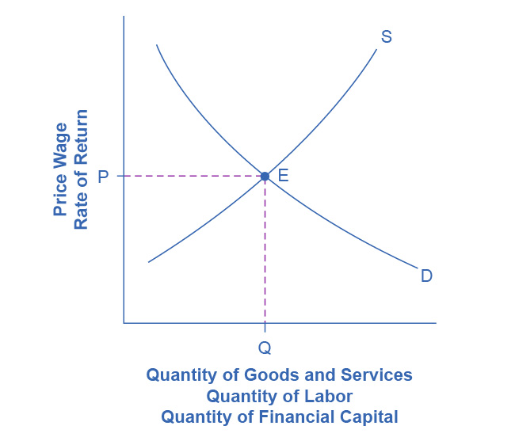
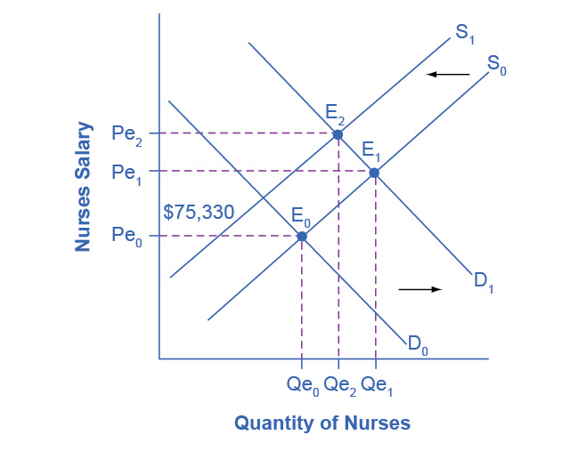

## 4.3 The Market System as an Efficient Mechanism for Information

### Learning Objectives

By the end of this section, you will be able to:

-   Apply demand and supply models to analyze prices and quantities
-   Explain the effects of price controls on the equilibrium of prices
    and quantities

Prices exist in markets for goods and services, for labor, and for
financial capital. In all of these markets, prices serve as a remarkable
social mechanism for collecting, combining, and transmitting information
that is relevant to the market---namely, the relationship between demand
and supply---and then serving as messengers to convey that information
to buyers and sellers. In a market-oriented economy, no government
agency or guiding intelligence oversees the set of responses and
interconnections that result from a change in price. Instead, each
consumer reacts according to that person's preferences and budget set,
and each profit-seeking producer reacts to the impact on its expected
profits. The following Clear It Up feature examines the demand and
supply models.

### Clear It Up {#clear-it-up .Heading3Grey}

#### Why are demand and supply curves important? {#why-are-demand-and-supply-curves-important .Heading4Grey}

The demand and supply model is the second fundamental diagram for this
course. (The opportunity set model that we introduced in the [Choice in
a World of
Scarcity](http://openstax.org/books/principles-microeconomics-3e/pages/2-introduction-to-choice-in-a-world-of-scarcity)
chapter was the first.) Just as it would be foolish to try to learn the
arithmetic of long division by memorizing every possible combination of
numbers that can be divided by each other, it would be foolish to try to
memorize every specific example of demand and supply in this chapter,
this textbook, or this course. Demand and supply is not primarily a list
of examples. It is a model to analyze prices and quantities. Even though
demand and supply diagrams have many labels, they are fundamentally the
same in their logic. Your goal should be to understand the underlying
model so you can use it to analyze *any* market.

[Figure 4.9](#CNX_Econ_C04_008) displays a generic demand and supply
curve. The horizontal axis shows the different measures of quantity: a
quantity of a good or service, or a quantity of labor for a given job,
or a quantity of financial capital. The vertical axis shows a measure of
price: the price of a good or service, the wage in the labor market, or
the rate of return (like the interest rate) in the financial market.

The demand and supply model can explain the existing levels of prices,
wages, and rates of return. To carry out such an analysis, think about
the quantity that will be demanded at each price and the quantity that
will be supplied at each price---that is, think about the shape of the
demand and supply curves---and how these forces will combine to produce
equilibrium.

We can also use demand and supply to explain how economic events will
cause changes in prices, wages, and rates of return. There are only four
possibilities: the change in any single event may cause the demand curve
to shift right or to shift left, or it may cause the supply curve to
shift right or to shift left. The key to analyzing the effect of an
economic event on equilibrium prices and quantities is to determine
which of these four possibilities occurred. The way to do this correctly
is to think back to the list of factors that shift the demand and supply
curves. Note that if more than one variable is changing at the same
time, the overall impact will depend on the degree of the shifts. When
there are multiple variables, economists isolate each change and analyze
it independently.

{width="3.25in" height="2.785in"}

Figure 4.9 Demand and Supply Curves The figure displays a generic demand
and supply curve. The horizontal axis shows the different measures of
quantity: a quantity of a good or service, a quantity of labor for a
given job, or a quantity of financial capital. The vertical axis shows a
measure of price: the price of a good or service, the wage in the labor
market, or the rate of return (like the interest rate) in the financial
market. We can use the demand and supply curves explain how economic
events will cause changes in prices, wages, and rates of return.

An increase in the price of some product signals consumers that there is
a shortage; therefore, they may want to economize on buying this
product. For example, if you are thinking about taking a plane trip to
Hawaii, but the ticket turns out to be expensive during the week you
intend to go, you might consider other weeks when the ticket might be
cheaper. The price could be high because you were planning to travel
during a holiday when demand for traveling is high. Maybe the cost of an
input like jet fuel increased or the airline has raised the price
temporarily to see how many people are willing to pay it. Perhaps all of
these factors are present at the same time. You do not need to analyze
the market and break down the price change into its underlying factors.
You just have to look at the ticket price and decide whether and when to
fly.

In the same way, price changes provide useful information to producers.
Imagine the situation of a farmer who grows oats and learns that the
price of oats has risen. The higher price could be due to an increase in
demand caused by a new scientific study proclaiming that eating oats is
especially healthful. Perhaps the price of a substitute grain, like
corn, has risen, and people have responded by buying more oats. The oat
farmer does not need to know the details. The farmer only needs to know
that the price of oats has risen and that it will be profitable to
expand production as a result.

The actions of individual consumers and producers as they react to
prices overlap and interlock in markets for goods, labor, and financial
capital. A change in any single market is transmitted through these
multiple interconnections to other markets. The vision of the role of
flexible prices helping markets to reach equilibrium and linking
different markets together helps to explain why price controls can be so
counterproductive. Price controls are government laws that serve to
regulate prices rather than allow the various markets to determine
prices. There is an old proverb: "Don't kill the messenger." In ancient
times, messengers carried information between distant cities and
kingdoms. When they brought bad news, there was an emotional impulse to
kill the messenger. However, killing the messenger did not kill the bad
news. Moreover, killing the messenger had an undesirable side effect:
Other messengers would refuse to bring news to that city or kingdom,
depriving its citizens of vital information.

Those who seek price controls are trying to kill the messenger---or at
least to stifle an unwelcome message that prices are bringing about the
equilibrium level of price and quantity. However, price controls do
nothing to affect the underlying forces of demand and supply, and this
can have serious repercussions. During China's "Great Leap Forward" in
the late 1950s, the government kept food prices artificially low, with
the result that 30 to 40 million people died of starvation because the
low prices depressed farm production. This was communist party leader
Mao Zedong\'s social and economic campaign to rapidly transform the
country from an agrarian economy to a socialist society through rapid
industrialization and collectivization. Changes in demand and supply
will continue to reveal themselves through consumers' and producers'
behavior. Immobilizing the price messenger through price controls will
deprive everyone in the economy of critical information. Without this
information, it becomes difficult for everyone---buyers and sellers
alike---to react in a flexible and appropriate manner as changes occur
throughout the economy.

### Bring It Home {#bring-it-home .Heading3Grey}

#### Baby Boomers Come of Age {#baby-boomers-come-of-age .Heading4Grey}

The theory of supply and demand can explain what happens in the labor
markets and suggests that the demand for nurses will increase as
healthcare needs of baby boomers increase, as [Figure
4.10](#CNX_Econ_C04_015) shows. The impact of that increase will result
in an average salary higher than the \$75,330 earned in 2020 referenced
in the first part of this case. The new equilibrium (E~1~) will be at
the new equilibrium price (Pe~1~).Equilibrium quantity will also
increase from Qe~0~ to Qe~1~.

{width="3.25in" height="2.535in"}

Figure 4.10 Impact of Increasing Demand for Nurses 2020--2030 In 2020,
the median salary for nurses was \$75,330. As demand for services
increases, the demand curve shifts to the right (from D~0~ to D~1~) and
the equilibrium quantity of nurses increases from Qe~0~ to Qe~1~. The
equilibrium salary increases from Pe~0~ to Pe~1~.

Suppose that as the demand for nurses increases, the supply shrinks due
to an increasing number of nurses entering retirement and increases in
the tuition of nursing degrees. The leftward shift of the supply curve
in [Figure 4.11](#CNX_Econ_C04_016) captures the impact of a decreasing
supply of nurses. The shifts in the two curves result in higher salaries
for nurses, but the overall impact on the quantity of nurses is
uncertain, as it depends on the relative shifts of supply and demand.

{width="3.25in" height="2.535in"}

Figure 4.11 Impact of Decreasing Supply of Nurses between 2020 and 2030
The increase in demand for nurses shown in Figure 4.10 leads to both
higher prices and higher quantities demanded. As nurses retire from the
work force, the supply of nurses decreases, causing a leftward shift in
the supply curve and higher salaries for nurses at Pe~2~. The net effect
on the equilibrium quantity of nurses is uncertain, which in this
representation is less than Qe~1~, but more than the initial Qe~0~.

While we do not know if the number of nurses will increase or decrease
relative to their initial employment, we know they will have higher
salaries.
