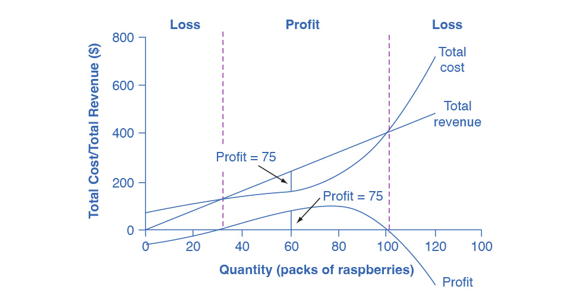

## 8.2 How Perfectly Competitive Firms Make Output Decisions

### Learning Objectives

By the end of this section, you will be able to:

-   Calculate profits by comparing total revenue and total cost
-   Identify profits and losses with the average cost curve
-   Explain the shutdown point
-   Determine the price at which a firm should continue producing in the
    short run

A perfectly competitive firm has only one major decision to
make---namely, what quantity to produce. To understand this, consider a
different way of writing out the basic definition of profit:

{width="5.15625in"
height="0.3958333333333333in"}

Since a perfectly competitive firm must accept the price for its output
as determined by the product's market demand and supply, it cannot
choose the price it charges. This is already determined in the profit
equation, and so the perfectly competitive firm can sell any number of
units at exactly the same price. It implies that the firm faces a
perfectly elastic demand curve for its product: buyers are willing to
buy any number of units of output from the firm at the market price.
When the perfectly competitive firm chooses what quantity to produce,
then this quantity---along with the prices prevailing in the market for
output and inputs---will determine the firm's total revenue, total
costs, and ultimately, level of profits.

### Determining the Highest Profit by Comparing Total Revenue and Total Cost

A perfectly competitive firm can sell as large a quantity as it wishes,
as long as it accepts the prevailing market price. The formula above
shows that total revenue depends on the quantity sold and the price
charged. If the firm sells a higher quantity of output, then total
revenue will increase. If the market price of the product increases,
then total revenue also increases whatever the quantity of output sold.
As an example of how a perfectly competitive firm decides what quantity
to produce, consider the case of a small farmer who produces raspberries
and sells them frozen for \$4 per pack. Sales of one pack of raspberries
will bring in \$4, two packs will be \$8, three packs will be \$12, and
so on. If, for example, the price of frozen raspberries doubles to \$8
per pack, then sales of one pack of raspberries will be \$8, two packs
will be \$16, three packs will be \$24, and so on.

[Table 8.1](#ch08mod02_tab01) shows total revenue and total costs for
the raspberry farm; these data also appear in [Figure
8.2](#CNX_Econ_C08_001). The horizontal axis shows the quantity of
frozen raspberries produced in packs. The vertical axis shows both total
revenue and total costs, measured in dollars. The total cost curve
intersects with the vertical axis at a value that shows the level of
fixed costs, and then slopes upward. All these cost curves follow the
same characteristics as the curves that we covered in the [Production,
Costs and Industry
Structure](http://openstax.org/books/principles-microeconomics-3e/pages/7-introduction-to-production-costs-and-industry-structure)
chapter.

{width="4.88in" height="2.435in"}

Figure 8.2 Total Cost and Total Revenue at the Raspberry Farm Total
revenue for a perfectly competitive firm is a straight line sloping up.
The slope is equal to the price of the good. Total cost also slopes up,
but with some curvature. At higher levels of output, total cost begins
to slope upward more steeply because of diminishing marginal returns.
The maximum profit will occur at the quantity where the difference
between total revenue and total cost is largest.

  -----------------------------------------------------------------------
  Quantity\         Total Cost\       Total Revenue\    Profit
  (Q)               (TC)              (TR)              
  ----------------- ----------------- ----------------- -----------------
  0                 \$62              \$0               −\$62

  10                \$90              \$40              −\$50

  20                \$110             \$80              −\$30

  30                \$126             \$120             −\$6

  40                \$138             \$160             \$22

  50                \$150             \$200             \$50

  60                \$165             \$240             \$75

  70                \$190             \$280             \$90

  80                \$230             \$320             \$90

  90                \$296             \$360             \$64

  100               \$400             \$400             \$0

  110               \$550             \$440             \$−110

  120               \$715             \$480             \$−235
  -----------------------------------------------------------------------

Table 8.1 Total Cost and Total Revenue at the Raspberry Farm

Based on its total revenue and total cost curves, a perfectly
competitive firm like the raspberry farm can calculate the quantity of
output that will provide the highest level of profit. At any given
quantity, total revenue minus total cost will equal profit. One way to
determine the most profitable quantity to produce is to see at what
quantity total revenue exceeds total cost by the largest amount. [Figure
8.2](#CNX_Econ_C08_001) shows total revenue, total cost and profit using
the data from [Table 8.1](#ch08mod02_tab01). The vertical gap between
total revenue and total cost is profit, for example, at Q = 60, TR = 240
and TC = 165. The difference is 75, which is the height of the profit
curve at that output level. The firm doesn't make a profit at every
level of output. In this example, total costs will exceed total revenues
at output levels from 0 to approximately 30, and so over this range of
output, the firm will be making losses. At output levels from 40 to 100,
total revenues exceed total costs, so the firm is earning profits.
However, at any output greater than 100, total costs again exceed total
revenues and the firm is making increasing losses. Total profits appear
in the final column of [Table 8.1](#ch08mod02_tab01). Maximum profit
occurs at an output between 70 and 80, when profit equals \$90.

A higher price would mean that total revenue would be higher for every
quantity sold. A lower price would mean that total revenue would be
lower for every quantity sold. What happens if the price drops low
enough so that the total revenue line is completely below the total cost
curve; that is, at every level of output, total costs are higher than
total revenues? In this instance, the best the firm can do is to suffer
losses. However, a profit-maximizing firm will prefer the quantity of
output where total revenues come closest to total costs and thus where
the losses are smallest.

(Later we will see that sometimes it will make sense for the firm to
close, rather than stay in operation producing output.)

### Comparing Marginal Revenue and Marginal Costs

The approach that we described in the previous section, using total
revenue and total cost, is not the only approach to determining the
profit maximizing level of output. In this section, we provide an
alternative approach which uses marginal revenue and marginal cost.

Firms often do not have the necessary data they need to draw a complete
total cost curve for all levels of production. They cannot be sure of
what total costs would look like if they, say, doubled production or cut
production in half, because they have not tried it. Instead, firms
experiment. They produce a slightly greater or lower quantity and
observe how it affects profits. In economic terms, this practical
approach to maximizing profits means examining how changes in production
affect marginal revenue and marginal cost.

[Figure 8.3](#CNX_Econ_C08_002) presents the marginal revenue and
marginal cost curves based on the total revenue and total cost in [Table
8.1](#ch08mod02_tab01). The marginal revenue curve shows the additional
revenue gained from selling one more unit. As mentioned before, a firm
in perfect competition faces a perfectly elastic demand curve for its
product---that is, the firm's demand curve is a horizontal line drawn at
the market price level. This also means that the firm's marginal revenue
curve is the same as the firm's demand curve: Every time a consumer
demands one more unit, the firm sells one more unit and revenue
increases by exactly the same amount equal to the market price. In this
example, every time the firm sells a pack of frozen raspberries, the
firm's revenue increases by \$4. [Table 8.2](#ch08mod02_tab02) shows an
example of this. This condition only holds for price taking firms in
perfect competition where:

$\text{marginal~revenue~=~price}$

The formula for marginal revenue is:

$\text{marginal~revenue~=~}\frac{\text{change~in~total~revenue}}{\text{change~in~quantity}}$

Table 8.2

Notice that marginal revenue does not change as the firm produces more
output. That is because under perfect competition, the price is
determined through the interaction of supply and demand in the market
and does not change as the farmer produces more (keeping in mind that,
due to the relative small size of each firm, increasing their supply has
no impact on the total market supply where price is determined).

Since a perfectly competitive firm is a price taker, it can sell
whatever quantity it wishes at the market-determined price. We calculate
marginal cost, the cost per additional unit sold, by dividing the change
in total cost by the change in quantity. The formula for marginal cost
is:

$\text{marginal~cost~=~}\frac{\text{change~in~total~cost}}{\text{change~in~quantity}}$

Ordinarily, marginal cost changes as the firm produces a greater
quantity.

In the raspberry farm example, in [Figure 8.3](#CNX_Econ_C08_002) and
[Table 8.3](#ch08mod02_tab03), marginal cost at first declines as
production increases from 10 to 20 to 30 to 40 packs of
raspberries---which represents the area of increasing marginal returns
that is not uncommon at low levels of production. At some point, though,
marginal costs start to increase, displaying the typical pattern of
diminishing marginal returns. If the firm is producing at a quantity
where MR \> MC, like 40 or 50 packs of raspberries, then it can increase
profit by increasing output because the marginal revenue is exceeding
the marginal cost. If the firm is producing at a quantity where MC \>
MR, like 90 or 100 packs, then it can increase profit by reducing output
because the reductions in marginal cost will exceed the reductions in
marginal revenue. The firm's profit-maximizing choice of output will
occur where MR = MC (or at a choice close to that point).

{width="4.88in" height="2.605in"}

Figure 8.3 Marginal Revenues and Marginal Costs at the Raspberry Farm:
Individual Farmer For a perfectly competitive firm, the marginal revenue
(MR) curve is a horizontal line because it is equal to the price of the
good, which is determined by the market, as [Figure
8.4](#CNX_Econ_C08_015) illustrates. The marginal cost (MC) curve is
sometimes initially downward-sloping, if there is a region of increasing
marginal returns at low levels of output, but is eventually
upward-sloping at higher levels of output as diminishing marginal
returns kick in.

{width="4.88in" height="2.655in"}

Figure 8.4 Supply, Demand, and Equilibrium Price in the Market for
Raspberries The equilibrium price of raspberries is determined through
the interaction of market supply and market demand at \$4.00.

Table 8.3 Marginal Revenues and Marginal Costs at the Raspberry Farm

In this example, the marginal revenue and marginal cost curves cross at
a price of \$4 and a quantity of 80 produced. If the farmer started out
producing at a level of 60, and then experimented with increasing
production to 70, marginal revenues from the increase in production
would exceed marginal costs---and so profits would rise. The farmer has
an incentive to keep producing. At a level of output of 80, marginal
cost and marginal revenue are equal so profit doesn't change. If the
farmer then experimented further with increasing production from 80 to
90, he would find that marginal costs from the increase in production
are greater than marginal revenues, and so profits would decline.

The profit-maximizing choice for a perfectly competitive firm will occur
at the level of output where marginal revenue is equal to marginal
cost---that is, where MR = MC. This occurs at Q = 80 in the figure.

### Work It Out {#work-it-out .Heading3Grey}

#### Does Profit Maximization Occur at a Range of Output or a Specific Level of Output?  {#does-profit-maximization-occur-at-a-range-of-output-or-a-specific-level-of-output .Heading4Grey}

[Table 8.1](#ch08mod02_tab01) shows that maximum profit occurs at any
output level between 70 and 80 units of output. But MR = MC occurs only
at 80 units of output. How can we explain this slight discrepancy? As
long as MR \> MC, a profit-seeking firm should keep expanding
production. Expanding production into the zone where MR \< MC reduces
economic profits. It's true that profit is the same at Q = 70 and Q =
80, but it's only when the firm goes beyond that Q that it will see that
profits fall. Thus, MR = MC is the signal to stop expanding, so that is
the level of output they should target.

Because the marginal revenue received by a perfectly competitive firm is
equal to the price P, we can also write the profit-maximizing rule for a
perfectly competitive firm as a recommendation to produce at the
quantity of output where P = MC.

### Profits and Losses with the Average Cost Curve

Does maximizing profit (producing where MR = MC) imply an actual
economic profit? The answer depends on the relationship between price
and average total cost, which is the average profit or profit margin. If
the market price is higher than the firm\'s average cost of production
for that quantity produced, then the profit margin is positive and the
firm will earn profits. Conversely, if the market price is lower than
the average cost of production, the profit margin is negative and the
firm will suffer losses. You might think that, in this situation, the
firm may want to shut down immediately. Remember, however, that the firm
has already paid for fixed costs, such as equipment, so it may continue
to produce for a while and incur a loss. [Table 8.3](#ch08mod02_tab03)
continues the raspberry farm example. [Figure 8.5](#CNX_Econ_C08_014)
illustrates the three possible scenarios: (a) where price intersects
marginal cost at a level above the average cost curve, (b) where price
intersects marginal cost at a level equal to the average cost curve, and
(c) where price intersects marginal cost at a level below the average
cost curve.

{width="6.5in" height="5.935in"}

Figure 8.5 Price and Average Cost at the Raspberry Farm In (a), price
intersects marginal cost above the average cost curve. Since price is
greater than average cost, the firm is making a profit. In (b), price
intersects marginal cost at the minimum point of the average cost curve.
Since price is equal to average cost, the firm is breaking even. In (c),
price intersects marginal cost below the average cost curve. Since price
is less than average cost, the firm is making a loss.

First consider a situation where the price is equal to \$5 for a pack of
frozen raspberries. The rule for a profit-maximizing perfectly
competitive firm is to produce the level of output where Price= MR = MC,
so the raspberry farmer will produce a quantity of approximately 85,
which is labeled as E\' in [Figure 8.5](#CNX_Econ_C08_014) (a). Remember
that the area of a rectangle is equal to its base multiplied by its
height. The farm's total revenue at this price will be shown by the
rectangle from the origin over to a quantity of 85 packs (the base) up
to point E\' (the height), over to the price of \$5, and back to the
origin. The average cost of producing 80 packs is shown by point C or
about \$3.50. Total costs will be the quantity of 85 times the average
cost of \$3.50, which is shown by the area of the rectangle from the
origin to a quantity of 90, up to point C, over to the vertical axis and
down to the origin. The difference between total revenues and total
costs is profits. Thus, profits will be the blue shaded rectangle on
top.

We calculate this as:

{width="2.5208333333333335in"
height="0.6145833333333334in"}

Or, we can calculate it as:

{width="3.0in" height="0.6145833333333334in"}

Now consider [Figure 8.5](#CNX_Econ_C08_014) (b), where the price has
fallen to \$2.75 for a pack of frozen raspberries. Again, the perfectly
competitive firm will choose the level of output where Price = MR = MC,
but in this case, the quantity produced will be 75. At this price and
output level, where the marginal cost curve is crossing the average cost
curve, the price the firm receives is exactly equal to its average cost
of production. We call this the break even point.

The farm's total revenue at this price will be shown by the large shaded
rectangle from the origin over to a quantity of 75 packs (the base) up
to point E (the height), over to the price of \$2.75, and back to the
origin. The height of the average cost curve at Q = 75, i.e. point E,
shows the average cost of producing this quantity. Total costs will be
the quantity of 75 times the average cost of \$2.75, which is shown by
the area of the rectangle from the origin to a quantity of 75, up to
point E, over to the vertical axis and down to the origin. It should be
clear that the rectangles for total revenue and total cost are the same.
Thus, the firm is making zero profit. The calculations are as follows:

{width="2.4375in"
height="0.6145833333333334in"}

Or, we can calculate it as:

{width="2.9791666666666665in"
height="0.6145833333333334in"}

In [Figure 8.5](#CNX_Econ_C08_014) (c), the market price has fallen
still further to \$2.00 for a pack of frozen raspberries. At this price,
marginal revenue intersects marginal cost at a quantity of 65. The
farm's total revenue at this price will be shown by the large shaded
rectangle from the origin over to a quantity of 65 packs (the base) up
to point E" (the height), over to the price of \$2, and back to the
origin. The average cost of producing 65 packs is shown by Point C" or
shows the average cost of producing 50 packs is about \$2.73. Total
costs will be the quantity of 65 times the average cost of \$2.73, which
the area of the rectangle from the origin to a quantity of 50, up to
point C", over to the vertical axis and down to the origin shows. It
should be clear from examining the two rectangles that total revenue is
less than total cost. Thus, the firm is losing money and the loss (or
negative profit) will be the rose-shaded rectangle.

The calculations are:

{width="2.6041666666666665in"
height="0.6145833333333334in"}

Or:

{width="3.0in" height="0.6145833333333334in"}

If the market price that perfectly competitive firm receives leads it to
produce at a quantity where the price is greater than average cost, the
firm will earn profits. If the price the firm receives causes it to
produce at a quantity where price equals average cost, which occurs at
the minimum point of the AC curve, then the firm earns zero profits.
Finally, if the price the firm receives leads it to produce at a
quantity where the price is less than average cost, the firm will earn
losses. [Table 8.4](#ch08mod02_tab04) summarizes this.

Table 8.4

### Clear It Up {#clear-it-up .Heading3Grey}

#### Which intersection should a firm choose? {#which-intersection-should-a-firm-choose .Heading4Grey}

At a price of \$2, MR intersects MC at two points: Q = 20 and Q = 65. It
never makes sense for a firm to choose a level of output on the downward
sloping part of the MC curve, because the profit is lower (the loss is
bigger). Thus, the correct choice of output is Q = 65.

### The Shutdown Point

The possibility that a firm may earn losses raises a question: Why can
the firm not avoid losses by shutting down and not producing at all? The
answer is that shutting down can reduce variable costs to zero, but in
the short run, the firm has already paid for fixed costs. As a result,
if the firm produces a quantity of zero, it would still make losses
because it would still need to pay for its fixed costs. Therefore when a
firm is experiencing losses, it must face a question: should it continue
producing or should it shut down?

As an example, consider the situation of the Yoga Center, which has
signed a contract to rent space that costs \$10,000 per month. If the
firm decides to operate, its marginal costs for hiring yoga teachers is
\$15,000 for the month. If the firm shuts down, it must still pay the
rent, but it would not need to hire labor. [Table 8.5](#ch08mod02_tab05)
shows three possible scenarios. In the first scenario, the Yoga Center
does not have any clients, and therefore does not make any revenues, in
which case it faces losses of \$10,000 equal to the fixed costs. In the
second scenario, the Yoga Center has clients that earn the center
revenues of \$10,000 for the month, but ultimately experiences losses of
\$15,000 due to having to hire yoga instructors to cover the classes. In
the third scenario, the Yoga Center earns revenues of \$20,000 for the
month, but experiences losses of \$5,000.

In all three cases, the Yoga Center loses money. In all three cases,
when the rental contract expires in the long run, assuming revenues do
not improve, the firm should exit this business. In the short run,
though, the decision varies depending on the level of losses and whether
the firm can cover its variable costs. In scenario 1, the center does
not have any revenues, so hiring yoga teachers would increase variable
costs and losses, so it should shut down and only incur its fixed costs.
In scenario 2, the center's losses are greater because it does not make
enough revenue to offset the increased variable costs, so it should shut
down immediately and only incur its fixed costs. If price is below the
minimum average variable cost, the firm must shut down. In contrast, in
scenario 3 the revenue that the center can earn is high enough that the
losses diminish when it remains open, so the center should remain open
in the short run.

  -----------------------------------------------------------------------
  **Scenario 1**

  If the center shuts down now, revenues are zero but it will not incur
  any variable costs and would only need to pay fixed costs of \$10,000.

  {width="3.5208333333333335in"
  height="0.6145833333333334in"}

  **Scenario 2**

  The center earns revenues of \$10,000, and variable costs are \$15,000.
  The center should shut down now.

  {width="3.625in"
  height="0.6145833333333334in"}

  **Scenario 3**

  The center earns revenues of \$20,000, and variable costs are \$15,000.
  The center should continue in business.

  {width="3.625in"
  height="0.6145833333333334in"}
  -----------------------------------------------------------------------

Table 8.5 Should the Yoga Center Shut Down Now or Later?

[Figure 8.6](#CNX_Econ_C08_012) illustrates the lesson that remaining
open requires the price to exceed the firm's average variable cost. When
the firm is operating below the break-even point, where price equals
average cost, it is operating at a loss so it faces two options:
continue to produce and lose money or shutdown. Which option is
preferable? The one that loses the least money is the best choice.

At a price of \$2.00 per pack, as Figure 8.6 (a) illustrates, if the
farm stays in operation it will produce at a level of 65 packs of
raspberries, and it will make losses of \$47.45 (as explained earlier).
The alternative would be to shut down and lose all the fixed costs of
\$62.00. Since losing \$47.45 is preferable to losing \$62.00, the
profit maximizing (or in this case the loss minimizing) choice is to
stay in operation. The key reason is because price is above average
variable cost. This means that at the current price the farm can pay all
its variable costs, and have some revenue left over to pay some of the
fixed costs. So the loss represents the part of the fixed costs the farm
can't pay, which is less than the entire fixed costs. However, if the
price declined to \$1.50 per pack, as [Figure 8.6](#CNX_Econ_C08_012)
(b) shows, and if the firm applied its rule of producing where P = MR =
MC, it would produce a quantity of 60. This price is below average
variable cost for this level of output. If the farmer cannot pay workers
(the variable costs), then it has to shut down. At this price and
output, total revenues would be \$90 (quantity of 60 times price of
\$1.50) and total cost would be \$165, for overall losses of \$75. If
the farm shuts down, it must pay only its fixed costs of \$62, so
shutting down is preferable to selling at a price of \$1.50 per pack.

{width="6.5in" height="2.73in"}

Figure 8.6 The Shutdown Point for the Raspberry Farm In (a), the farm
produces at a level of 65. It is making losses of \$47.50, but price is
above average variable cost, so it continues to operate. In (b), total
revenues are \$90 and total cost is \$165, for overall losses of \$75.
If the farm shuts down, it must pay only its fixed costs of \$62.
Shutting down is preferable to selling at a price of \$1.50 per pack.

Looking at [Table 8.6](#ch08mod02_tab06), if the price falls below about
\$1.72, the minimum average variable cost, the firm must shut down.

  -----------------------------------------------------------------------
  Quantity\         Average Variable  Average Cost\     Marginal Cost\
  Q                 Cost\             AC                MC
                    AVC                                 
  ----------------- ----------------- ----------------- -----------------
  0                 \-                \-                \-

  10                \$2.80            \$9.00            \$2.80

  20                \$2.40            \$5.50            \$2.00

  30                \$2.13            \$4.20            \$1.60

  40                \$1.90            \$3.45            \$1.20

  50                \$1.76            \$3.00            \$1.20

  60                \$1.72            \$2.75            \$1.50

  70                \$1.83            \$2.71            \$2.50

  80                \$2.10            \$2.88            \$4.00

  90                \$2.60            \$3.29            \$6.60

  100               \$3.38            \$4.00            \$10.40

  110               \$4.44            \$5.00            \$15.00

  120               \$5.44            \$5.96            \$31.50
  -----------------------------------------------------------------------

Table 8.6 Cost of Production for the Raspberry Farm

The intersection of the average variable cost curve and the marginal
cost curve, which shows the price below which the firm would lack enough
revenue to cover its variable costs, is called the **shutdown point**.
If the perfectly competitive firm faces a market price above the
shutdown point, then the firm is at least covering its average variable
costs. At a price above the shutdown point, the firm is also making
enough revenue to cover at least a portion of fixed costs, so it should
limp ahead even if it is making losses in the short run, since at least
those losses will be smaller than if the firm shuts down immediately and
incurs a loss equal to total fixed costs. However, if the firm is
receiving a price below the price at the shutdown point, then the firm
is not even covering its variable costs. In this case, staying open is
making the firm's losses larger, and it should shut down immediately. To
summarize, if:

-   price \< minimum average variable cost, then firm shuts down
-   price \> minimum average variable cost, then firm stays in business

### Short-Run Outcomes for Perfectly Competitive Firms

The average cost and average variable cost curves divide the marginal
cost curve into three segments, as [Figure 8.7](#CNX_Econ_C08_008)
shows. At the market price, which the perfectly competitive firm accepts
as given, the profit-maximizing firm chooses the output level where
price or marginal revenue, which are the same thing for a perfectly
competitive firm, is equal to marginal cost: P = MR = MC.

{width="4.88in" height="3.38in"}

Figure 8.7 Profit, Loss, Shutdown We can divide the marginal cost curve
into three zones, based on where it is crossed by the average cost and
average variable cost curves. We call the point where MC crosses AC the
break even point. If the firm is operating where the market price is at
a level higher than the break even point, then price will be greater
than average cost and the firm is earning profits. If the price is
exactly at the break even point, then the firm is making zero profits.
If price falls in the zone between the shutdown point and the break even
point, then the firm is making losses but will continue to operate in
the short run, since it is covering its variable costs, and more if
price is above the shutdown-point price. However, if price falls below
the price at the shutdown point, then the firm will shut down
immediately, since it is not even covering its variable costs.

First consider the upper zone, where prices are above the level where
marginal cost (MC) crosses average cost (AC) at the zero profit point.
At any price above that level, the firm will earn profits in the short
run. If the price falls exactly on the break even point where the MC and
AC curves cross, then the firm earns zero profits. If a price falls into
the zone between the break even point, where MC crosses AC, and the
shutdown point, where MC crosses AVC, the firm will be making losses in
the short run---but since the firm is more than covering its variable
costs, the losses are smaller than if the firm shut down immediately.
Finally, consider a price at or below the shutdown point where MC
crosses AVC. At any price like this one, the firm will shut down
immediately, because it cannot even cover its variable costs.

### Marginal Cost and the Firm's Supply Curve

For a perfectly competitive firm, the marginal cost curve is identical
to the firm's supply curve starting from the minimum point on the
average variable cost curve. To understand why this perhaps surprising
insight holds true, first think about what the supply curve means. A
firm checks the market price and then looks at its supply curve to
decide what quantity to produce. Now, think about what it means to say
that a firm will maximize its profits by producing at the quantity where
P = MC. This rule means that the firm checks the market price, and then
looks at its marginal cost to determine the quantity to produce---and
makes sure that the price is greater than the minimum average variable
cost. In other words, the marginal cost curve above the minimum point on
the average variable cost curve becomes the firm's supply curve.

### Link It Up {#link-it-up .Heading3Grey}

Watch this [video](http://openstax.org/l/foodprice) that addresses how
drought in the United States can impact food prices across the world.

As we discussed in the chapter on [Demand and
Supply](http://openstax.org/books/principles-microeconomics-3e/pages/3-introduction-to-demand-and-supply),
many of the reasons that supply curves shift relate to underlying
changes in costs. For example, a lower price of key inputs or new
technologies that reduce production costs cause supply to shift to the
right. In contrast, bad weather or added government regulations can add
to costs of certain goods in a way that causes supply to shift to the
left. We can also interpret these shifts in the firm's supply curve as
shifts of the marginal cost curve. A shift in costs of production that
increases marginal costs at all levels of output---and shifts MC upward
and to the left---will cause a perfectly competitive firm to produce
less at any given market price. Conversely, a shift in costs of
production that decreases marginal costs at all levels of output will
shift MC downward and to the right and as a result, a competitive firm
will choose to expand its level of output at any given price. The
following Work It Out feature will walk you through an example.

### Work It Out {#work-it-out-1 .Heading3Grey}

#### At What Price Should the Firm Continue Producing in the Short Run? {#at-what-price-should-the-firm-continue-producing-in-the-short-run .Heading4Grey}

To determine the short-run economic condition of a firm in perfect
competition, follow the steps outlined below. Use the data in [Table
8.7](#ch08mod02_tab07).

Table 8.7

Step 1. Determine the cost structure for the firm. For a given total
fixed costs and variable costs, calculate total cost, average variable
cost, average total cost, and marginal cost. Follow the formulas given
in the [Production, Costs, and Industry
Structure](http://openstax.org/books/principles-microeconomics-3e/pages/7-introduction-to-production-costs-and-industry-structure)
chapter. These calculations are in [Table 8.8](#ch08mod02_tab08).

  ----------------------------------------------------------------------------------------------------------
  Q        P        TFC      TVC      TC\               AVC\             ATC\              MC\
                                      (TFC+TVC)         (TVC/Q)          (TC/Q)            (TC~2~−TC~1~)/\
                                                                                           (Q~2~−Q~1~)
  -------- -------- -------- -------- ----------------- ---------------- ----------------- -----------------
  0        \$28     \$20     \$0      \$20+\$0=\$20     \-               \-                \-

  1        \$28     \$20     \$20     \$20+\$20=\$40    \$20/1=\$20.00   \$40/1=\$40.00    (\$40−\$20)/\
                                                                                           (1−0)= \$20

  2        \$28     \$20     \$25     \$20+\$25=\$45    \$25/2=\$12.50   \$45/2=\$22.50    (\$45−\$40)/\
                                                                                           (2−1)= \$5

  3        \$28     \$20     \$35     \$20+\$35=\$55    \$35/3=\$11.67   \$55/3=\$18.33    (\$55−\$45)/\
                                                                                           (3−2)= \$10

  4        \$28     \$20     \$52     \$20+\$52=\$72    \$52/4=\$13.00   \$72/4=\$18.00    (\$72−\$55)/\
                                                                                           (4−3)= \$17

  5        \$28     \$20     \$80     \$20+\$80=\$100   \$80/5=\$16.00   \$100/5=\$20.00   (\$100−\$72)/\
                                                                                           (5−4)= \$28
  ----------------------------------------------------------------------------------------------------------

Table 8.8

Step 2. Determine the market price that the firm receives for its
product. Since the firm in perfect competition is a price taker, the
market price is constant. With the given price, calculate total revenue
as equal to price multiplied by quantity for all output levels produced.
In this example, the given price is \$28. You can see that in the second
column of [Table 8.9](#ch08mod02_tab09).

Table 8.9

Step 3. Calculate profits as total cost subtracted from total revenue,
as [Table 8.10](#ch08mod02_tab10) shows.

Table 8.10

Step 4. To find the profit-maximizing output level, look at the Marginal
Cost column (at every output level produced), as [Table
8.11](#ch08mod02_tab11) shows, and determine where it is equal to the
market price. The output level where price equals the marginal cost is
the output level that maximizes profits.

Table 8.11

Step 5. Once you have determined the profit-maximizing output level (in
this case, output quantity 5), you can look at the amount of profits
made (in this case, \$40).

Step 6. If the firm is making economic losses, the firm needs to
determine whether it produces the output level where price equals
marginal revenue and equals marginal cost or it shuts down and only
incurs its fixed costs.

Step 7. For the output level where marginal revenue is equal to marginal
cost, check if the market price is greater than the average variable
cost of producing that output level.

-   If P \> AVC but P \< ATC, then the firm continues to produce in the
    short-run, making economic losses.
-   If P \< AVC, then the firm stops producing and only incurs its fixed
    costs.

In this example, the price of \$28 is greater than the AVC (\$16.40) of
producing 5 units of output, so the firm continues producing.
