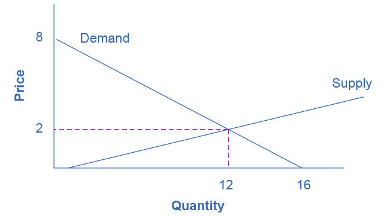
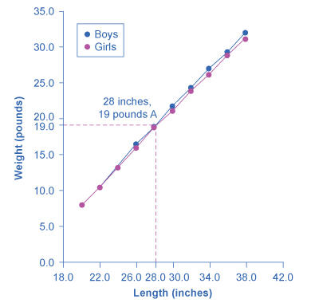
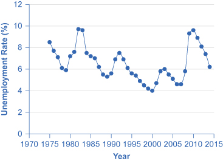
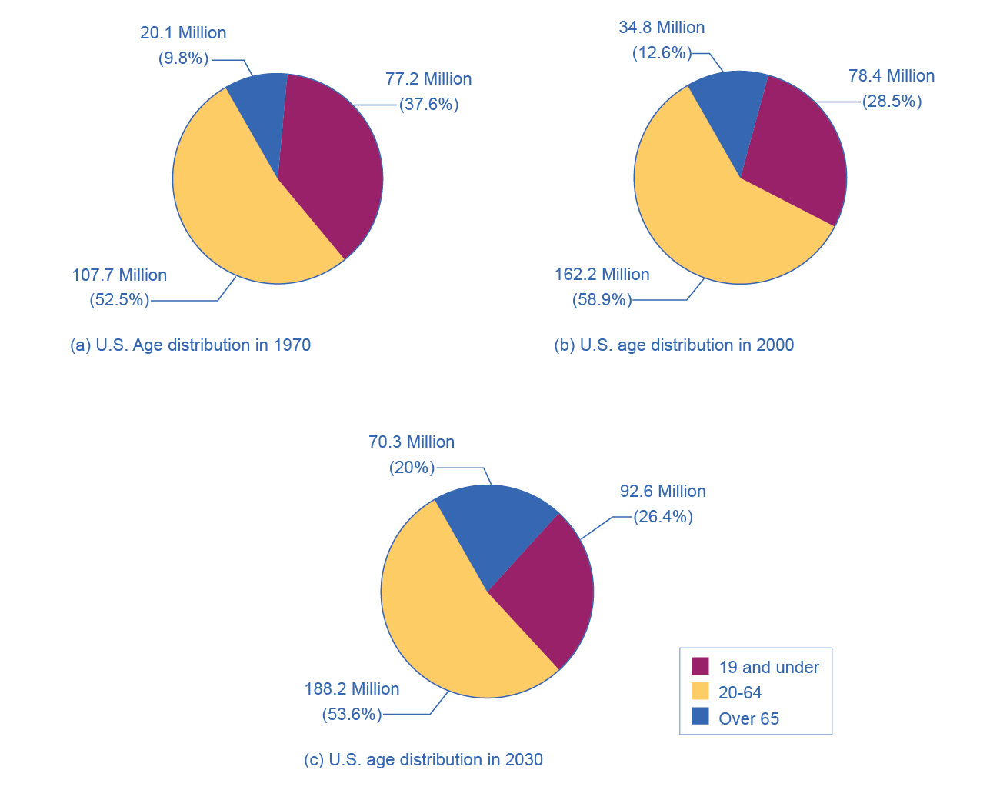
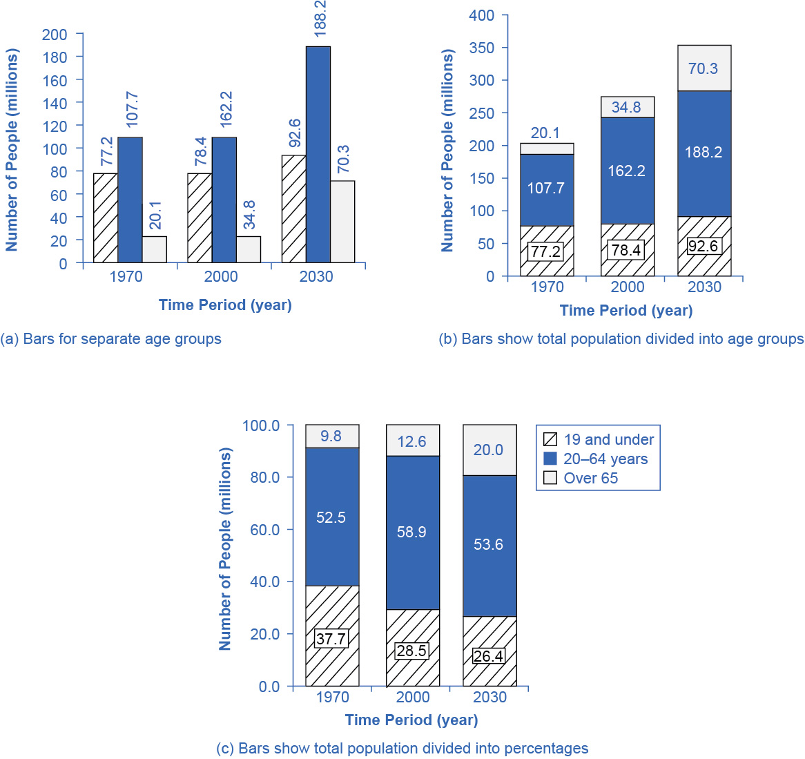
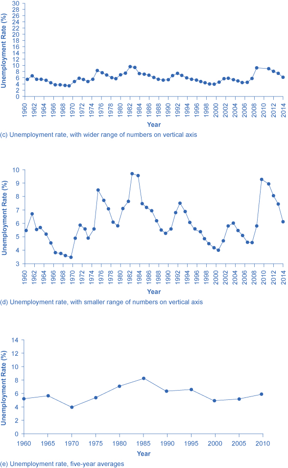
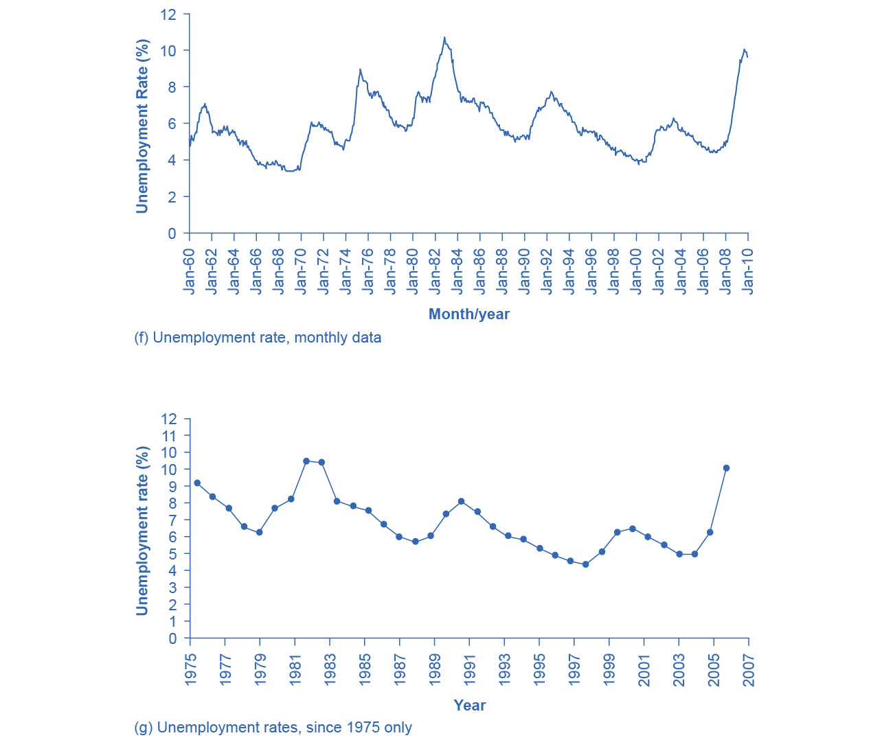

# Appendix A The Use of Mathematics in Principles of Economics

(This appendix should be consulted after first reading [Welcome to
Economics!](http://openstax.org/books/principles-microeconomics-3e/pages/1-introduction))
Economics is not math. There is no important concept in this course that
cannot be explained without mathematics. That said, math is a tool that
can be used to illustrate economic concepts. Remember the saying a
picture is worth a thousand words? Instead of a picture, think of a
graph. It is the same thing. Economists use models as the primary tool
to derive insights about economic issues and problems. Math is one way
of working with (or manipulating) economic models.

There are other ways of representing models, such as text or narrative.
But why would you use your fist to bang a nail, if you had a hammer?
Math has certain advantages over text. It disciplines your thinking by
making you specify exactly what you mean. You can get away with fuzzy
thinking in your head, but you cannot when you reduce a model to
algebraic equations. At the same time, math also has disadvantages.
Mathematical models are necessarily based on simplifying assumptions, so
they are not likely to be perfectly realistic. Mathematical models also
lack the nuances which can be found in narrative models. The point is
that math is one tool, but it is not the only tool or even always the
best tool economists can use. So what math will you need for this book?
The answer is: little more than high school algebra and graphs. You will
need to know:

-   What a function is
-   How to interpret the equation of a line (i.e., slope and intercept)
-   How to manipulate a line (i.e., changing the slope or the intercept)
-   How to compute and interpret a growth rate (i.e., percentage change)
-   How to read and manipulate a graph

In this text, we will use the easiest math possible, and we will
introduce it in this appendix. So if you find some math in the book that
you cannot follow, come back to this appendix to review. Like most
things, math has diminishing returns. A little math ability goes a long
way; the more advanced math you bring in, the less additional knowledge
that will get you. That said, if you are going to major in economics,
you should consider learning a little calculus. It will be worth your
while in terms of helping you learn advanced economics more quickly.

## Algebraic Models

Often economic models (or parts of models) are expressed in terms of
mathematical functions. What is a function? A function describes a
relationship. Sometimes the relationship is a definition. For example
(using words), your professor is Adam Smith. This could be expressed as
Professor = Adam Smith. Or Friends = Bob + Shawn + Margaret.

Often in economics, functions describe cause and effect. The variable on
the left-hand side is what is being explained ("the effect"). On the
right-hand side is what is doing the explaining ("the causes"). For
example, suppose your GPA was determined as follows:

$\text{GPA~=~0.25~×~combined\_SAT~+~0.25~×~class\_attendance~+~0.50~×~hours\_spent\_studying}$

This equation states that your GPA depends on three things: your
combined SAT score, your class attendance, and the number of hours you
spend studying. It also says that study time is twice as important
(0.50) as either combined_SAT score (0.25) or class_attendance (0.25).
If this relationship is true, how could you raise your GPA? By not
skipping class and studying more. Note that you cannot do anything about
your SAT score, since if you are in college, you have (presumably)
already taken the SATs.

Of course, economic models express relationships using economic
variables, like Budget = money_spent_on_econ_books +
money_spent_on_music, assuming that the only things you buy are
economics books and music.

Most of the relationships we use in this course are expressed as linear
equations of the form:

$\text{y~=~b~+~mx}$

**Expressing Equations Graphically**

Graphs are useful for two purposes. The first is to express equations
visually, and the second is to display statistics or data. This section
will discuss expressing equations visually.

To a mathematician or an economist, a variable is the name given to a
quantity that may assume a range of values. In the equation of a line
presented above, x and y are the variables, with x on the horizontal
axis and y on the vertical axis, and b and m representing factors that
determine the shape of the line. To see how this equation works,
consider a numerical example:

$\text{y~=~9~+~3x}$

In this equation for a specific line, the b term has been set equal to 9
and the m term has been set equal to 3. [Table A1](#Table_A_01) shows
the values of x and y for this given equation. [Figure
A1](#CNX_Econ_A01_010) shows this equation, and these values, in a
graph. To construct the table, just plug in a series of different values
for x, and then calculate what value of y results. In the figure, these
points are plotted and a line is drawn through them.

Table A1 Values for the Slope Intercept Equation

{width="3.25in" height="2.52in"}

Figure A1 Slope and the Algebra of Straight Lines This line graph has
*x* on the horizontal axis and y on the vertical axis. The
y-intercept---that is, the point where the line intersects the
y-axis---is 9. The slope of the line is 3; that is, there is a rise of 3
on the vertical axis for every increase of 1 on the horizontal axis. The
slope is the same all along a straight line.

This example illustrates how the b and m terms in an equation for a
straight line determine the shape of the line. The b term is called the
y-intercept. The reason for this name is that, if x = 0, then the b term
will reveal where the line intercepts, or crosses, the y-axis. In this
example, the line hits the vertical axis at 9. The m term in the
equation for the line is the slope. Remember that slope is defined as
rise over run; more specifically, the slope of a line from one point to
another is the change in the vertical axis divided by the change in the
horizontal axis. In this example, each time the x term increases by one
(the run), the y term rises by three. Thus, the slope of this line is
three. Specifying a y-intercept and a slope---that is, specifying b and
m in the equation for a line---will identify a specific line. Although
it is rare for real-world data points to arrange themselves as an exact
straight line, it often turns out that a straight line can offer a
reasonable approximation of actual data.

**Interpreting the Slope**

The concept of slope is very useful in economics, because it measures
the relationship between two variables. A positive slope means that two
variables are positively related; that is, when x increases, so does y,
or when x decreases, y decreases also. Graphically, a positive slope
means that as a line on the line graph moves from left to right, the
line rises. The length-weight relationship, shown in [Figure
A3](#CNX_Econ_A01_008) later in this Appendix, has a positive slope. We
will learn in other chapters that price and quantity supplied have a
positive relationship; that is, firms will supply more when the price is
higher.

A negative slope means that two variables are negatively related; that
is, when x increases, y decreases, or when x decreases, y increases.
Graphically, a negative slope means that, as the line on the line graph
moves from left to right, the line falls. The altitude-air density
relationship, shown in [Figure A4](#CNX_Econ_A01_009) later in this
appendix, has a negative slope. We will learn that price and quantity
demanded have a negative relationship; that is, consumers will purchase
less when the price is higher.

A slope of zero means that there is no relationship between x and y.
Graphically, the line is flat; that is, zero rise over the run. [Figure
A5](#CNX_Econ_A01_025) of the unemployment rate, shown later in this
appendix, illustrates a common pattern of many line graphs: some
segments where the slope is positive, other segments where the slope is
negative, and still other segments where the slope is close to zero.

The slope of a straight line between two points can be calculated in
numerical terms. To calculate slope, begin by designating one point as
the "starting point" and the other point as the "end point" and then
calculating the rise over run between these two points. As an example,
consider the slope of the air density graph between the points
representing an altitude of 4,000 meters and an altitude of 6,000
meters:

Rise: Change in variable on vertical axis (end point minus original
point)

{width="1.1354166666666667in"
height="0.3958333333333333in"}

Run: Change in variable on horizontal axis (end point minus original
point)

{width="1.09375in"
height="0.3958333333333333in"}

Thus, the slope of a straight line between these two points would be
that from the altitude of 4,000 meters up to 6,000 meters, the density
of the air decreases by approximately 0.1 kilograms/cubic meter for each
of the next 1,000 meters.

Suppose the slope of a line were to increase. Graphically, that means it
would get steeper. Suppose the slope of a line were to decrease. Then it
would get flatter. These conditions are true whether or not the slope
was positive or negative to begin with. A higher positive slope means a
steeper upward tilt to the line, while a smaller positive slope means a
flatter upward tilt to the line. A negative slope that is larger in
absolute value (that is, more negative) means a steeper downward tilt to
the line. A slope of zero is a horizontal flat line. A vertical line has
an infinite slope.

Suppose a line has a larger intercept. Graphically, that means it would
shift out (or up) from the old origin, parallel to the old line. If a
line has a smaller intercept, it would shift in (or down), parallel to
the old line.

**Solving Models with Algebra**

Economists often use models to answer a specific question, like: What
will the unemployment rate be if the economy grows at 3% per year?
Answering specific questions requires solving the "system" of equations
that represent the model.

Suppose the demand for personal pizzas is given by the following
equation:

$\text{Qd~=~16~–~2P}$

where Qd is the amount of personal pizzas consumers want to buy (i.e.,
quantity demanded), and P is the price of pizzas. Suppose the supply of
personal pizzas is:

$\text{Qs~=~2~+~5P}$

where Qs is the amount of pizza producers will supply (i.e., quantity
supplied).

Finally, suppose that the personal pizza market operates where supply
equals demand, or

$\text{Qd~=~Qs}$

We now have a system of three equations and three unknowns (Qd, Qs, and
P), which we can solve with algebra:

Since Qd = Qs, we can set the demand and supply equation equal to each
other:

{width="1.2291666666666667in"
height="0.3958333333333333in"}

Subtracting 2 from both sides and adding 2P to both sides yields:

{width="1.8541666666666667in"
height="1.3541666666666667in"}

In other words, the price of each personal pizza will be \$2. How much
will consumers buy?

Taking the price of \$2, and plugging it into the demand equation, we
get:

{width="1.0625in" height="0.8541666666666666in"}

So if the price is \$2 each, consumers will purchase 12. How much will
producers supply? Taking the price of \$2, and plugging it into the
supply equation, we get:

{width="1.0104166666666667in"
height="0.8541666666666666in"}

So if the price is \$2 each, producers will supply 12 personal pizzas.
This means we did our math correctly, since Qd = Qs.

**Solving Models with Graphs**

If algebra is not your forte, you can get the same answer by using
graphs. Take the equations for Qd and Qs and graph them on the same set
of axes as shown in [Figure A2](#CNX_Econ_A01_024). Since P is on the
vertical axis, it is easiest if you solve each equation for P. The
demand curve is then P = 8 -- 0.5Qd and the supply curve is P = --0.4 +
0.2Qs. Note that the vertical intercepts are 8 and --0.4, and the slopes
are --0.5 for demand and 0.2 for supply. If you draw the graphs
carefully, you will see that where they cross (Qs = Qd), the price is
\$2 and the quantity is 12, just like the algebra predicted.

{width="3.25in" height="1.8499989063867017in"}

Figure A2 Supply and Demand Graph The equations for Qd and Qs are
displayed graphically by the sloped lines.

We will use graphs more frequently in this book than algebra, but now
you know the math behind the graphs.

## Growth Rates

Growth rates are frequently encountered in real world economics. A
growth rate is simply the percentage change in some quantity. It could
be your income. It could be a business's sales. It could be a nation's
GDP. The formula for computing a growth rate is straightforward:

{width="2.5520833333333335in"
height="0.23958333333333334in"}

Suppose your job pays \$10 per hour. Your boss, however, is so impressed
with your work that he gives you a \$2 per hour raise. The percentage
change (or growth rate) in your pay is \$2/\$10 = 0.20 or 20%.

To compute the growth rate for data over an extended period of time, for
example, the average annual growth in GDP over a decade or more, the
denominator is commonly defined a little differently. In the previous
example, we defined the quantity as the initial quantity---or the
quantity when we started. This is fine for a one-time calculation, but
when we compute the growth over and over, it makes more sense to define
the quantity as the average quantity over the period in question, which
is defined as the quantity halfway between the initial quantity and the
next quantity. This is harder to explain in words than to show with an
example. Suppose a nation's GDP was \$1 trillion in 2005 and \$1.03
trillion in 2006. The growth rate between 2005 and 2006 would be the
change in GDP (\$1.03 trillion -- \$1.00 trillion) divided by the
average GDP between 2005 and 2006 (\$1.03 trillion + \$1.00 trillion)/2.
In other words:

{width="1.96875in"
height="0.9583333333333334in"}

Note that if we used the first method, the calculation would be (\$1.03
trillion -- \$1.00 trillion) / \$1.00 trillion = 3% growth, which is
approximately the same as the second, more complicated method. If you
need a rough approximation, use the first method. If you need accuracy,
use the second method.

A few things to remember: A positive growth rate means the quantity is
growing. A smaller growth rate means the quantity is growing more
slowly. A larger growth rate means the quantity is growing more quickly.
A negative growth rate means the quantity is decreasing.

The same change over times yields a smaller growth rate. If you got a
\$2 raise each year, in the first year the growth rate would be \$2/\$10
= 20%, as shown above. But in the second year, the growth rate would be
\$2/\$12 = 0.167 or 16.7% growth. In the third year, the same \$2 raise
would correspond to a \$2/\$14 = 14.2%. The moral of the story is this:
To keep the growth rate the same, the change must increase each period.

## Displaying Data Graphically and Interpreting the Graph

Graphs are also used to display data or evidence. Graphs are a method of
presenting numerical patterns. They condense detailed numerical
information into a visual form in which relationships and numerical
patterns can be seen more easily. For example, which countries have
larger or smaller populations? A careful reader could examine a long
list of numbers representing the populations of many countries, but with
over 200 nations in the world, searching through such a list would take
concentration and time. Putting these same numbers on a graph can
quickly reveal population patterns. Economists use graphs both for a
compact and readable presentation of groups of numbers and for building
an intuitive grasp of relationships and connections.

Three types of graphs are used in this book: line graphs, pie graphs,
and bar graphs. Each is discussed below. We also provide warnings about
how graphs can be manipulated to alter viewers' perceptions of the
relationships in the data.

**Line Graphs**

The graphs we have discussed so far are called line graphs, because they
show a relationship between two variables: one measured on the
horizontal axis and the other measured on the vertical axis.

Sometimes it is useful to show more than one set of data on the same
axes. The data in [Table A2](#Table_A_02) is displayed in [Figure
A3](#CNX_Econ_A01_008) which shows the relationship between two
variables: length and median weight for American baby boys and girls
during the first three years of life. (The median means that half of all
babies weigh more than this and half weigh less.) The line graph
measures length in inches on the horizontal axis and weight in pounds on
the vertical axis. For example, point A on the figure shows that a boy
who is 28 inches long will have a median weight of about 19 pounds. One
line on the graph shows the length-weight relationship for boys and the
other line shows the relationship for girls. This kind of graph is
widely used by healthcare providers to check whether a child's physical
development is roughly on track.

{width="3.25in" height="3.2083333333333335in"}

Figure A3 The Length-Weight Relationship for American Boys and Girls The
line graph shows the relationship between height and weight for boys and
girls from birth to 3 years. Point A, for example, shows that a boy of
28 inches in height (measured on the horizontal axis) is typically 19
pounds in weight (measured on the vertical axis). These data apply only
to children in the first three years of life.

Table A2 Length to Weight Relationship for American Boys and Girls

Not all relationships in economics are linear. Sometimes they are
curves. [Figure A4](#CNX_Econ_A01_009) presents another example of a
line graph, representing the data from [Table A3](#Table_A_03). In this
case, the line graph shows how thin the air becomes when you climb a
mountain. The horizontal axis of the figure shows altitude, measured in
meters above sea level. The vertical axis measures the density of the
air at each altitude. Air density is measured by the weight of the air
in a cubic meter of space (that is, a box measuring one meter in height,
width, and depth). As the graph shows, air pressure is heaviest at
ground level and becomes lighter as you climb. [Figure
A4](#CNX_Econ_A01_009) shows that a cubic meter of air at an altitude of
500 meters weighs approximately one kilogram (about 2.2 pounds).
However, as the altitude increases, air density decreases. A cubic meter
of air at the top of Mount Everest, at about 8,828 meters, would weigh
only 0.023 kilograms. The thin air at high altitudes explains why many
mountain climbers need to use oxygen tanks as they reach the top of a
mountain.

{width="4.88in" height="3.31in"}

Figure A4 Altitude-Air Density Relationship This line graph shows the
relationship between altitude, measured in meters above sea level, and
air density, measured in kilograms of air per cubic meter. As altitude
rises, air density declines. The point at the top of Mount Everest has
an altitude of approximately 8,828 meters above sea level (the
horizontal axis) and air density of 0.023 kilograms per cubic meter (the
vertical axis).

Table A3 Altitude to Air Density Relationship

The length-weight relationship and the altitude-air density
relationships in these two figures represent averages. If you were to
collect actual data on air pressure at different altitudes, the same
altitude in different geographic locations will have slightly different
air density, depending on factors like how far you are from the equator,
local weather conditions, and the humidity in the air. Similarly, in
measuring the height and weight of children for the previous line graph,
children of a particular height would have a range of different weights,
some above average and some below. In the real world, this sort of
variation in data is common. The task of a researcher is to organize
that data in a way that helps to understand typical patterns. The study
of statistics, especially when combined with computer statistics and
spreadsheet programs, is a great help in organizing this kind of data,
plotting line graphs, and looking for typical underlying relationships.
For most economics and social science majors, a statistics course will
be required at some point.

One common line graph is called a time series, in which the horizontal
axis shows time and the vertical axis displays another variable. Thus, a
time series graph shows how a variable changes over time. [Figure
A5](#CNX_Econ_A01_025) shows the unemployment rate in the United States
since 1975, where unemployment is defined as the percentage of adults
who want jobs and are looking for a job, but cannot find one. The points
for the unemployment rate in each year are plotted on the graph, and a
line then connects the points, showing how the unemployment rate has
moved up and down since 1975. The line graph makes it easy to see, for
example, that the highest unemployment rate during this time period was
slightly less than 10% in the early 1980s and 2010, while the
unemployment rate declined from the early 1990s to the end of the 1990s,
before rising and then falling back in the early 2000s, and then rising
sharply during the recession from 2008--2009.

{width="3.058333333333333in"
height="2.2083333333333335in"}

Figure A5 U.S. Unemployment Rate, 1975--2014 This graph provides a quick
visual summary of unemployment data. With a graph like this, it is easy
to spot the times of high unemployment and of low unemployment.

**Pie Graphs**

A pie graph (sometimes called a pie chart) is used to show how an
overall total is divided into parts. A circle represents a group as a
whole. The slices of this circular "pie" show the relative sizes of
subgroups.

[Figure A6](#CNX_Econ_A01_020) shows how the U.S. population was divided
among children, working age adults, and the elderly in 1970, 2000, and
what is projected for 2030. The information is first conveyed with
numbers in [Table A4](#Table_A_04), and then in three pie charts. The
first column of [Table A4](#Table_A_04) shows the total U.S. population
for each of the three years. Columns 2--4 categorize the total in terms
of age groups---from birth to 18 years, from 19 to 64 years, and 65
years and above. In columns 2--4, the first number shows the actual
number of people in each age category, while the number in parentheses
shows the percentage of the total population comprised by that age
group.

Table A4 U.S. Age Distribution, 1970, 2000, and 2030 (projected)

{width="6.5in" height="5.135in"}

Figure A6 Pie Graphs of the U.S. Age Distribution (numbers in millions)
The three pie graphs illustrate the division of total population into
three age groups for the three different years.

In a pie graph, each slice of the pie represents a share of the total,
or a percentage. For example, 50% would be half of the pie and 20% would
be one-fifth of the pie. The three pie graphs in [Figure
A6](#CNX_Econ_A01_020) show that the share of the U.S. population 65 and
over is growing. The pie graphs allow you to get a feel for the relative
size of the different age groups from 1970 to 2000 to 2030, without
requiring you to slog through the specific numbers and percentages in
the table. Some common examples of how pie graphs are used include
dividing the population into groups by age, income level, ethnicity,
religion, occupation; dividing different firms into categories by size,
industry, number of employees; and dividing up government spending or
taxes into its main categories.

**Bar Graphs**

A bar graph uses the height of different bars to compare quantities.
[Table A5](#Table_A_05) lists the 12 most populous countries in the
world. [Figure A7](#CNX_Econ_A01_004) provides this same data in a bar
graph. The height of the bars corresponds to the population of each
country. Although you may know that China and India are the most
populous countries in the world, seeing how the bars on the graph tower
over the other countries helps illustrate the magnitude of the
difference between the sizes of national populations.

{width="5.025in" height="2.075in"}

Figure A7 Leading Countries of the World by Population, 2015 (in
millions) The graph shows the 12 countries of the world with the largest
populations. The height of the bars in the bar graph shows the size of
the population for each country.

Table A5 Leading 12 Countries of the World by Population

Bar graphs can be subdivided in a way that reveals information similar
to that we can get from pie charts. [Figure A8](#CNX_Econ_A01_021)
offers three bar graphs based on the information from [Figure
A6](#CNX_Econ_A01_020) about the U.S. age distribution in 1970, 2000,
and 2030. [Figure A8](#CNX_Econ_A01_021) (a) shows three bars for each
year, representing the total number of persons in each age bracket for
each year. [Figure A8](#CNX_Econ_A01_021) (b) shows just one bar for
each year, but the different age groups are now shaded inside the bar.
In [Figure A8](#CNX_Econ_A01_021) (c), still based on the same data, the
vertical axis measures percentages rather than the number of persons. In
this case, all three bar graphs are the same height, representing 100%
of the population, with each bar divided according to the percentage of
population in each age group. It is sometimes easier for a reader to run
their eyes across several bar graphs, comparing the shaded areas, rather
than trying to compare several pie graphs.

{width="5.83in" height="5.495in"}

Figure A8 U.S. Population with Bar Graphs Population data can be
represented in different ways. (a) Shows three bars for each year,
representing the total number of persons in each age bracket for each
year. (b) Shows just one bar for each year, but the different age groups
are now shaded inside the bar. (c) Sets the vertical axis as a measure
of percentages rather than the number of persons. All three bar graphs
are the same height and each bar is divided according to the percentage
of population in each age group.

[Figure A7](#CNX_Econ_A01_004) and [Figure A8](#CNX_Econ_A01_021) show
how the bars can represent countries or years, and how the vertical axis
can represent a numerical or a percentage value. Bar graphs can also
compare size, quantity, rates, distances, and other quantitative
categories.

**Comparing Line Graphs with Pie Charts and Bar Graphs**

Now that you are familiar with pie graphs, bar graphs, and line graphs,
how do you know which graph to use for your data? Pie graphs are often
better than line graphs at showing how an overall group is divided.
However, if a pie graph has too many slices, it can become difficult to
interpret.

Bar graphs are especially useful when comparing quantities. For example,
if you are studying the populations of different countries, as in
[Figure A7](#CNX_Econ_A01_004), bar graphs can show the relationships
between the population sizes of multiple countries. Not only can it show
these relationships, but it can also show breakdowns of different groups
within the population.

A line graph is often the most effective format for illustrating a
relationship between two variables that are both changing. For example,
time series graphs can show patterns as time changes, like the
unemployment rate over time. Line graphs are widely used in economics to
present continuous data about prices, wages, quantities bought and sold,
the size of the economy.

**How Graphs Can Be Misleading**

Graphs not only reveal patterns; they can also alter how patterns are
perceived. To see some of the ways this can be done, consider the line
graphs of [Figure A9](#CNX_Econ_A01_022), [Figure
A10](#CNX_Econ_A01_023), and [Figure A11](#CNX_Econ_A01_017). These
graphs all illustrate the unemployment rate---but from different
perspectives.

{width="4.866666666666666in"
height="6.658333333333333in"}

Figure A9

{width="4.9in" height="7.958333333333333in"}

Figure A10 Presenting Unemployment Rates in Different Ways, All of Them
Accurate Simply changing the width and height of the area in which data
is displayed can alter the perception of the data.

{width="6.5in" height="5.47in"}

Figure A11 Presenting Unemployment Rates in Different Ways, All of Them
Accurate Simply changing the width and height of the area in which data
is displayed can alter the perception of the data.

Suppose you wanted a graph which gives the impression that the rise in
unemployment in 2009 was not all that large, or all that extraordinary
by historical standards. You might choose to present your data as in
[Figure A9](#CNX_Econ_A01_022) (a). [Figure A9](#CNX_Econ_A01_022) (a)
includes much of the same data presented earlier in [Figure
A5](#CNX_Econ_A01_025), but stretches the horizontal axis out longer
relative to the vertical axis. By spreading the graph wide and flat, the
visual appearance is that the rise in unemployment is not so large, and
is similar to some past rises in unemployment. Now imagine you wanted to
emphasize how unemployment spiked substantially higher in 2009. In this
case, using the same data, you can stretch the vertical axis out
relative to the horizontal axis, as in [Figure A9](#CNX_Econ_A01_022)
(b), which makes all rises and falls in unemployment appear larger.

A similar effect can be accomplished without changing the length of the
axes, but by changing the scale on the vertical axis. In [Figure
A10](#CNX_Econ_A01_023) (c), the scale on the vertical axis runs from 0%
to 30%, while in [Figure A10](#CNX_Econ_A01_023) (d), the vertical axis
runs from 3% to 10%. Compared to [Figure A5](#CNX_Econ_A01_025), where
the vertical scale runs from 0% to 12%, [Figure A10](#CNX_Econ_A01_023)
(c) makes the fluctuation in unemployment look smaller, while [Figure
A10](#CNX_Econ_A01_023) (d) makes it look larger.

Another way to alter the perception of the graph is to reduce the amount
of variation by changing the number of points plotted on the graph.
[Figure A10](#CNX_Econ_A01_023) (e) shows the unemployment rate
according to five-year averages. By averaging out some of the
year-to-year changes, the line appears smoother and with fewer highs and
lows. In reality, the unemployment rate is reported monthly, and [Figure
A11](#CNX_Econ_A01_017) (f) shows the monthly figures since 1960, which
fluctuate more than the five-year average. [Figure
A11](#CNX_Econ_A01_017) (f) is also a vivid illustration of how graphs
can compress lots of data. The graph includes monthly data since 1960,
which over almost 50 years, works out to nearly 600 data points. Reading
that list of 600 data points in numerical form would be hypnotic. You
can, however, get a good intuitive sense of these 600 data points very
quickly from the graph.

A final trick in manipulating the perception of graphical information is
that, by choosing the starting and ending points carefully, you can
influence the perception of whether the variable is rising or falling.
The original data show a general pattern with unemployment low in the
1960s, but spiking up in the mid-1970s, early 1980s, early 1990s, early
2000s, and late 2000s. [Figure A11](#CNX_Econ_A01_017) (g), however,
shows a graph that goes back only to 1975, which gives an impression
that unemployment was more-or-less gradually falling over time until the
2009 recession pushed it back up to its "original" level---which is a
plausible interpretation if one starts at the high point around 1975.

These kinds of tricks---or shall we just call them "presentation
choices"--- are not limited to line graphs. In a pie chart with many
small slices and one large slice, someone must decide what categories
should be used to produce these slices in the first place, thus making
some slices appear bigger than others. If you are making a bar graph,
you can make the vertical axis either taller or shorter, which will tend
to make variations in the height of the bars appear more or less.

Being able to read graphs is an essential skill, both in economics and
in life. A graph is just one perspective or point of view, shaped by
choices such as those discussed in this section. Do not always believe
the first quick impression from a graph. View with caution.

## Key Concepts and Summary

Math is a tool for understanding economics and economic relationships
can be expressed mathematically using algebra or graphs. The algebraic
equation for a line is y = b + mx, where x is the variable on the
horizontal axis and y is the variable on the vertical axis, the b term
is the y-intercept and the m term is the slope. The slope of a line is
the same at any point on the line and it indicates the relationship
(positive, negative, or zero) between two economic variables.

Economic models can be solved algebraically or graphically. Graphs allow
you to illustrate data visually. They can illustrate patterns,
comparisons, trends, and apportionment by condensing the numerical data
and providing an intuitive sense of relationships in the data. A line
graph shows the relationship between two variables: one is shown on the
horizontal axis and one on the vertical axis. A pie graph shows how
something is allotted, such as a sum of money or a group of people. The
size of each slice of the pie is drawn to represent the corresponding
percentage of the whole. A bar graph uses the height of bars to show a
relationship, where each bar represents a certain entity, like a country
or a group of people. The bars on a bar graph can also be divided into
segments to show subgroups.

Any graph is a single visual perspective on a subject. The impression it
leaves will be based on many choices, such as what data or time frame is
included, how data or groups are divided up, the relative size of
vertical and horizontal axes, whether the scale used on a vertical
starts at zero. Thus, any graph should be regarded somewhat skeptically,
remembering that the underlying relationship can be open to different
interpretations.

## Review Questions

Exercise A1

Name three kinds of graphs and briefly state when is most appropriate to
use each type of graph.

Exercise A2

What is slope on a line graph?

Exercise A3

What do the slices of a pie chart represent?

Exercise A4

Why is a bar chart the best way to illustrate comparisons?

Exercise A5

How does the appearance of positive slope differ from negative slope and
from zero slope?
