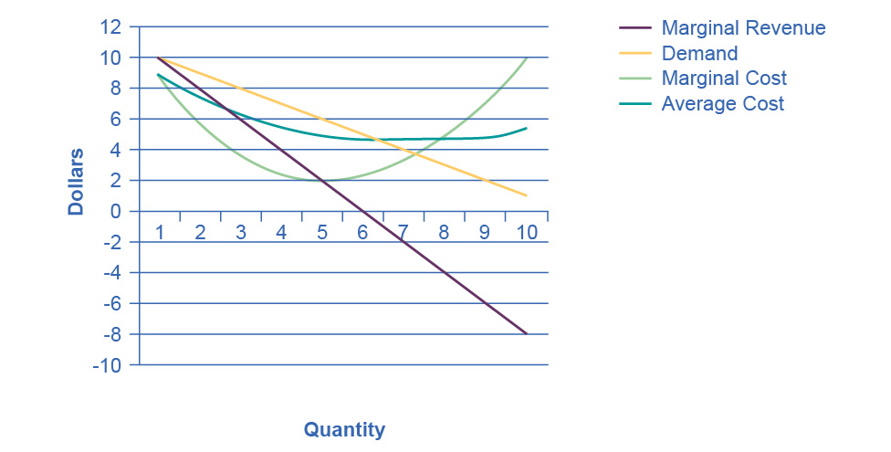

## Chapter 11

[1](http://openstax.org/books/principles-microeconomics-3e/pages/11-self-check-questions#fs-idp20050208).

Yes, it is true. The HHI example is easy enough: since the market shares
of all firms are included in the HHI calculation, a merger between two
of the firms will change the HHI. For the four-firm concentration ratio,
it is quite possible that a merger between, say, the fifth and sixth
largest firms in the market could create a new firm that is then ranked
in the top four in the market. In this case, a merger of two firms,
neither in the top four, would still change the four-firm concentration
ratio.

[2](http://openstax.org/books/principles-microeconomics-3e/pages/11-self-check-questions#fs-idm32347520).

No, it is not true. The HHI includes the market shares of all firms in
its calculation, but the squaring of the market shares has the effect of
making the impact of the largest firms relatively bigger than in the
4-firm or 8-firm ratio.

[3](http://openstax.org/books/principles-microeconomics-3e/pages/11-self-check-questions#fs-idp133328928).

The bus companies wanted the broader market definition (i.e., the second
definition). If the narrow definition had been used, the combined bus
companies would have had a near-monopoly on the market for intercity bus
service. But they had only a sliver of the market for intercity
transportation when everything else was included. The merger was
allowed.

[4](http://openstax.org/books/principles-microeconomics-3e/pages/11-self-check-questions#fs-idp62461936).

The common expectation is that the definition of markets will become
broader because of greater competition from faraway places. However,
this broadening doesn't necessarily mean that antitrust authorities can
relax. There is also a fear that companies with a local or national
monopoly may use the new opportunities to extend their reach across
national borders, and that it will be difficult for national authorities
to respond.

[5](http://openstax.org/books/principles-microeconomics-3e/pages/11-self-check-questions#fs-idm57918848).

Because outright collusion to raise profits is illegal and because
existing regulations include gray areas which firms may be able to
exploit.

[6](http://openstax.org/books/principles-microeconomics-3e/pages/11-self-check-questions#fs-idm35141040).

Yes, all curves have normal shapes.

{width="4.88in" height="2.475in"}

[7](http://openstax.org/books/principles-microeconomics-3e/pages/11-self-check-questions#fs-idm151696144).

Yes it is a natural monopoly because average costs decline over the
range that satisfies the market demand. For example, at the point where
the demand curve and the average cost curve meet, there are economies of
scale.

[8](http://openstax.org/books/principles-microeconomics-3e/pages/11-self-check-questions#fs-idm85133776).

Improvements in technology that allowed phone calls to be made via
microwave transmission, communications satellites, and other wireless
technologies.

[9](http://openstax.org/books/principles-microeconomics-3e/pages/11-self-check-questions#fs-idm43695440).

More consumer choice. Cheaper phone calls, especially long distance.
Better-quality phone service in many cases. Cheaper, faster, and
better-quality data transmission. Spin-off technologies like free
Internet-based calling and video calling.

[10](http://openstax.org/books/principles-microeconomics-3e/pages/11-self-check-questions#fs-idm15499232).

More choice can sometimes make for difficult decisions---not knowing if
you got the best plan for your situation, for example. Some phone
service providers are less reliable than AT&T used to be.
