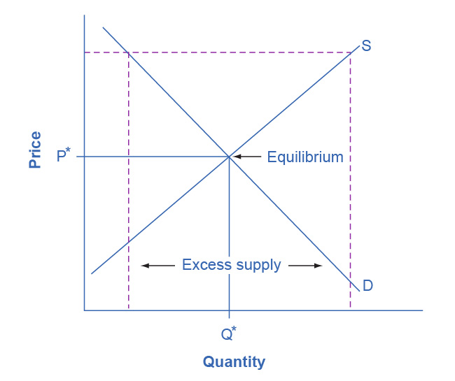
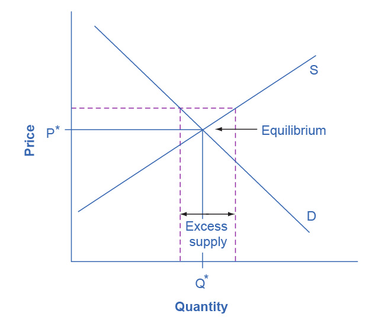
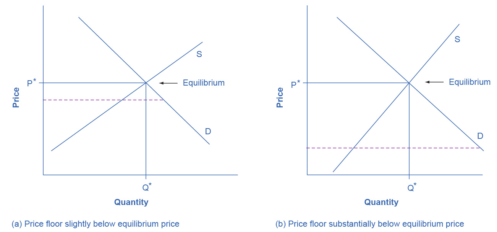
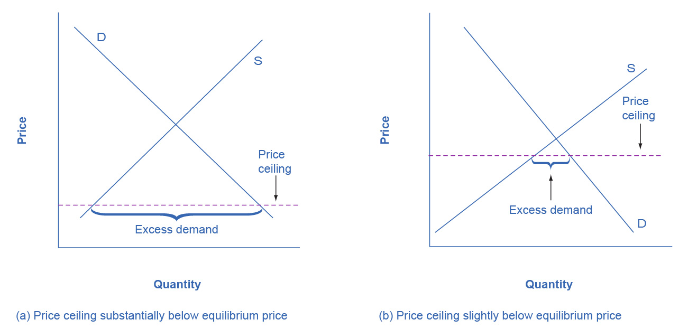
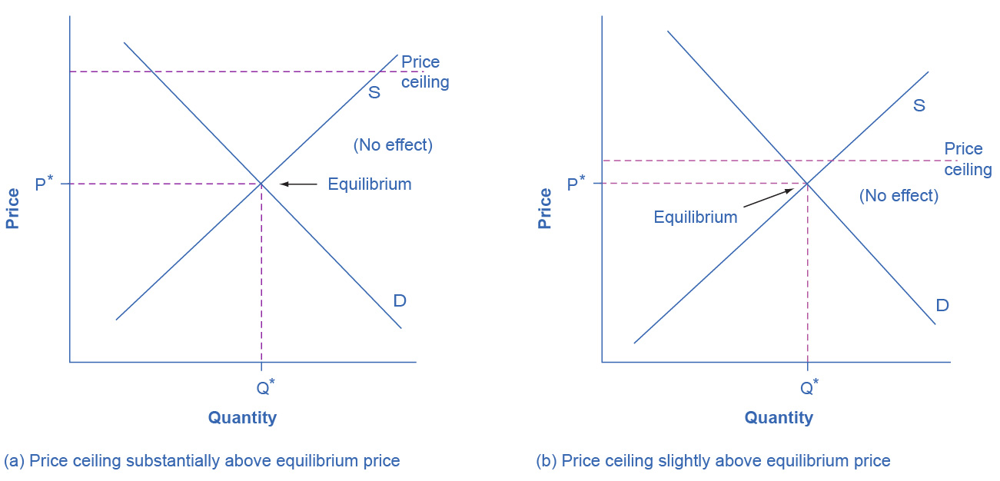

## Chapter 4

[1](http://openstax.org/books/principles-microeconomics-3e/pages/4-self-check-questions#fs-idp159528560).

Changes in the wage rate (the price of labor) cause a movement along the
demand curve. A change in anything else that affects demand for labor
(e.g., changes in output, changes in the production process that use
more or less labor, government regulation) causes a shift in the demand
curve.

[2](http://openstax.org/books/principles-microeconomics-3e/pages/4-self-check-questions#fs-idp45547376).

Changes in the wage rate (the price of labor) cause a movement along the
supply curve. A change in anything else that affects supply of labor
(e.g., changes in how desirable the job is perceived to be, government
policy to promote training in the field) causes a shift in the supply
curve.

[3](http://openstax.org/books/principles-microeconomics-3e/pages/4-self-check-questions#fs-idm193520).

Since a living wage is a suggested minimum wage, it acts like a price
floor (assuming, of course, that it is followed). If the living wage is
binding, it will cause an excess supply of labor at that wage rate.

[4](http://openstax.org/books/principles-microeconomics-3e/pages/4-self-check-questions#fs-idm182294112).

Changes in the interest rate (i.e., the price of financial capital)
cause a movement along the demand curve. A change in anything else
(non-price variable) that affects demand for financial capital (e.g.,
changes in confidence about the future, changes in needs for borrowing)
would shift the demand curve.

[5](http://openstax.org/books/principles-microeconomics-3e/pages/4-self-check-questions#fs-idm102226576).

Changes in the interest rate (i.e., the price of financial capital)
cause a movement along the supply curve. A change in anything else that
affects the supply of financial capital (a non-price variable) such as
income or future needs would shift the supply curve.

[6](http://openstax.org/books/principles-microeconomics-3e/pages/4-self-check-questions#fs-idm107095712).

If market interest rates stay in their normal range, an interest rate
limit of 35% would not be binding. If the equilibrium interest rate rose
above 35%, the interest rate would be capped at that rate, and the
quantity of loans would be lower than the equilibrium quantity, causing
a shortage of loans.

[7](http://openstax.org/books/principles-microeconomics-3e/pages/4-self-check-questions#fs-idm28938304).

b and c will lead to a fall in interest rates. At a lower demand,
lenders will not be able to charge as much, and with more available
lenders, competition for borrowers will drive rates down.

[8](http://openstax.org/books/principles-microeconomics-3e/pages/4-self-check-questions#fs-idp68468928).

a and c will increase the quantity of loans. More people who want to
borrow will result in more loans being given, as will more people who
want to lend.

[9](http://openstax.org/books/principles-microeconomics-3e/pages/4-self-check-questions#fs-idp53788832).

A price floor prevents a price from falling below a certain level, but
has no effect on prices above that level. It will have its biggest
effect in creating excess supply (as measured by the entire area inside
the dotted lines on the graph, from D to S) if it is substantially above
the equilibrium price. This is illustrated in the following figure.

{width="3.25in" height="2.725in"}

It will have a lesser effect if it is slightly above the equilibrium
price. This is illustrated in the next figure.

{width="3.25in" height="2.705in"}

It will have no effect if it is set either slightly or substantially
below the equilibrium price, since an equilibrium price above a price
floor will not be affected by that price floor. The following figure
illustrates these situations.

{width="6.5in" height="3.047655293088364in"}

[10](http://openstax.org/books/principles-microeconomics-3e/pages/4-self-check-questions#fs-idm48819088).

A price ceiling prevents a price from rising above a certain level, but
has no effect on prices below that level. It will have its biggest
effect in creating excess demand if it is substantially below the
equilibrium price. The following figure illustrates these situations.

{width="6.5in" height="3.1126049868766406in"}

When the price ceiling is set substantially or slightly above the
equilibrium price, it will have no effect on creating excess demand. The
following figure illustrates these situations.

{width="6.5in" height="3.127594050743657in"}

[11](http://openstax.org/books/principles-microeconomics-3e/pages/4-self-check-questions#fs-idp29140256).

Neither. A shift in demand or supply means that at every price, either a
greater or a lower quantity is demanded or supplied. A price floor does
not shift a demand curve or a supply curve. However, if the price floor
is set above the equilibrium, it will cause the quantity supplied on the
supply curve to be greater than the quantity demanded on the demand
curve, leading to excess supply.

[12](http://openstax.org/books/principles-microeconomics-3e/pages/4-self-check-questions#fs-idp75628784).

Neither. A shift in demand or supply means that at every price, either a
greater or a lower quantity is demanded or supplied. A price ceiling
does not shift a demand curve or a supply curve. However, if the price
ceiling is set below the equilibrium, it will cause the quantity
demanded on the demand curve to be greater than the quantity supplied on
the supply curve, leading to excess demand.
